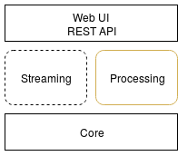

.. _Architecture:

SJ-Platform Architecture
==============================

A good data processing system needs to be fault-tolerant and scalable; it needs to support micro-batch and event-by-event data processing and must be extensible. The Stream Juggler Platform architecture fulfills all these aspects. 

The Stream Juggler Platform is an integrated processing system. It means the system includes all the parts required to achieve goals: components for computation, administration. These parts can be rearranged in different pipelines. That allows building sophisticated processing graphs to customize the system.

SJ-Platform's architecture is designed so that exactly-once processing is performed not only within a single processing block but throughout the entire platform, starting from the moment streams of events are fed to the system and up to the moment the output data are saved in conventional data storage.

The approach based on loosely coupled blocks with exactly-once processing support throughout the entire pipeline allows a user to decompose data processing providing better modularity, performance management and simplicity in development.

In this section, we will take a closer look at the system components, their functions within the data flow pipeline.

But first of all, let's get the general idea of the platform structure and concepts.

Architecture Overview
-------------------------

The platform features presented above have conditioned the architecture developed for SJ-Platform. The diagram below represents the overview of the platform components:

1) **Processing** component for launching data computation,
2) **Streaming** component for data transportation,
3) **Core** component for task execution,
4) **API/UI** component for administration.

The Stream Juggler Platform performs data processing that is fulfilled in modules. The mode of processing in a module is determined by a set of configurations uploaded to the system via the UI.

The events enter the processing module in streams from a list of supported interfaces - TCP, Apache Kafka and T-streams. A result data are placed into an external data storage.

.. figure:: _static/Overview2.png
    :align: center
    :scale: 80%

SJ-Platform provides a user with the comprehensive **API** and **UI** that allow him/her to develop, customize and manage the event processing pipeline.

The core component is presented with services that simplify the deployment and operation and support best industrial practices. 

Platform Components
------------------------
Now let's have a look at each component in detail.

Core Component
~~~~~~~~~~~~~~~~~~~
The *Core* is composed of prerequisites for the platform. These are the services and settings that should be deployed prior to exploring the Stream Juggler Platform features. The services at this layer are responsible for input data ingestion, task execution management, data storage. 

- Resource management is fulfilled via `Apache Mesos <http://mesos.apache.org/>`_ that allows to run the system at scale and to support different types of workloads.

- To start applicable services in the Mesos we use `Docker <http://mesos.apache.org/documentation/latest/docker-containerizer/>`_

- `Marathon <https://mesosphere.github.io/marathon/>`_ allows running long-life tasks on Mesos.

- To perform leader election in case the currently leading Marathon instance fails `Apache Zookeeper <https://zookeeper.apache.org/>`_ is used. Zookeeper is also responsible for instance task synchronization for a Batch module.

- Data sources for the platform are `Netty <https://netty.io/>`_ and `T-streams <https://t-streams.com>`_ libraries and `Apache Kafka <https://kafka.apache.org/>`_. 

- The system saves the outcoming data to Elasticsearch, JDBC-compatible or RESTful external storages.

- We use `MongoDB <https://www.mongodb.com/>`_ as a document database that provides high performance and availability. All created platform entities (Providers, Services, Streams, Instances, etc.), as well as configurations, are stored here. 

SJ-Platform's backend is written in Scala. The UI is based on Angular 4.0. REST API is written in Akka HTTP.

Processing Component
~~~~~~~~~~~~~~~~~~~~~~~~~~~
The *Processing component* is provided by the Stream Juggler Platform. At this layer, the data processing itself is performed via modules. In fact, the platform represents a pipeline of modules.

The major one is the **processing module** that performs data processing. Two types of processing modules exist in SJ-Platform:

- Regular – the most generic module which receives events, transforms data and sends them to the next processing step.

- Batch – a module which is used to implement streaming joins and processing where algorithm must observe a range of input messages rather than current one. A batch is a minimum data set for a module to collect the events in the stream. Batches are collected in a window. The data is processed applying the idea of a sliding window. 

The processing module receives data to process from Apache Kafka and T-streams. You also can use TCP as a source, but you will need an input module in this case. The **input module** handles external inputs, does data deduplication, transforms raw data into objects for T-streams. 

To receive the result of processing an output module is required. The **output module** puts the processed data from event processing pipeline to external data destinations (Elasticsearch, SQL database, RESTful).

So the pipeline may look like at the following scheme:

.. figure:: _static/ModuleStructure3.png
   :scale: 80%

At the Processing platform component, the ingested data are transformed into streams, processed and sent to an external storage.  Data transformation and computation are the two major tasks of this component.

.. tip:: More information on modules you can find at the :ref:`Modules` page.

Streaming Component
~~~~~~~~~~~~~~~~~~~~~
The *Streaming component* is essential in SJ-Platform. The data are fed to the system, transferred between modules and exported to an external storage via streams. Streaming makes possible such platform features as exactly-once processing, parallelism, fault-tolerance, horizontal scalability.

The data can be received from different sources. Currently, the platform supports obtaining data from Apache Kafka and via TCP.

Using **TCP** as an input source a custom protocol can be used for receiving events, deduplicating them and putting into the processing pipeline.

SJ-Platform supports **Apache Kafka** as a standard message broker providing a common interface for the integration of many applications.

Within the platform, the data are transported to and from modules via *transactional streams* or **T-streams**. It is a message broker and a Scala library which is native to SJ-Platform and designed primarily for exactly-once processing  (so it includes a transactional producer, a consumer and a subscriber). 

.. tip:: More information on T-streams as well as streaming infrastructure in SJ-Platform can be found at the :ref:`Streaming` page. 

API/UI Component
~~~~~~~~~~~~~~~~~~~~~~~~~~~
The *Web UI* allows administrating of the platform. It is based on Angular 4.0. The platform  provides REST API that allows interacting with the platform, monitoring and managing module statuses (its starting or stopping), retrieving configuration information.

.. tip:: More information about the UI in the platform can be found in the :ref:`UI_Guide` and the :ref:`REST_API`.

Platform Features
-----------------------

Each SJ-Platform component contributes to its outstanding features.

SJ-Platform performs **stream processing**. That means the system can handle events as soon as they are available inside the system without specific delay. **Micro-batch data processing** can be also performed in the platform.

Streams can be very intensive and all events cannot be handled by a single server of arbitrary performance. The system allows **scaling** the computations horizontally to handle increasing demands.

The events are guaranteed to be processed **exactly-once**. The key idea of exactly-once processing lies in a group **checkpoint**. That means all producers and consumers of a stream are bunched into a group and do a checkpoint automatically fixing the current state. Moreover, a user can initialize a checkpoint whenever it is necessary.

Saving the variables in a state fulfills the idea of SJ-Platform`s **fault-tolerance**. In the case of a live data stream processing failure, the variables stored in the state are recovered and the module is restarted.

The streaming layer allows handling the idea of **parallelism** through multi-partitioning. The data elements in a stream are assembled in partitions.  A **partition** is a part of a data stream allocated for convenience in processing. Upon creation, every stream gets a name and a certain amount of partitions. The parallelism is enabled by dividing existing partitions fairly among modules' tasks and it enables to scale the data processing.

The general structure of SJ-Platform can be rendered as at the scheme below where all the mentioned above  components are presented in detail:

.. figure:: _static/SJ_General2.png

The diagram below represents the interconnections between platform components. 

SJ-Platform uses a range of data sources and data storages. A client operates the platform via UI/REST API. And he/she uploads a custom module to the platform with a set of configurations. The platform runs the module via an "executable" engine on Mesos and Marathon. And the module uses MongoDB as a data store.

.. figure:: _static/SJComponentDiagram.png

Every component deployed to the Stream Juggler Platform contributes to the main idea of hitting three V-s of data processing:

- Volume 
    The system is scalable and perfectly fits for large data processing.
    
- Velocity 
    The Stream Juggler Platform is the solution for real-time processing that means the system can handle events as soon as they are available inside the system without specific delay. Alongside with the stream processing, the micro-batch processing is supported in the system.
    
- Variety 
    The SJ-Platform components are ready-to-use and can be reorganized in various pipelines. Besides, the system is compatible with different types of data sources, data storages, services and systems. Stream Juggler Platform easily integrates with in-memory grid systems, for example, Hazelcast, Apache Ignite.

The system is available under Apache License v2. 
    
    
