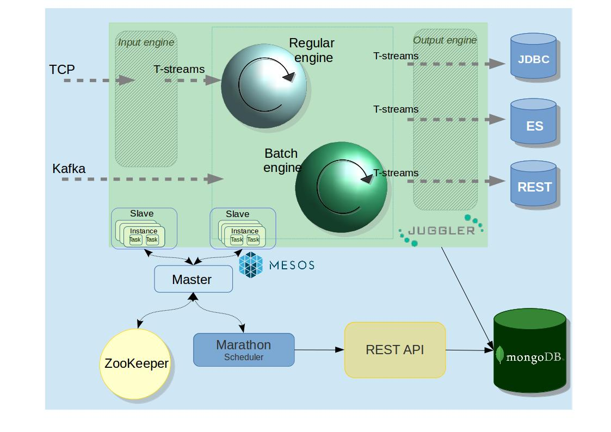
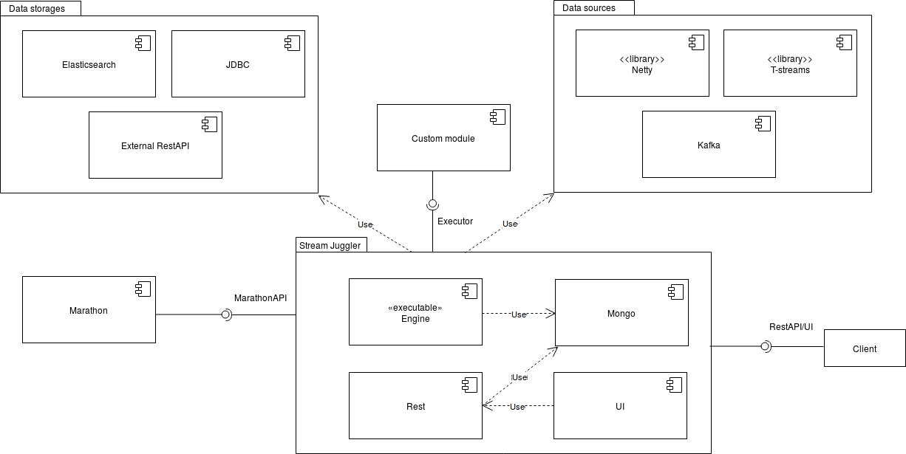

.. _Architecture:

Stream Juggler Architecture
==============================

.. warning:: *The section is under development!*

Architecture Overview
-------------------------

A good real-time data processing architecture needs to be fault-tolerant and scalable; it needs to support batch and incremental data processing, and must be extensible. All these aspects are fulfilled in the Stream Juggler platform.

The Stream Juggler is an integrated processing system. It means the system includes all the parts required to achieve goals.  At the same time these ready-to-use components can be reused in different pipelines. That allows to build sophisticated processing graphs to customize the system.
At this section we will take a closer look into the system components, their functions within the data flow pipeline.

Juggler's architecture is designed so that exactly-once processing is performed not only within a single processing block but throughout the entire sequence, starting from the moment stream events are fed to the system and up to the moment when the output data is stored to conventional data storage.

The approach based on loosely coupled blocks with exactly-once processing support throughout the entire sequence allows for decomposing data processing in order to provide better modularity, performance management and simplicity in development.

Platform Components
------------------------

The diagram below presents the structure of the platform. 

Figuratively, it can be divided into two layers. 

The *first layer* – data processing – is provided by Stream Juggler. At this layer the data processing itself is performed via custom modules. The ingested data is transformed into streams, processed and sent to an external storage. Data transformation and computation are the two major tasks of this layer.

This layer is marked with green in the diagram.

The *second layer* is composed of prerequisites for the platform. These are the services and settings that should be deployed prior to exploring the Stream Juggler features. The services at this layer are responsible for input data ingestion, platform management, data storage. In the diagram they are placed in the blue sector.

- Resource management is fulfilled via `Apache Mesos <http://mesos.apache.org/>`_ that allows to run the system at scale and to support different types of workloads.

- To start applicable services in Mesos cloud we use `Docker <http://mesos.apache.org/documentation/latest/docker-containerizer/>`_

- The support for Mesos containers and Docker is provided by `Marathon <https://mesosphere.github.io/marathon/>`_ that allows to run long-life tasks as well.

- For starting periodic tasks `Chronos <https://mesos.github.io/chronos/>`_ is used.

- To perform leader election in the event that the currently leading Marathon instance fails `ZooKeeper <https://zookeeper.apache.org/>`_ is used.

- For base service search  https://github.com/CiscoCloud/mesos-consul_ is used.

- Data sources for the platform are Netty and `T-streams <https://t-streams.com>`_ libraries and `Kafka <https://kafka.apache.org/>`_. For starting Kafka we use https://github.com/mesos/kafka_.

- The outcoming data is stored to Elasticsearch, JDBC or REST external storages.

- We use `MongoDB <https://www.mongodb.com/>`_ as a document database that provides high performance and availability. To start MongoDB in Mesos we use https://hub.docker.com/r/tobilg/mongodb-marathon/_

- For external access a custom-container on `NGINX <https://www.nginx.com>`_ is used. 

The platform kernel is coded in Scala.

The UI is presented via Node JS.

The diagram below represents the interconnections between platform components.

Every component deployed to the Stream Juggler platform contributes to the main idea of hitting three V-s of data processing:

- Volume 
    The system is scalable and perfectly fits for large data processing
    
- Velocity 
    Stream Juggler is the solution for real-time processing that means the system can handle events as soon as they are available inside the system without specific delay
    
- Variety 
    The platform components are ready-to-use and can be reorganized in various pipelines. Besides, the system  is compatible with different types of data sources, data storages, services and systems. 

Stream Juggler provides UI and REST for a platform user to create a processing sequence of arbitrary complexity, watch it in action and manage it.

Stream Juggler easily integrates with in-memory grid systems, for example, Hazelcast, Apache Ignite.

The systems is available under Apache License v2. 
    
