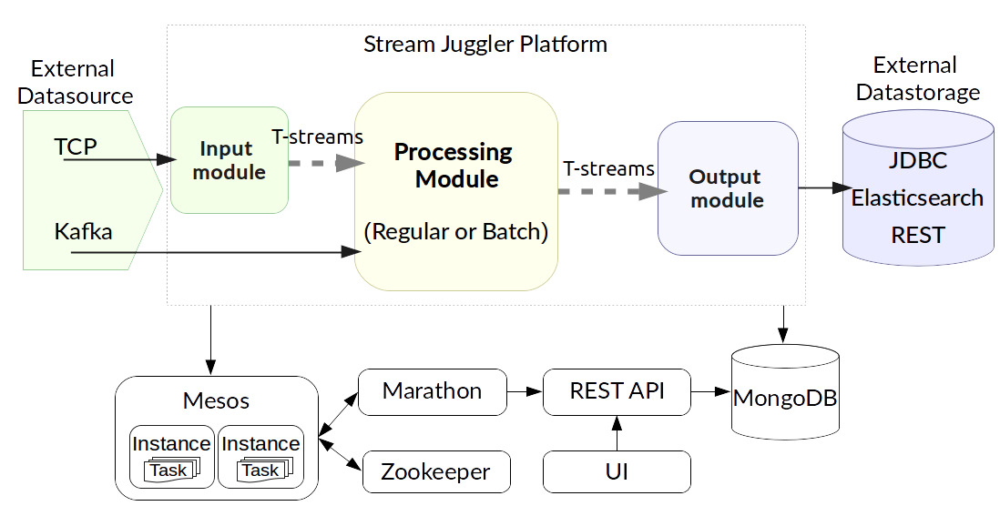

.. _Architecture:

Stream Juggler Architecture
==============================

Architecture Overview
-------------------------

A good real-time data processing architecture needs to be fault-tolerant and scalable; it needs to support micro-batch and event-by-event data processing, and must be extensible. All these aspects are fulfilled in the Stream Juggler Platform. 

The Stream Juggler Platform is an integrated processing system. It means the system includes all the parts required to achieve goals: parts for computation, administration, components for processing pipeline building. These ready-to-use components can be rearranged in different pipelines that allows to build sophisticated processing graphs to customize the system.

SJ-Platform's architecture is designed so that exactly-once processing is performed not only within a single processing block but throughout the entire platform, starting from the moment stream events are fed to the system and up to the moment when the output data is stored to conventional data storage.

The approach based on loosely coupled blocks with exactly-once processing support throughout the entire sequence allows for decomposing data processing in order to provide better modularity, performance management and simplicity in development.

At this section we will take a closer look into the system components, their functions within the data flow pipeline.

But previously, let's get the general idea of the platform structure and concepts.

General Concepts
------------------------

The Stream Juggler Platform performs data processing that is fulfilled in modules. A module is a processor. The mode of processing in it is determined by a set of configurations uploaded to the system via the UI. 

The events enter the processor in streams from a list of supported interfaces - TCP, Kafka and T-streams. A result data are put into an external datastorage. 

.. figure:: _static/Overview2.png

Actually, the platform represents a pipeline of modules that perform input data transformation, computation and result data exporting.

Below the general concepts fulfilled within the platform are presented.

SJ-Platform performs a **real-time data processing**. That means the system can handle events as soon as they are available inside the system without specific delay. 

The events are guaranteed to be processed **exactly-once**. The key idea of exactly-once processing lies in a group **checkpoint**. That means all producers and consumers are bunched into a group and do a checkpoint automatically fixing the current state.

Storing the variables in a state fulfills the idea of Platform`s **fault-tolerance**. In case of the live datastream processing failure, the variables stored in the state are recovered and the module is restarted.

The events enter the platform in streams from a list of supported interfaces - TCP, Kafka and T-streams. 

Streams can be very intensive and all events can not be handled by a single server of arbitrary performance. The system allows **scaling** the computations horizontally to handle increasing demands.

The streaming layer allows handling the idea of **parallelism** through multipartitioning. The data elements in a stream are assembled in partitions.  A **partition** is a part of a data stream allocated for convenience in operation. Upon creation, every stream gets a name and a certain amount of partitions. The parallelism is enabled by dividing existing partitions fairly among modules' tasks and it enables to scale the data processing. Partitions are also helpful in distributing processing load between several workers.

The platform features presented above are responsible for the architecture developed for SJ-Platform.

Platform Components
------------------------

The diagram below presents the structure of the SJ-Platform. 

Figuratively, it can be divided into two layers. 

The *first layer* – data processing – is provided by the Stream Juggler Platform. At this layer the data processing itself is performed via custom modules. The ingested data is transformed into streams, processed and sent to an external storage.  Data transformation and computation are the two major tasks of this layer.

In the diagram this layer is placed within the Stream Juggler Platform area. More information on module workflow you can find at the :ref:`Modules` page.

The *second layer* is composed of prerequisites for the platform. These are the services and settings that should be deployed prior to exploring the Stream Juggler Platform features. The services at this layer are responsible for input data ingestion, platform management, data storage. In the diagram they are placed beyond the Stream Juggler Platform area.

- Resource management is fulfilled via `Apache Mesos <http://mesos.apache.org/>`_ that allows to run the system at scale and to support different types of workloads.

- To start applicable services in Mesos cloud we use `Docker <http://mesos.apache.org/documentation/latest/docker-containerizer/>`_

- The support for Mesos containers and Docker is provided by `Marathon <https://mesosphere.github.io/marathon/>`_ that allows to run long-life tasks as well.

- For starting periodic tasks `Chronos <https://mesos.github.io/chronos/>`_ is used.

- To perform leader election in the event that the currently leading Marathon instance fails `ZooKeeper <https://zookeeper.apache.org/>`_ is used. ZooKeeper is also responsible for instance task synchronization for a Batch module.

- For base service search `Mesos+Consul <https://github.com/CiscoCloud/mesos-consul>`_ is used.

- Data sources for the platform are `Netty <https://netty.io/>`_ and `T-streams <https://t-streams.com>`_ libraries and `Kafka <https://kafka.apache.org/>`_. For starting Kafka we use `Kafka on Mesos <https://github.com/mesos/kafka>`_.

- The outcoming data is stored to Elasticsearch, JDBC or REST external storages.

- We use `MongoDB <https://www.mongodb.com/>`_ as a document database that provides high performance and availability. All created platform entities (Providers, Services, Streams, Instances, etc.) as well as Config Settings are stored here. To start MongoDB in Mesos we use `MongoDB-Marathon Docker <https://hub.docker.com/r/tobilg/mongodb-marathon/>`_

- For external access a custom-container on `NGINX <https://www.nginx.com>`_ is used. 

The platform kernel is coded in Scala.

The UI is presented via Node JS.

The diagram below represents the interconnections between platform components.

.. figure:: _static/SJComponentDiagram.png

Every component deployed to the Stream Juggler Platform contributes to the main idea of hitting three V-s of data processing:

- Volume 
    The system is scalable and perfectly fits for large data processing
    
- Velocity 
    The Stream Juggler Platform is the solution for real-time processing that means the system can handle events as soon as they are available inside the system without specific delay
    
- Variety 
    The SJ-Platform components are ready-to-use and can be reorganized in various pipelines. Besides, the system  is compatible with different types of data sources, data storages, services and systems. 

Stream Juggler Platform provides `UI <http://streamjuggler.readthedocs.io/en/develop/SJ_UI_Guide.html>`_ and `REST <http://streamjuggler.readthedocs.io/en/develop/SJ_CRUD_REST_API.html>`_ for a platform user to create a processing sequence of arbitrary complexity, watch it in action and manage it.

Stream Juggler Platform easily integrates with in-memory grid systems, for example, Hazelcast, Apache Ignite.

The systems is available under Apache License v2. 
    
