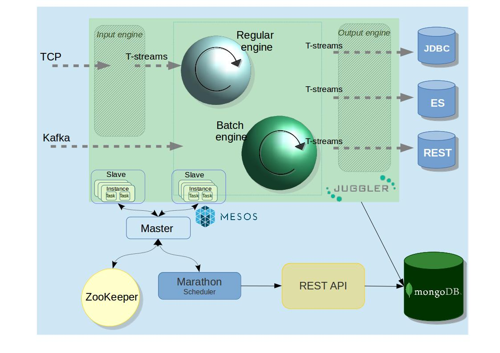

Stream Juggler Architecture
==============================

Architecture Overview
-------------------------

A good real-time data processing architecture needs to be fault-tolerant and scalable; it needs to support batch and incremental data processing, and must be extensible. All these aspects are fulfilled in the Stream Juggler platform.

The Stream Juggler is an integrated processing system. It means the system includes all the parts required to achieve goals.  At the same time these ready-to-use components can be reused in different pipelines. That allows to build sophisticated processing graphs to customize the system.
At this section we will take a closer look into the system components, their functions within the data flow pipeline.

Platform Components
------------------------

The diagram below presents the structure of the platform. 

Figuratively, it can be divided into two layers. 

The first layer – data processing – is provided by Stream Juggler. At this layer the data processing itself is performed via modules. The ingested data is transformed into streams, processed and sent to an external storage. Data transformation and computation are the two major tasks of this layer.

This layer is marked with green in the diagram.
The second layer is composed of prerequisites for the platform. These are the services and settings that should be deployed prior to exploring the Stream Juggler features. The services at this layer are responsible for input data ingestion, platform management, data storage...

