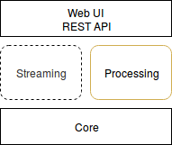
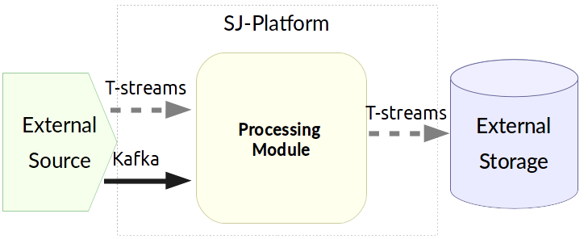
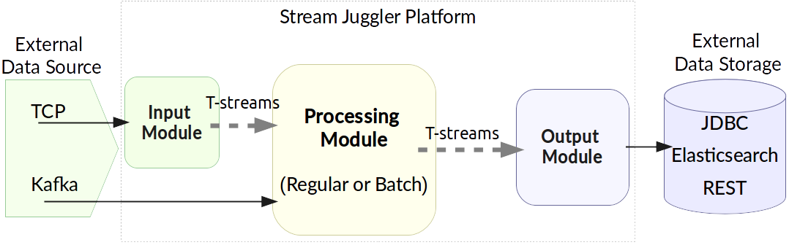
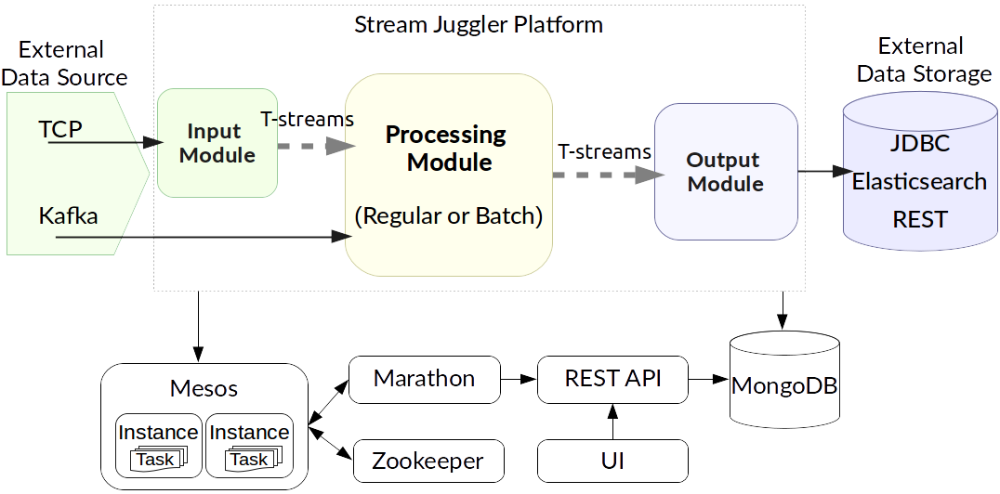

.. _Architecture:

Stream Juggler Architecture
==============================

A good real-time data processing architecture needs to be fault-tolerant and scalable; it needs to support micro-batch and event-by-event data processing and must be extensible. All these aspects are fulfilled in the Stream Juggler Platform. 

The Stream Juggler Platform is an integrated processing system. It means the system includes all the parts required to achieve goals: parts for computation, administration, components for processing pipeline building. These ready-to-use components can be rearranged in different pipelines. That allows building sophisticated processing graphs to customize the system.

SJ-Platform's architecture is designed so that exactly-once processing is performed not only within a single processing block but throughout the entire platform, starting from the moment stream events are fed to the system and up to the moment when the output data is stored in conventional data storage.

The approach based on loosely coupled blocks with exactly-once processing support throughout the entire sequence allows for decomposing data processing in order to provide better modularity, performance management and simplicity in development.

At this section, we will take a closer look into the system components, their functions within the data flow pipeline.

But previously, let's get the general idea of the platform structure and concepts.

Architecture Overview
-------------------------

The platform features presented above have conditioned the architecture developed for SJ-Platform. The platform is made up of the following components:

1) **Processing** component for data computation,
2) **Streaming** component for data transportation,
3) **Core** component for task execution,
4) **API/UI** component for administration.

The Stream Juggler Platform performs data processing that is fulfilled in modules. A module is a processor. The mode of processing in it is determined by a set of configurations uploaded to the system via the UI.

The events enter the processor in streams from a list of supported interfaces - TCP, Kafka and T-streams. A result data are put into an external data storage.

SJ-Platform performs **real-time data processing**. That means the system can handle events as soon as they are available inside the system without specific delay. 

Streams can be very intensive and all events can not be handled by a single server of arbitrary performance. The system allows **scaling** the computations horizontally to handle increasing demands.

The events are guaranteed to be processed **exactly-once**. The key idea of exactly-once processing lies in a group **checkpoint**. That means all producers and consumers of a stream are bunched into a group and do a checkpoint automatically fixing the current state. Moreover, an additional checkpoint is possible whenever it is necessary.

Storing the variables in a state fulfills the idea of SJ-Platform`s **fault-tolerance**. In the case of a live data stream processing failure, the variables stored in the state are recovered and the module is restarted.

The streaming layer allows handling the idea of **parallelism** through multi-partitioning. The data elements in a stream are assembled in partitions.  A **partition** is a part of a data stream allocated for convenience in operation. Upon creation, every stream gets a name and a certain amount of partitions. The parallelism is enabled by dividing existing partitions fairly among modules' tasks and it enables to scale the data processing. Partitions are also helpful in distributing processing load between several workers.

SJ-Platform provides a developer with the comprehensive **API** and **UI**, which allow him to develop, customize and manage the event processing pipeline.

The core component is presented with Mesos and other services that simplify the deployment and operation and support best industrial practices. 

Platform Components
------------------------
Now let's have a look at each component in detail.

The *Core* is composed of prerequisites for the platform. These are the services and settings that should be deployed prior to exploring the Stream Juggler Platform features. The services at this layer are responsible for input data ingestion, platform management, data storage. 

- Resource management is fulfilled via `Apache Mesos <http://mesos.apache.org/>`_ that allows to run the system at scale and to support different types of workloads.

- To start applicable services in Mesos cloud we use `Docker <http://mesos.apache.org/documentation/latest/docker-containerizer/>`_

- The support for Mesos containers and Docker is provided by `Marathon <https://mesosphere.github.io/marathon/>`_ that allows running long-life tasks as well.

- For starting periodic tasks `Chronos <https://mesos.github.io/chronos/>`_ is used.

- To perform leader election in the event that the currently leading Marathon instance fails `ZooKeeper <https://zookeeper.apache.org/>`_ is used. ZooKeeper is also responsible for instance task synchronization for a Batch module.

- For base service search `Mesos+Consul <https://github.com/CiscoCloud/mesos-consul>`_ is used.

- Data sources for the platform are `Netty <https://netty.io/>`_ and `T-streams <https://t-streams.com>`_ libraries and `Kafka <https://kafka.apache.org/>`_. For starting Kafka we use `Kafka on Mesos <https://github.com/mesos/kafka>`_.

- The outcoming data is stored to Elasticsearch, JDBC or REST external storages.

- We use `MongoDB <https://www.mongodb.com/>`_ as a document database that provides high performance and availability. All created platform entities (Providers, Services, Streams, Instances, etc.), as well as Config Settings are stored here. To start MongoDB in Mesos we use `MongoDB-Marathon Docker <https://hub.docker.com/r/tobilg/mongodb-marathon/>`_

- For external access, a custom-container on `NGINX <https://www.nginx.com>`_ is used. 

The platform kernel is coded in Scala.

The UI is presented via Node JS.

The *Processing component* is provided by the Stream Juggler Platform. At this layer, the data processing itself is performed via modules, or processors. In fact, the platform represents a pipeline of modules.

The major one is the **Pipeline Stream Processor** (PSP) that handles data processing inside the pipeline. Two types of PSP exist in SJ-Platform:

- Regular – the most generic processor which receives event, does some data transformation and sends transformation to the next processing step.

- Windowed (Batch) – the processor which organizes incoming data into batches and processing is done with a sliding window. Windowed PSP may be used to implement streaming joins and processing where algorithm must observe a range of input messages rather than current one.

As PSP receives data from Kafka and T-streams, and data can be passed from other sources, there is a need in an input module. The **Input Stream Processor** (ISP) handles external inputs, does data deduplication, transforms raw data into objects for T-streams. Currently, the platform supports the TCP Input Stream Processor.

To receive the result of processing an output module is required. The **Output Stream Processor** (OSP) handles external output from event processing pipeline to external data destinations (Elasticsearch, JDBC, etc.).

So the pipeline may look like at the scheme:

At the Processing platform component, the ingested data is transformed into streams, processed and sent to an external storage.  Data transformation and computation are the two major tasks of this component.

.. tip:: More information on module workflow you can find at the :ref:`Modules` page.

The *Streaming component* is essential in SJ-Platform. The data is fed to the system, transported between modules and exported to an external storage via streams. It is streaming that makes possible such platform features as exactly-once processing, parallelism, fault-tolerance, horizontal scalability

The data can be received from different sources. Currently, the platform supports obtaining data from TCP sockets and Kafka.

Using **TCP** as an input source a custom protocol can be applied for receiving events, deduplicating them and putting into the processing pipeline.

SJ-Platform supports **Apache Kafka** as a standard providing a common interface for integration for most applications.

Within the platform, the data is transported to and from modules via *transactional streams* or **T-streams**. It is a message broker and a Scala library native to SJ-Platform and designed primarily for exactly-once processing  (so it includes a transactional producer, a consumer and a subscriber). More information on T-streams can be found at `the project site <http://t-streams.com/>`_. 

*Administration* of the platform is performed through `the UI <http://streamjuggler.readthedocs.io/en/develop/SJ_UI_Guide.html>`_. It is presented via Node JS. The platform UI provides `REST <http://streamjuggler.readthedocs.io/en/develop/SJ_CRUD_REST_API.html>`_ API instrumentation that allows interacting with the platform, monitoring the module performance, retrieving metrics data and configuration information as well as managing operations such as starting or stopping modules.

The general structure of SJ-Platform can be rendered as at the scheme below where all the mentioned above  components are presented in detail:

The diagram below represents the interconnections between platform components. 

SJ-Platform uses a range of data sources and data storages. Client operates the platform via REST API/UI. And he/she uploads a custom module to the platform with a set of configurations. The platform runs the module via an "executable" engine on Mesos and Marathon that also uses MongoDB as a data store.

.. figure:: _static/SJComponentDiagram.png

Every component deployed to the Stream Juggler Platform contributes to the main idea of hitting three V-s of data processing:

- Volume 
    The system is scalable and perfectly fits for large data processing.
    
- Velocity 
    The Stream Juggler Platform is the solution for real-time processing that means the system can handle events as soon as they are available inside the system without specific delay.
    
- Variety 
    The SJ-Platform components are ready-to-use and can be reorganized in various pipelines. Besides, the system is compatible with different types of data sources, data storages, services and systems. 

Stream Juggler Platform easily integrates with in-memory grid systems, for example, Hazelcast, Apache Ignite.

The systems is available under Apache License v2. 
    
    
