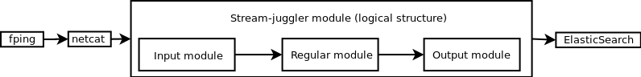
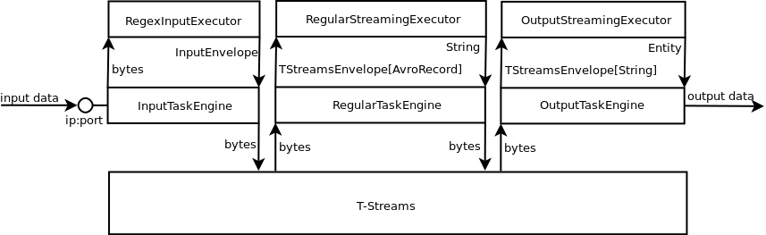

Custom Module Development Guide
======================================

.. Contents::

Under this section how to write your own module for the Stream Juggler will be described.

Stream Juggler is a platform for your custom module implementation. It allows to adjust the system to your custom aims. Creation of a custom module will not become a challenge for a practicing developer or a programmer as no special tools or services are necessary.

Prior to the module development, please, take a look at the platform :ref:`Architecture` and :ref:`Modules`.

As a simple refresher, processing modules in Stream Juggler can be of the following types:

1. Input module - It handles external inputs, does data deduplication, transforms raw data to objects.
2. Processing module:

- Regular-streaming - A generic module which receives an event, does some data transformation and sends it to the next processing step.
- Batch-streaming - It organizes incoming data into batches and processing is performed with sliding window. Batch module may be used to implement streaming joins and processing where algorithm must observe the range of input messages rather than a current one.

3. Output module - It handles the data outcoming from event processing pipeline to external data destinations (Elasticsearch, JDBC, etc.).

The workflow of the platform implies the structure:

1. As incoming information can be fed to a processing module in T-streams or Kafka, the input module is necessary at the first step of ingesting data to transform it from TCP into T-streams. If you want to process the data from Kafka, the input module is not required.
2. A processing module performs the main transformation and calculation of data. It accepts data via T-streams and Kafka. The processed data is put into T-streams only. So an output module is required in the next step.
3. An output module is necessary to transform the data from T-streams into the result data of the type appropriate for the external storage.

.. figure:: _static/ModulePipeline.png

Below you will find the instructions on custom module creation in Scala.

Before Starting With Modules
--------------------------------------------------
The instructions below are given for assembling a .jar file via sbt in Scala.

It is meant that all necessary services are deployed for the module and you know for sure:

- what type of module you want to create;
- what type of inputs/outputs are necessary for it;
- what engine will be used (it should exist in the database);
- what type of external storage you are going to use for result data.

Input Streaming Custom Module
---------------------------------
1) Create a new sbt project depending on sj-engine-core library, i.e. use the latest version from https://mvnrepository.com/artifact/com.bwsw in your `build.sbt` file.
2) Create an executor class inheriting InputStreamingExecutor class and override some methods if necessary (:ref:`input-module`)
3) Create a validator class inheriting StreamingValidator class and override the validate method if necessary (:ref:`validator`)
4) Create `specification.json` in a resources folder and fill it in as shown in the example (:ref:`Json_schema`).
5) Assemble a jar of your module by calling sbt instruction from the project folder, e.g. 'sbt my-input-module/assembly'
6) Upload the module (via UI or REST)
7) Create an instance of the module (via UI or REST)
8) Launch the instance. 

.. note:: You can use a module simulator for preliminary testing of executor work (:ref:`Input_Engine_Simulator`).

Regular Streaming Custom Module
---------------------------------
1) Create a new sbt project depending on sj-engine-core library, i.e. use the latest version from https://mvnrepository.com/artifact/com.bwsw in your build.sbt file.
2) Create an executor class inheriting RegularStreamingExecutor class and override some methods if necessary (:ref:`regular-module`)
3) Create a validator class inheriting StreamingValidator class and override the validate method if necessary (:ref:`validator`)
4) Create `specification.json` in a resources folder and fill it in as shown in the example (:ref:`Json_schema`). 
5) Assemble a jar of your module by calling sbt instruction from project folder, e.g. 'sbt my-regular-module/assembly' 
6) Upload the module (via REST or UI)
7) Create an instance of the module (via REST or UI)
8) Launch the instance. 

.. note:: You can use a module simulator for preliminary testing of executor work (:ref:`Regular_Engine_Simulator`).

Batch Streaming Custom Module
------------------------------------
1) Create a new sbt project depending on sj-engine-core library, i.e. use the latest version from https://mvnrepository.com/artifact/com.bwsw in your build.sbt file.
2) Create an executor class inheriting BatchStreamingExecutor class and override some methods if necessary (:ref:`batch-module`)
3) Create a batch collector inheriting BatchCollector class and override the required methods (:ref:`Batch-Collector`)
4) Create a validator class inheriting StreamingValidator class and override the validate method if necessary (:ref:`validator`)
5) Create `specification.json` in a resources folder and fill it in as shown in the example (:ref:`Json_schema`).
6) Assemble a jar of your module by calling sbt instruction from project folder, e.g. 'sbt my-batch-module/assembly' 
7) Upload the module (via REST or UI)
8) Create an instance of the module (via REST or UI)
9) Launch the instance. 

.. note:: You can use a module simulator for preliminary testing of executor work (:ref:`Batch_Engine_Simulator`).

Output Streaming Custom Module
-----------------------------------------------
1) Create a new sbt project depending on sj-engine-core library, i.e. use the latest version from https://mvnrepository.com/artifact/com.bwsw in your build.sbt file.
2) Create an executor class inheriting OutputStreamingExecutor class and override some of methods if necessary (:ref:`output-module`)
3) Create a validator class inheriting StreamingValidator class and override the validate method if necessary (:ref:`validator`)
4) Create `specification.json` in a resources folder and fill it in as shown in the example (:ref:`Json_schema`).

.. note:: Stream types for output-streaming module:
 
 - stream.t-stream (only for incoming streams)
 - elasticsearch-output (output stream)
 - jdbc-output (output stream)
 - rest-output (output stream)

5) Create class of entity that extends OutputEnvelope. Override method "getFieldsValue".
6) Assemble a jar of your module by calling sbt instruction from the project folder, e.g. 'sbt my-output-module/assembly' 
7) Create an index in Elasticsearch and the index mapping, or a table in a database, or deploy some REST service. Name of index is provided in Elasticsearch service. A table name and a document type is a stream name. A full URL to entities of the REST service is "http://<host>:<port><basePath>/<stream-name>"
8) Upload the module (via Rest API or UI)
9) Create an instance of the module  (via Rest API or UI)
10) Launch the instance. 

.. note:: You can use a module simulator for preliminary testing of executor work (:ref:`Output_Engine_Simulator`).

Hello World Custom Module
------------------------------

This tutorial explains how to write a module using a simple Hello World example. Let's create a module together!

Prerequisites 
~~~~~~~~~~~~~~~~~~~~~~~
First of all you should:

- follow the deployment process described in :ref:`Minimesos_deployment` up to Point 9 inclusive
- OR follow the deployment process described :ref:`Mesos_deployment` up to Point 7 inclusive

And remember <ip> of the machine that everything is deployed on and <port> of deployed SJ-REST (in Minimesos deployment it is written in Point 7 in variable `$address`, in Mesos deployment it is written in Point 4 in variable `$address`).

Task description 
~~~~~~~~~~~~~~~~~~~~~~~~~~~~
Then we postulate the task to be resolved.

In this example we are going to write the system to aggregate information about nodes accessibility. Raw data are provided by fping utility.

An example of fping utility usage::

 fping -l -g 91.221.60.0/23 2>&1 | awk '{printf "%s ", $0; system("echo $(date +%s%N | head -c -7)")}'

Here we are going to ping all addresses in particular subnet indefinitely. Result of fping utility execution is a stream of lines which looks like::

 91.221.60.14  : [0], 84 bytes, 0.46 ms (0.46 avg, 0% loss)
 91.221.61.133 : [0], 84 bytes, 3.76 ms (3.76 avg, 0% loss)
 <...>

We process them via awk utility, just adding current system time to the end of the line::

 91.221.60.77  : [0], 84 bytes, 0.84 ms (0.84 avg, 0% loss) 1499143409312
 91.221.61.133 : [0], 84 bytes, 0.40 ms (0.40 avg, 0% loss) 1499143417151
 <...>

There could be error messages as output of fping utility which are sent to stdout, that's why all of them look like::

 ICMP Unreachable (Communication with Host Prohibited) from 91.221.61.59 for ICMP Echo sent to 91.221.61.59 1499143409313
 ICMP Unreachable (Communication with Host Prohibited) from 91.221.61.215 for ICMP Echo sent to 91.221.61.215 1499143417152
 <...>

As we can see, awk processes them too - so there is also timestamp in the ends of error lines.

So, there could be 2 types of lines:

* Normal answer::
 
 91.221.61.133 : [0], 84 bytes, 0.40 ms (0.40 avg, 0% loss) 1499143417151

And we are interested only in three values from it: 

 - IP (91.221.60.77), 
 - response time (0.40 ms), 
 - timestamp (1499143417151)

* Error answer::

 ICMP Unreachable (Communication with Host Prohibited) from 91.221.61.59 for ICMP Echo sent to 91.221.61.59 1499143409313

And we are interested only in two values from it: 
   
* IP (91.221.61.59), 
* timestamp (1499143409313)

Everything we receive from 'fping + awk' pipe is going to our configured stream-juggler module, which aggregates all data for every needed amount of time, e.g. for 1 minute, and provides output like::

 <timestamp of last response> <ip> <average response time> <total amount of successful packets> <total amount of unreachable responses> <total amount of packets sent>
 
for all IPs it has received data about at that particular minute.

All output data we are going to send into ElasticSearch to store them and have an ability to show on plot (via Kibana).

Basic classes description 
~~~~~~~~~~~~~~~~~~~~~~~~~~~~~~~~
Let's create classes for the described input and output data of stream-juggler module.

As we can see, there are common fields in 'fping + awk' output normal and error records: IP and timestamp.

So, we can create abstract common class::

 abstract class PingResponse {
  val ts: Long
  val ip: String
 }

And then extend it by `EchoResponse` and `UnreachableResponse` classes::

 case class EchoResponse(ts: Long, ip: String, time: Double) extends PingResponse
 case class UnreachableResponse(ts: Long, ip: String) extends PingResponse

There was two classes for input records. But we need to aggregate data inside our module, so let's create internal class - `PingState`::

 case class PingState(lastTimeStamp: Long = 0, totalTime: Double = 0, totalSuccessful: Long = 0, totalUnreachable: Long = 0) {

  // This one method is needed to update aggregated information.
  def += (pingResponse: PingResponse): PingState = pingResponse match {
    case er: EchoResponse => PingState(er.ts, totalTime + er.time, totalSuccessful + 1, totalUnreachable)
    case ur: UnreachableResponse => PingState(ur.ts, totalTime, totalSuccessful, totalUnreachable + 1)
  }

  // Returns description
  def getSummary(ip: String): String = {
    lastTimeStamp.toString + ',' + ip + ',' +
    {
      if(totalSuccessful > 0) totalTime / totalSuccessful
      else 0
    } + ',' +
    totalSuccessful + ',' + totalUnreachable
  }
 }

Let's then create an output class (name it `PingMetrics`), which contains all fields we need::

 class PingMetrics {
  var ts: Date = null
  var ip: String = null
  var avgTime: Double = 0
  var totalOk: Long = 0
  var totalUnreachable: Long = 0
  var total: Long = 0
 }

But there is a condition: an output class should extend `OutputEnvelope` abstract class of the stream-juggler engine::

 abstract class OutputEnvelope {
  def getFieldsValue: Map[String, Any]
 }

It has one method - `getFieldsValue` - which is needed to obtain map[fieldName: String -> fieldValue: Any].

So, we need a set of variables with names of fields. Looks like all of them will be constants, that's why we include them into companion class::

 object PingMetrics {
  val tsField = "ts"
  val ipField = "ip"
  val avgTimeField = "avg-time"
  val totalOkField = "total-ok"
  val totalUnreachableField = "total-unreachable"
  val totalField = "total"
 }

And override the `getFieldsValue` method in the following way::

 class PingMetrics extends OutputEnvelope {

  import PingMetrics._

  var ts: Date = null
  var ip: String = null
  var avgTime: Double = 0
  var totalOk: Long = 0
  var totalUnreachable: Long = 0
  var total: Long = 0

  override def getFieldsValue = {
    Map(
      tsField -> ts,
      ipField -> ip,
      avgTimeField -> avgTime,
      totalOkField -> totalOk,
      totalUnreachableField -> totalUnreachable,
      totalField -> total
    )
  }
 }

Processing description 
~~~~~~~~~~~~~~~~~~~~~~~~~~~~~~~~
Architecture of our solution is going to look like at the schema below:

Netcat appears here because we will send our data to SJ-module via TCP connection.

That is general description.

If we look deeper in the structure, we will see the following data flow:

All input data elements are going as a flow of bytes to particular interface provided by `InputTaskEngine`. That flow is going straight to `RegexInputModule` (which extends `InputStreamingExecutor` interface) and converted to an `InputEnvelope` instance which stores all data as `AvroRecord` inside. 

An `InputEnvelope` instance then goes to `InputTaskEngine` which serializes it to the stream of bytes and then sends to T-Streams. 

`RegularTaskEngine` deserializes the flow of bytes to `TStreamsEnvelope[AvroRecord]` which is then put to `RegularStreamingExecutor`. 

`RegularStreamingExecutor` processes the received data and returns them as a result stream of strings. 

`RegularTaskEngine` serializes all the received data to the flow of bytes and puts it back to T-Streams. 

Then `OutputTaskEngine` deserializes the stream of bytes from T-Streams to TStreamsEnvelope[String] and sends it to `OutputStreamingExecutor`. `OutputStreamingExecutor` returns Entities back to `OutputTaskEngine`. They are then put to ElasticSearch.

Input module 
""""""""""""""""""

Input module is `RegexInputExecutor` (it extends `InputStreamingExecutor`) and it is provided via Sonatype repository. Its purpose (in general) is to process input stream of strings using regexp rules provided by a user and create `InputEnvelope` objects as a result.

The rules are described in `pingstation-input.json`. As we can see, there are rules for each type of input records and each has its own value in the `outputStream` fields: "echo-response" and "unreachable-response". 

So, `InputEnvelope` objects will be put into two corresponding streams.

Regular module
""""""""""""""""""""""

Data from both of these streams will be sent to Regular module. We choose Regular module because we need to process each input element separately. So we define an Executor class which extends `RegularStreamingExecutor`::

 class Executor(manager: ModuleEnvironmentManager) extends RegularStreamingExecutor[Record](manager)

A manager (of `ModuleEnvironmentManager` type) here is just a source of information and a point of access to several useful methods: get output, get state (for stateful modules to store some global variables), etc. We use Record (avro record) type here as a generic type because output elements of input module are stored as avro records.

The data will be received from two streams, each of them will have its own name, so let's create the following object to store their names::

 object StreamNames {
  val unreachableResponseStream = "unreachable-response"
  val echoResponseStream = "echo-response"
 }

And just import it inside our class::

 import StreamNames._

Regular module will get data from Input module element by element and aggregate it via state mechanism. On each checkpoint all aggregated data will be sent to Output module and the state will be cleared.

So we need to obtain the state in our class::

 private val state = manager.getState

To describe the whole logic we need to override the following methods:

- onMessage(envelope: TStreamEnvelope[T]) - to get and process messages
- onBeforeCheckpoint() - to send everything gained further
- deserialize(bytes: Array[Byte]) - to deserialize flow of bytes from T-Streams into AvroRecord correctly

Validator 
++++++++++++++++++

An instance contains a field `options` of String type. That field is used to send some configuration into module (for example, via this field regexp rules are passed to InputModule). This field is described in json-file for a particular module.

When this field is used its validation is handled with Validator class. So it is necessary to describe the Validator class here.

Input module uses `options` field to pass avro schema to Regular module. That's why we create Validator class in the following way (with constant field in singleton `OptionsLiterals` object)::

 object OptionsLiterals {
  val schemaField = "schema"
 }
 class Validator extends StreamingValidator {

  import OptionsLiterals._

  override def validate(options: String): ValidationInfo = {
    val errors = ArrayBuffer[String]()

    val jsonSerializer = new JsonSerializer
    val mapOptions = jsonSerializer.deserialize[Map[String, Any]](options)
    mapOptions.get(schemaField) match {
      case Some(schemaMap) =>
        val schemaJson = jsonSerializer.serialize(schemaMap)
        val parser = new Schema.Parser()
        if (Try(parser.parse(schemaJson)).isFailure)
          errors += s"'$schemaField' attribute contains incorrect avro schema"

      case None =>
        errors += s"'$schemaField' attribute is required"
    }

    ValidationInfo(errors.isEmpty, errors)
  }
 }

And then just try to parse the schema.

onMessage
+++++++++++++++

The 'onMessage' method is called every time the Executor receives an envelope.

As we remember, there are two possible types of envelopes: echo-response and unreachable-response, which are stored in two different streams. 

We obtain envelopes from both of them and the name of the stream is stored in the `envelope.stream` field::

 val maybePingResponse = envelope.stream match {
	case `echoResponseStream` =>
	// create EchoResponse and fill its fields
	case `unreachableResponseStream` =>
	// create UnreachableResponse and fill its fields
	case stream =>
	// if we receive something we don't need
 }

The `envelope.data.head` field contains all data we need and its type is avro record. 

So the next step is obvious - we will use Try scala type to cope with possibility of a wrong or a corrupted envelope::

 val maybePingResponse = envelope.stream match {
  case `echoResponseStream` =>
    Try {
      envelope.data.dequeueAll(_ => true).map { data =>
        EchoResponse(data.get(FieldNames.timestamp).asInstanceOf[Long],
          data.get(FieldNames.ip).asInstanceOf[Utf8].toString,
          data.get(FieldNames.latency).asInstanceOf[Double])
      }
    }

  case `unreachableResponseStream` =>
    Try {
      envelope.data.dequeueAll(_ => true).map { data =>
        UnreachableResponse(data.get(FieldNames.timestamp).asInstanceOf[Long],
          data.get(FieldNames.ip).asInstanceOf[Utf8].toString)
      }
    }

  case stream =>
    logger.debug("Received envelope has incorrect stream field: " + stream)
    Failure(throw new Exception)
 }

And then just process `maybePingResponse` variable to obtain actual `pingResponse` or to finish execution in case of an error::

 val pingResponses = maybePingResponse.get

After unfolding an envelope we need to store it (and to aggregate information about each host). As mentioned, we will use state mechanism for this purpose.

The following code does what we need::

 if (state.isExist(pingResponse.ip)) {
  // If IP already exists, we need to get its data, append new data and put everything back (rewrite)
  val pingEchoState = state.get(pingResponse.ip).asInstanceOf[PingState]
  state.set(pingResponse.ip, pingEchoState + pingResponse)
 } else {
  // Otherwise - just save new one pair (IP - PingState)
  state.set(pingResponse.ip, PingState() + pingResponse)
 }

So, here is the whole code that we need to process a new message in our Executor class::

 class Executor(manager: ModuleEnvironmentManager) extends RegularStreamingExecutor[Record](manager) {
  private val state = manager.getState
  override def onMessage(envelope: TStreamEnvelope[Record]): Unit = {
    val maybePingResponse = envelope.stream match {
      case `echoResponseStream` =>
        Try {
          envelope.data.dequeueAll(_ => true).map { data =>
            EchoResponse(data.get(FieldNames.timestamp).asInstanceOf[Long],
              data.get(FieldNames.ip).asInstanceOf[Utf8].toString,
              data.get(FieldNames.latency).asInstanceOf[Double])
          }
        }

      case `unreachableResponseStream` =>
        Try {
          envelope.data.dequeueAll(_ => true).map { data =>
            UnreachableResponse(data.get(FieldNames.timestamp).asInstanceOf[Long],
              data.get(FieldNames.ip).asInstanceOf[Utf8].toString)
          }
        }

      case stream =>
        logger.debug("Received envelope has incorrect stream field: " + stream)
        Failure(throw new Exception)
    }

    val pingResponses = maybePingResponse.get

    pingResponses.foreach { pingResponse =>
      if (state.isExist(pingResponse.ip)) {
        val pingEchoState = state.get(pingResponse.ip).asInstanceOf[PingState]
        state.set(pingResponse.ip, pingEchoState + pingResponse)
      } else {
        state.set(pingResponse.ip, PingState() + pingResponse)
      }
    }
  }
 }

onBeforeCheckpoint
++++++++++++++++++++++

A `onBeforeCheckpoint` method calling condition is described in 'pingstation-input.json' configuration file::

 "checkpointMode" : "every-nth",
 "checkpointInterval" : 10

So we can see it will be called after each 10 responses received in the `onMessage` method.

First of all we need to obtain an output object to send all data into. In this example we will use `RoundRobinOutput` because it is not important for us in this example how data would be spread out of partitions::

 val outputName: String = manager.outputs.head.name
 val output: RoundRobinOutput = manager.getRoundRobinOutput(outputName)

In `manager.outputs` all output streams are returned. In this project there would be only one output stream, so we just get its name. And then we obtain `RoundRobinOutput` object for this stream via `getRoundRobinOutput`.

Then we will use a `state.getAll()` method to obtain all data we collect right now. 

It returns Map[String, Any]. We use the following code to process all elements::

 // Second one element here is converted to PingState type and is put to output object via getSummary convertion to string description.
 case (ip, pingState: PingState) =>
      output.put(pingState.getSummary(ip))

 case _ =>
      throw new IllegalStateException

 Full code of onBeforeCheckpoint method:
 override def onBeforeCheckpoint(): Unit = {
  val outputName = manager.outputs.head.name
  val output = manager.getRoundRobinOutput(outputName)

  state.getAll.foreach {
    case (ip, pingState: PingState) =>
      output.put(pingState.getSummary(ip))

    case _ =>
      throw new IllegalStateException
  }

  state.clear
 }

deserialize
+++++++++++++++++++

This method is called when we need to correctly deserialize the flow of bytes from T-Streams into AvroRecord.

There is `AvroSerializer` class which shall be used for this purpose. But due to the features of Avro format we need `avroSchema` to do that properly. 

Avro schema is stored into `manager.options` field. 

So, the next code listing shows the way of creating `AvroSerialiser` and obtaining avro scheme::

 private val jsonSerializer: JsonSerializer = new JsonSerializer
 private val mapOptions: Map[String, Any] = jsonSerializer.deserialize[Map[String, Any]](manager.options)
 private val schemaJson: String = jsonSerializer.serialize(mapOptions(schemaField))
 private val parser: Parser = new Schema.Parser()
 private val schema: Schema = parser.parse(schemaJson)
 private val avroSerializer: AvroSerializer = new AvroSerializer
 override def deserialize(bytes: Array[Byte]): GenericRecord = avroSerializer.deserialize(bytes, schema)

specification.json
++++++++++++++++++++++

This file describes the module. Examples of description can be found here :ref:`Json_schema`.

Output module 
""""""""""""""""""

We define Executor class (in another package), which extends `OutputStreamingExecutor`::

 class Executor(manager: OutputEnvironmentManager) extends OutputStreamingExecutor[String](manager)

Manager here (of `OutputEnvironmentManager` type) is also a point of access to some information but in this example we will not use it.

Type of data sent by Regular module is String that's why this type is used as a template type.

We will need to override two methods:

- onMessage(envelope: TStreamEnvelope[String]) - to get and process messages
- getOutputEntity() - to return format of output records

Validator 
+++++++++++++

Validator class here is empty due to absence of extra information on how we need to process data from Regular module.

onMessage 
+++++++++++++

The full code of this method is listed below::

 override def onMessage(envelope: TStreamEnvelope[String]): mutable.Queue[PingMetrics] = {
	val list = envelope.data.map { s =>
	  val data = new PingMetrics()
	  val rawData = s.split(",")
	  data.ts = new Date(rawData(0).toLong)
	  data.ip = rawData(1)
	  data.avgTime = rawData(2).toDouble
	  data.totalOk = rawData(3).toLong
	  data.totalUnreachable = rawData(4).toLong
	  data.total = data.totalOk + data.totalUnreachable
	  data
	}

	list
 }

All data are in the 'envelope' data field. 

So, for each record in this field we create a new `PingMetrics` instance and fill in all corresponding fields. Then just return sequence of these objects.

getOutputEntity 
++++++++++++++++++

Signature of the method looks like::

 override def getOutputEntity: Entity[String]

It returns instances of Entity[String] - that class contains metadata on `OutputEnvelope` structure: map (field name -> field type) (Map[String, NamedType[T]]).

In file 'es-echo-response-1m.json' we use `elasticsearch-output` string as a value of `type` field. It means that we will use ElasticSearch as output of our sj-module. Other possible variants are REST and JDBC.

So, for ElasticSearch destination type we shall use appropriate builder in 'getOutputEntity' (there are three of them - one for each type) and just describe all fields we have::

 override def getOutputEntity: Entity[String] = {
	val entityBuilder = new ElasticsearchEntityBuilder()
	val entity: Entity[String] = entityBuilder
	  .field(new DateField(tsField))
	  .field(new JavaStringField(ipField))
	  .field(new DoubleField(avgTimeField))
	  .field(new LongField(totalOkField))
	  .field(new LongField(totalUnreachableField))
	  .field(new LongField(totalField))
	  .build()
	entity
 }

specification.json 
+++++++++++++++++++++

This file describes the module. Examples of description can be found at :ref:`Json_schema`.
