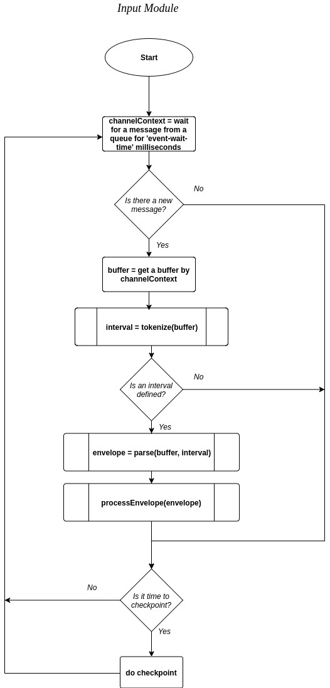
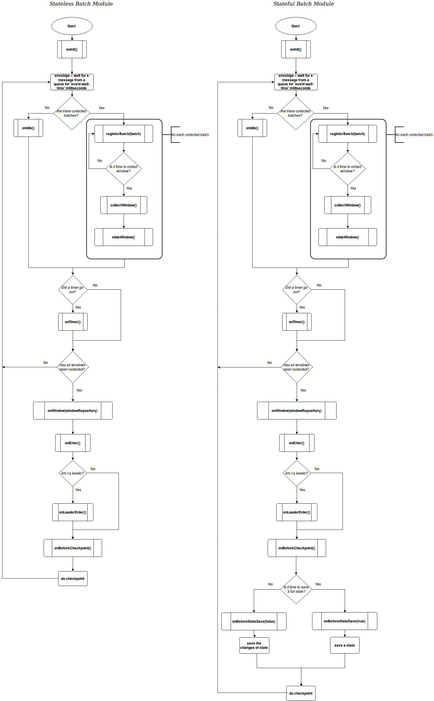
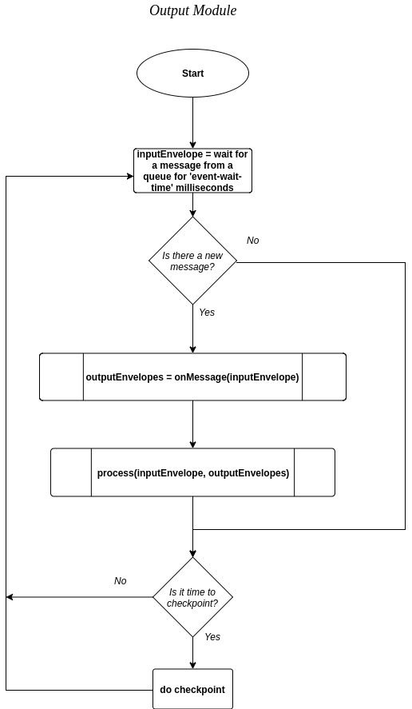

.. _Engines:

Engines: types, workflow 
==============================

.. Contents::

An **engine** is the base of the system. It provides basic I/O functionalities. It is started via a Mesos framework which provides distributed task dispatching and then the statistics on task execution. The engine performs data processing using an uploaded module. 

An engine is required to start a module. A module can not process data streams without an engine (that is a .jar file containing necessary configuration settings) that launches the module ingesting raw data and sends the processed data further in the pipeline.

Engine Types
----------------------
The types of the engines correspond to the types of modules in the platform (see :ref:`Modules`): 

1. *Input Streaming Engine* 
2. *Output Streaming Engine*  
3. *Regular Streaming Engine*  
4. *Batch Streaming Engine*

Each engine has its unique workflow. 

.. _Input_Streaming_Engine:

Input Streaming Engine
~~~~~~~~~~~~~~~~~~~~~~~~~
Input streaming engine is required to run an input module (currently TCP Input Stream Module); it handles external inputs, does data deduplication, transforms raw data to objects. 

Here is the engine processing flow.

Input module waits for new events (messages) from the TCP channel. A wait time period (‘event-wait-time’) is 1000 ms by default. Once a new data portion is received, the “tokenize” method determins the beginning and the end of the Interval (i.e. significant set of bytes in the incoming flow of bytes). 

Once an Interval is set the buffer of incoming data is validated to define whether the Interval contains a message or meaningless data. If the buffer of incoming data is determined as a message it is checked for duplication and a key/id is assigned to it. At this stage the location where the data will be passed is attributed to the message (this is T-streams for the input module). The message is processed and passed further into T-streams after a checkpoint is done.

Via T-streams the message is sent further in the pipeline to the next stage of processing (to a Regular/Batch module).

.. tip:: The engine utilizes methods provided by its module. The description of the methods you can find at the :ref:`input-module` section.

.. _Regular_Streaming_Engine:

Regular Streaming Engine
~~~~~~~~~~~~~~~~~~~~~~~~~
Regular Streaming Engine receives incoming events and then passes data after transformation to the next processing step.

The processing flow for Regular Engine is presented below. 

.. figure:: _static/Regular_Engine.jpg

The diagram represents two types of processing:

- for a stateless mode of processing (the left schema). The module does not have a state that means it does not aggregate the incoming data via state mechanism. On each checkpoint the data are sent to the Output module.

- for a statefull mode of processing (the right schema). For stateful processing the state is saved at the same moment the checkpoint is performed. Regular module gets data from Input module element by element and aggregate it via state mechanism. On each checkpoint all aggregated data will be sent to Output module and the state will be cleared.

Once a module is launched the ‘onInit’ method performs some preparations for the module, for example initializes some auxiliary variables, or checks the state variables on existence.
Then a new message is received. The incoming data are ingested via T-streams or Apache Kafka. The messages are processed by two methods appropriate for T-streams or Apache Kafka messages.

A checkpoint is performed after a set period of time or after a set number of messages is received.

If the module has a state the data are stored at the moment of checkpoint. In case of a failure the stored data from the state will be recovered and the module will be restarted.

If there is no state the checkpoint is performed and the cycle starts again from receiving a new message.

.. tip:: The engine utilizes methods provided by its module. The description of the methods you can find at the :ref:`regular-module` section.

.. _Batch_Streaming_Engine:

Batch Streaming Engine
~~~~~~~~~~~~~~~~~~~~~~~~~~~
Batch Streaming Engine receives incoming events and organizes incoming data into batches,  fulfill window operations (i.e. collect batches in a window and shift the window after checkpoint) then sends data after transformation to the next processing step. 

The processing flow for Batch engine is presented below.

The diagram represents two types of processing:

- for a stateless mode of processing (the left schema): The module does not have a state that means it does not aggregate the incoming data via state mechanism. On each checkpoint the data are sent to the Output module.

- for a statefull mode of processing (the right schema). For stateful processing the state is saved at the same moment the checkpoint is performed. Batch module gets data from Input module batch by batch and aggregate it via state mechanism. On each checkpoint all aggregated data will be sent to Output module and the state will be cleared.

Once a module is launched the ‘onInit’ method performs some preparations for the module, for example, initializes some auxiliary variables, or checks the state variables on existence.

Then a new message is received. The incoming data are ingested via T-streams or Apache Kafka. The messages are processed by two methods appropriate for T-streams or Apache Kafka messages.

Input data are collected in batches. A batch is a minimum data set for a handler to collect the events in the stream. In the module it is a :ref:`Batch-Collector` that is responsible for the logic of collecting batches. 

The batches are collected in a window. The number of batches in a window is set in the Instance settings. The engine collects one window per one incoming stream. And, as the module may have one and more incoming streams,  then all windows are collected together for processing data in them. 

The Batch module allows for intercommunication between tasks that process incoming data. The number of tasks is set in the ‘parallelism’ field of Instance settings. The following handlers are used for synchronizing the tasks’ work. It can be helpful at information aggregation using shared memory, e.g. Hazelcast or any other.

1. “onEnter”: The system awaits for every task to finish the “onWindow” method and then the “onEnter” method of all tasks is invoked. 
2. “onLeaderEnter”: The system awaits for every task to finish the “onEnter” method and then the “onLeaderEnter” method of a leader task is invoked. 

After the data are processed the checkpoint is performed and the result of processing is sent further into T-streams.

If the module has a state the data are stored at the moment of checkpoint. In case of a failure the stored data from the state will be recovered and the module will be restarted.

If there is no state the checkpoint is performed and the cycle starts again from collecting new messages into batches.

.. tip:: The engine utilizes methods provided by its module. The description of the methods you can find at the :ref:`batch-module` section.

.. _Output_Streaming_Engine:

Output Streaming Engine
~~~~~~~~~~~~~~~~~~~~~~~~
Output Streaming Engine handles external output from event processing pipeline to external data destinations (Elasticsearch, JDBC, etc.). 

The processing flow for Output Engine is presented below. 

It waits for an event (message) in T-streams outcoming from a Regular/Batch module. A wait time period (‘event-wait-time’) is 1000 ms by default. When receiving an envelope of T-streams type, it processes the data transforming it into a data type appropriate for an external datastorage. 

The data are passed to the external storage (Elasticsearch, SQL database, REST, etc.) right after the processing. 

To avoid data duplication in the storage, in case of module failure prior to a checkpoint the engine is restarted and incoming messages are written instead of the previously received data. The messages will be written again up to the checkpoint.

After a checkpoint the cycle repeats again starting from receiving a new message.

.. tip:: The engine utilizes methods provided by its module. The description of the methods you can find at the :ref:`output-module` section.

