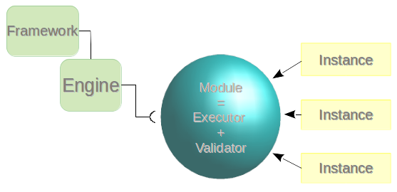
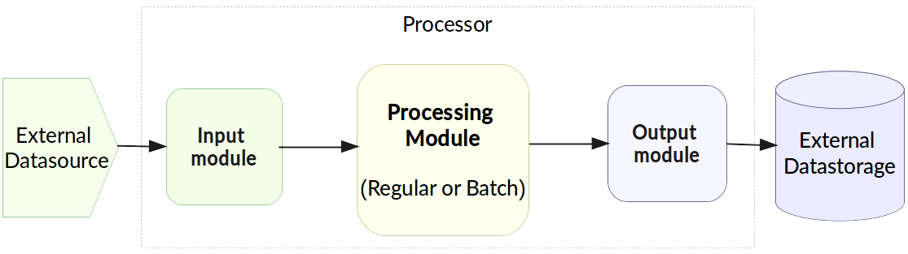
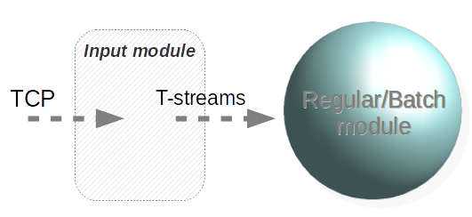
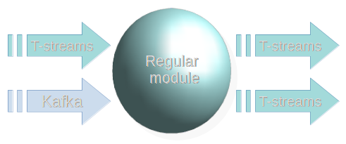
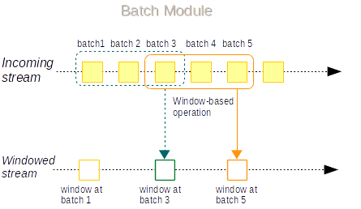

.. _Modules:

Modules: types, structure, pipeline
===================================

.. contents:: Contents
   
Module is a processor that handles events in data streams.

It includes an executor that processes data streams and a validator.

- Streaming validator provides a method to validate "options" or "InstanceMetadata" parameter of run module specification.
  This method returns a tuple that contains two values. The first value indicates whether the "options" or "InstanceMetadata" is proper or not (true value by default). The second value is a list of errors in case of the validation fail (empty list by default). It is used when you try to create a new instance of a specific module and if the validate method returns false value the instance will not be created.

- An executor of the module utilizes an instance/instances. An instance is a full range of settings for an exact module.

An engine is required to start a module. A module can not process data streams without an engine (that is a .jar file containing required configuration settings) that launches the module ingesting raw data and sends the processed data further in the stream.

The engine is getting started via a framework. 

A general structure of a module can be rendered as at the scheme below:

A module handles data flow making it into streams. Raw data are transformed to objects referred to as an envelope. An envelope is a container for messages or events with data records.

The platform supports 4 types of modules:

1. *Input-streaming* - It handles external inputs, does data deduplication, transforms raw data to objects. 

2. *Output-streaming* — It handles the data outcoming from event processing pipeline to external data destinations (Elasticsearch, JDBC, etc.).

3. *Regular-streaming* (base type) - a generic processor which receives an event, does some data transformation and sends transformation to the next processing step. 

4. *Batch-streaming* — It organizes incoming data into batches and processing is performed with sliding window. Batch module may be used to implement streaming joins and processing where algorithm must observe range of input messages rather than current one. 

The modules can be strung in a pipeline as illustrated below:

In this document each module is described in detail.

.. _input-module:

Input module
----------------
An input type of modules handles external input streams, does data deduplication, transforms raw data to objects. In the SJ platform the TCP Input Stream processor is currently implemented in an Input module.

It performs the transformation of the streams incoming from TCP to T-streams. T-streams are persistent streams designed for exactly-once processing (so it includes transactional producer, consumer and subscriber). Find more information about T-streams at `the site: <http://t-streams.com>`_ 

An Input module executor provides the following methods with default implementations but they can be overridden.

1) "tokenize": 
      It is invoked every time when a new portion of data is received. It processes a flow of bytes to determine the beginning and the end of the Interval (significant set of bytes in incoming flow of bytes). By default it returns None value (means that it is impossible to determine an Interval). If Interval detected, method should return it (first and last indexes of Interval's elements in flow of bytes). Resulting interval can either contain message or not.

2) "parse": 
      If "tokenize" method returns an Interval, this method is invoked. It processes both a buffer with incoming data (a flow of bytes) and an Interval (an output of "tokenize" method). Its purpose is to define whether the Interval contains a message or meaningless data. Default return value is None. The same value should be returned if Interval contains meaningless data. If Interval contains message, return value should be "InputEnvelope".

3) "createProcessedMessageResponse": 
      It is invoked after each call of parse method. Its purpose is to create response to the source of data - instance of InputStreamingResponse.

The parameters of the method are:

- "InputEnvelope" (it can be defined or not)

- "isNotEmptyOrDuplicate" - a boolean flag (denoting whether an "InputEnvelope" is defined and isn't a duplicate (true) or an "InputEnvelope" is a duplicate or empty (false))

Default implementation of the method::

  def createProcessedMessageResponse(envelope: Option[InputEnvelope],
  isNotEmptyOrDuplicate: Boolean): InputStreamingResponse = {
    var message = ""
    var sendResponsesNow = true
    if (isNotEmptyOrDuplicate) {
      message = s"Input envelope with key: '${envelope.get.key}' has been sent\n"
      sendResponsesNow = false
    } else if (envelope.isDefined) {
      message = s"Input envelope with key: '${envelope.get.key}' is duplicate\n"
    } else {
      message = s"Input envelope is empty\n"
    }
  InputStreamingResponse(message, sendResponsesNow)
}

4) "createCheckpointResponse": 
      It is invoked on checkpoint's finish. It's purpose is to create response for data source to inform that checkpoint has been done. It returns an instance of "InputStreamingResponse".

Default implementation of the method::

 def createCheckpointResponse(): InputStreamingResponse = {
   InputStreamingResponse(s"Checkpoint has been done\n", isBuffered = false)
 }

There is a manager inside the module which allows to:

- retrieve a list of output names by a set of tags (by calling "getStreamsByTags()")

- initiate checkpoint at any time (by calling `initiateCheckpoint()`) which would be performed only at the end of processing step (check diagram at the Input Streaming Engine page)

**Entities description**

InputEnvelope: 

- key of an envelope 
- information about the destination 
- "check on duplication" boolean flag (it has higher priority than 'duplicateCheck' in InputInstance)
- message data 

InputStreamingResponse: 

- message - string message
 
- sendResponsesNow - a boolean flag denoting whether response should be saved in temporary storage or all responses from this storage should be send to the source right now (including this one)
 
.. To see a flow chart about how these methods intercommunicate, please, visit the `Input Streaming Engine`_ page.

Output module
------------------

An Output module handles external output from event processing pipeline to external data destinations (Elasticsearch, JDBC, etc.)

.. figure:: _static/OutputModule.png

It transforms the processing data results into T-streams and put them into an external data storage. It allows to transform one data item from incoming streaming into one and more data output items.

The output executor provides the following methods that does not perform any work by default so you should define their implementation by yourself.

1. "onMessage": 
    It is invoked for every received message from one of the inputs that are defined within the instance. Inside the method you have an access to the message that has the TStreamEnvelope type. 

2. "getOutputEntity":
    It is invoked once when module running. This method returns the current working entity, i.e. fields and types. This method must be overridden. 

Regular module
-------------------
A simplified definition of a Regular module is a handler that performs data transformation and put the processed data into a T-stream.

In the Regular module the executor provides the following methods that does not perform any work by default so you should define their implementation by yourself.

1) "onInit": 
        It is invoked only once, when a module is launched. This method can be used to initialize some auxiliary variables, or check the state variables on existence and create them if necessary . Thus, you should do preparation of the executor before usage.

Example of the checking a state variable::

 if (!state.isExist(<variable_name>)) state.set(<variable_name>, <variable_value>)

``<variable_name>`` must have the String type

``<variable_value>`` can be any type (a user must be careful when casting a state variable value to a particular data type)

2) "onMessage": 
    It is invoked for every received message from one of the inputs that are defined within the instance. There are two possible data types of input sources - that's why there are two methods with appropriate signatures::
    
``def onMessage(envelope: TStreamEnvelope[T]): Unit``

``def onMessage(envelope: KafkaEnvelope[T]): Unit``
 
Each envelope has a type parameter that defines the type of data in the envelope.

.. note:: The data type of the envelope can be only KafkaEnvelope data type or TStreamEnvelope data type. A user may specify one of them or both, depending on which type(s) is(are) used. 

3) "onBeforeCheckpoint": 
    It is invoked before every checkpoint.
4) "onAfterCheckpoint": 
    It is invoked after every checkpoint.
5) "onTimer": 
    It is invoked every time when a set timer goes out. Inside the method there is an access to a parameter that defines a delay between a real response time and an invocation of this handler.
6) "onIdle": 
    It is invoked every time when idle timeout goes out but a new message hadn't appeared. It is a moment when there is nothing to process.
7) "onBeforeStateSave": 
    It is invoked prior to every saving of the state. Inside the method there is a flag denoting the full state (true) or partial changes of state (false) will be saved.
8) "onAfterStateSave": 
    It is invoked after every saving of the state. Inside the method there is a flag denoting the full state (true) or partial changes of state (false) have(s) been saved

The module may have a state. A state is a sort of a key-value storage and can be used to keep some global module variables related to processing. These variables are persisted and are recovered after a fail. In case of a fail (when something is going wrong in one of the methods described above) a whole module will be restarted. And the work will start on `onInit` method invocation.

Inside of the module there is a manager allowing to get an access to: 

- an output that is defined within the instance (by calling "getPartitionedOutput()" or "getRoundRobinOutput()"),
- timer (by calling "setTimer()")
- state (by calling "getState()") if it is a stateful module
- list of output names (by calling "getStreamsByTags()"). Every output contains its own set of tags which are used to retrieve it. 
-  initiation of checkpoint (by calling "initiateCheckpoint()").

.. To see a flow chart on how these methods intercommunicate see the page `Regular Streaming Engine`_ .

Batch module
-----------------
A batch is a minimum data set for a handler to collect the events in the stream. The size of a batch is defined by a user. It can be a period of time or a quantity of events or a specific type of event after receiving which the batch is considered closed.  Then, the queue of batches is sent further in the flow for the next stage of processing. 

In the module it is a Batch Collector that is responsible for the logic of collecting batches. It provides the following methods, implementation of which you should specify. 

1) “getBatchesToCollect”:
       It should return a list of stream names that are ready to collect.

2) “afterEnvelopeReceive”:
       It is invoked when a new envelope is received.

3) “prepareForNextCollecting”:
     It is invoked when a batch is collected. If several batches are collected at the same time then the method is invoked for each batch.

Let us consider an example:

This is a batch collector defining that a batch consists of a certain number of envelopes::

  class NumericalBatchCollector(instance: BatchInstanceDomain,
                              performanceMetrics: BatchStreamingPerformanceMetrics,
                              streamRepository: Repository[StreamDomain])
  extends BatchCollector(instance, performanceMetrics, streamRepository) {

  private val logger = LoggerFactory.getLogger(this.getClass)
  private val countOfEnvelopesPerStream = mutable.Map(instance.getInputsWithoutStreamMode.map(x => (x, 0)): _*)           (1)
  private val everyNthCount = 2                                                                                           (2)

  def getBatchesToCollect(): Seq[String] = {
    countOfEnvelopesPerStream.filter(x => x._2 == everyNthCount).keys.toSeq                                               (3)
  }

  def afterEnvelopeReceive(envelope: Envelope): Unit = {
    increaseCounter(envelope)                                                                                             (4)
  }

  private def increaseCounter(envelope: Envelope) = {
    countOfEnvelopesPerStream(envelope.stream) += 1
    logger.debug(s"Increase count of envelopes of stream: ${envelope.stream} to: ${countOfEnvelopesPerStream(envelope.stream)}.")
  }

  def prepareForNextCollecting(streamName: String): Unit = {
    resetCounter(streamName)                                                                                              (5)
  }

  private def resetCounter(streamName: String) = {
    logger.debug(s"Reset a counter of envelopes to 0.")
    countOfEnvelopesPerStream(streamName) = 0
  }
 }

Let's take a look at the main points:

.(1) - create a storage of incoming envelopes for each input stream 

.(2) - set a size of batch (in envelopes)

.(3) - check that batches contain the necessary number of envelopes

.(4) - when a new envelope is received then increase the number of envelopes for specific batch

.(5) - when a batch has been collected then reset the number of envelopes for this batch 

The module allows to transform the data aggregated from input streams applying the idea of a sliding window. 

A window is a period of time that is multiple of a batch and during which the batches of input events are collected into a queue for further transformation.

The diagram below is a simple illustration of how a sliding widow operation looks like.

As shown in the figure, every time the window slides over an input stream, the batches of events that fall within the window are combined and operated upon to produce the transformed data of the windowed stream. It is important that any window operation needs to specify the parameters:

- *batch size* — The quantity of events within a batch, or a period of time during which the events are collected in one batch.

- *window size* - The duration of the window, i.e. how many batches should be collected before sliding. 

- *sliding interval* - A step size at which the window slides forward.

In the example, the operation is applied over the last 3 events, and slides by 2 events. Thus, the window size is 3 and the sliding interval is 2.

In general, a window consists of batches, a batch consists of events (messages) that may contain data of different type depending on a data type of input. So, each event should have a type parameter that defines the type of data containing in the event unit.

The executor of the batch module provides the following methods that does not perform any work by default. So you should define their implementation by yourself.

1) "onInit": 
    It is invoked only once, when a module is launched. This method can be used to initialize some auxiliary variables or check the state variables on existence and if it's necessary create them. Thus, you should do preparation of the executor before usage.

Example of the checking a state variable::
 
  if (!state.isExist(<variable_name>)) state.set(<variable_name>, <variable_value>)
  
``<variable_name>`` should be of the String type

``<variable_value>`` can be of any type (be careful when you will cast a state variable value to a particular data type)

2) "onWindow": 
    It is invoked when a window for each input stream is collected (a list of input streams are defined within the instance). These collected windows are accessible via a window repository within the method. A window consists of batches, a batch consists of envelopes (messages). There are two possible data types of envelopes - that's why you should cast the envelope inside the method. Each envelope has a type parameter that defines the type of message data.

Example of a message casting to a particular data type::

  val allWindows = windowRepository.getAll()
  allWindows.flatMap(x => x._2.batches).flatMap(x => 
  x.envelopes).foreach {
  case kafkaEnvelope: KafkaEnvelope[Integer @unchecked] => //here there is an access to certain fields such as offset and data of integer type
  case tstreamEnvelope: TStreamEnvelope[Integer @unchecked] => //here there is an access to certain fields such as txnUUID, consumerName and data (array of integers)
  }

The data type of the envelope can be "KafkaEnvelope" data type or "TStreamEnvelope" data type. If you specify in an instance the inputs of the only one of this data types you shouldn't match the envelope like in the  example above and cast right the envelope to a particular data type::

  val tstreamEnvelope =
  envelope.asInstanceOf[TStreamEnvelope[Integer]]

3) "onBeforeCheckpoint": 
    It is invoked before every checkpoint
4) "onAfterCheckpoint": 
    It is invoked after every checkpoint
5) "onTimer": 
    It is invoked every time when a set timer goes out. Inside the method there is an access to a parameter that defines a delay between a real response time and an invocation of this handler
6) "onIdle": 
    It is invoked every time when idle timeout goes out but a new message hasn't appeared. It is a moment when there is nothing to process
7) "onBeforeStateSave": 
    It is invoked before every saving of the state. Inside the method there is a flag denoting the full state (true) or partial changes of state (false) will be saved
8) "onAfterStateSave": 
    It is invoked after every saving of the state. Inside the method there is a flag denoting the full state (true) or partial changes of state (false) have(s) been saved

The following handlers are used for synchronizing the tasks' work. It can be useful when at information aggregation using shared memory, e.g. Hazelcast or any other.
 
1) "onEnter": The system awaits for every task to finish the "onWindow" method and then the "onEnter" method of all tasks is invoked.

2) "onLeaderEnter": The system awaits for every task to finishe the "onEnter" method and then the "onLeaderEnter" method of a leader task is invoked.

.. 3) "onLeave": It is invoked by every task and waits for a leader-task stop processing

.. 4) "onLeaderLeave": It is invoked by a leader-task after passing an output barrier

.. To see a flow chart about how these methods intercommunicate see the page `Batch Streaming Engine`_ .

The Batch module can either have a state or not. A state is a sort of a key-value storage and can be used to keep some global module variables related to processing. These variables are persisted and are recovered after a fail. A fail means that something is going wrong in one of the methods described above. In this case a whole module will be restarted. And the work will start on onInit method invocation.
There is a manager inside module which grants access to:

- output that was defined within the instance (by calling getPartitionedOutput() or getRoundRobinOutput()),
- timer (by calling setTimer())
- state (by calling getState()) (only if it is a stateful module)
- list of output's names (by calling getStreamsByTags()). Every output contains it's own set of tags which are used to retrieve it.
- initiation of checkpoint (by calling initiateCheckpoint())

A Batch and a Regular modules may have a state. A state is a sort of a key-value storage that can be used to keep some global module variables related to processing. These variables are persisted and are recovered after a fail. A fail means that something is going wrong in one of the methods used in an executor. In this case a whole module will be restarted. 
The state is performed alongside with the checkpoint. At a checkpoint the data received after processing is checked for completeness. The checkpoint is an event that provides an exactly-once processing. 

.. A detailed manual on how to write a module you may find at `page`_ .

Modules` performance is determined with the work of engine. An engine structure, components and  the workflow are determined with the type of module. 

.. Please, find more information about engines at the `Engines`_  page.

Prerequisites For Modules. Streaming Components.
================================================
 .. Warning:: The section is under development!

A module requires the following elements to be created for its performance:

- Provider

- Service

- Stream 

- Instance

The type of module requires a specific type of instance to create. An instance is a full range of settings to perform an exact executor type. These settings are specified via UI or REST API and determine the mode of the module operation: data stream type the module is going to work with, a checkpoint concept, the settings of state and parallelism, other options, etc.

As stated above, modules process the data arranged in streams. The Stream Juggler supports *Kafka* and *T-stream* type of streams. And when the Kafka streams are a well-known type of streaming introduced by Apache Kafka, the T-streams are intentionally designed for the Stream Juggler platform as a complement for Apache Kafka. The T-streams have more features than Kafka and make exactly-once processing possible. Find more about T-streams at the `site <http://t-streams.com>`_ .

To transform data into a stream of exact type you need to create a service and a provider for this service. The type of a service and a provider is determined by the type of a stream you need for the module.

For example, a Batch module that receives data from Kafka will require a Kafka service (KfkQ) and two provider types for it: Kafka and ZooKeeper. 

.. Or if you work with an Output module and you want to store the processed data to ElasticSearch index, you are going to work with  the ElasticSearch output type stream that in its turn requires a service and a provider of ElasticSearch type.

The diagram below may help you to understand the dependency of instances in the platform.

The data elements in a stream are assembled in partitions. A partition is a part of a data stream allocated for convenience in operation. The streams with many partitions allow to handle the idea of parallelism properly. In such case, an engine divides existing partitions fairly among executors and it enables to scale the data processing.  
