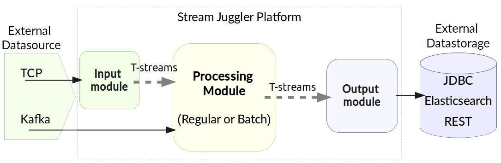

.. _Modules:

Modules: Types, Structure, Pipeline
===================================

.. contents:: Contents
   
A **module** is a processor that handles events in data streams. It works within an engine that receives raw data and sends them to the module executor. A module uses instances as a range of settings determining the collaborative work of an engine and a module. 

A module includes:

- an executor that processes data streams,
- a validator to check an instance.

.. figure:: _static/moduleExecutorAndValidator.png
   :scale: 120%
   :align: center

Below you will find more information on each of these two components.

.. _validator:

Streaming Validator
-------------------------

Streaming validator provides two methods:

1. to validate ``options`` parameter of the module.
2. to validate an instance of the module. The method is used when you try to create a new instance of a specific module, and if the validation method returns false value the instance will not be created.

Each of these two methods returns a tuple of values that contains:

- The value that indicates if the validation is sucessful or not;

- The value that is a list of errors in case of the validation failures (it is an empty list by default). 

Executor
---------------------

An executor is a key module component that performs the data processing. It receives the data and processes them in correspondence with the requirements of module specification. It utilizes an instance/instances for processing. An instance is a full range of settings for an exact module. It determins the work of an engine and a module.

Data Processing Flow in Modules
---------------------------------
In general, data processing in modules can be generally described in a simple scheme.

The base of the system is the engine: it provides basic I/O functionalities. It is started via a Mesos framework which is a framework that provides distributed task dispatching and then the statistics on task execution. The engine performs data processing using an uploaded module. 

   
After its uploading, the engine receives raw data and sends them to the module executor. The executor starts data processing and returns the resulting data back to the engine where they are deserialized to be passed into the stream or a storage.

Module Types
--------------

The platform supports 4 types of modules:

1. *Input- streaming* - handles external inputs, does data deduplication, transforms raw data to objects. 

2. *Output-streaming* - handles the data outcoming from event processing pipeline to external data destinations (Elasticsearch, JDBC, etc.).

3. *Regular-streaming* (base type) - a generic processor which receives an event, does some data transformation and sends transformation to the next processing step. 

4. *Batch-streaming* - a module which is used to implement streaming joins and processing where algorithm must observe a range of input messages rather than current one.  A batch is a minimum data set for a module to collect the events in the stream. Batches are collected in a window. The data is processed in the batch module applying the idea of a sliding window.

The modules can be strung in a pipeline as illustrated below:

At this page each module is described in detail. You will find more information on the methods provided by module executors as well as entities' description.

.. _input-module:

Modules of Input Type
~~~~~~~~~~~~~~~~~~~~~~~~~~~~
Modules of the input type handle external input streams, does data deduplication, transforms raw data to objects. 

In the SJ-Platform the TCP Input module is currently implemented.
.. figure:: _static/InputModuleStructure1.png
  :scale: 80 %

It performs the transformation of the streams incoming via TCP into T-streams. T-streams are persistent streams designed for exactly-once processing (so they include a transactional producer, a consumer and a subscriber). Find more information about T-streams `here <http://t-streams.com>`_.

In the diagram below you can see the illustrated data flow for the input module.

.. figure:: _static/InputModuleDataflow1.png
  :scale: 80 %

All input data elements are going as a flow of bytes to particular interface provided by Task Engine. That flow is going straight to Streaming Executor and is converted to an object called an Input Envelope. 

An **envelope** is a specialized fundamental data structure containing data and metadata that allow exactly-once processing.

The Input Envelope then goes to Task Engine which serializes it to a stream of bytes and then sends to T-Streams. 

An input module executor provides the following methods with default implementation but they can be overridden.

1) ``tokenize``: 
      It is invoked every time when a new portion of data is received. It processes a flow of bytes to determine the beginning and the end of the Interval (significant set of bytes in incoming flow of bytes). By default it returns None value (meaning that it is impossible to determine an Interval). If Interval detected, method should return it (the first and the last indexes of Interval elements in the flow of bytes). The resulting interval can either contain message or not.

2) ``parse``: 
     This method is invoked once the "tokenize" method returns an Interval. It processes both a buffer with incoming data (a flow of bytes) and an Interval (an output of "tokenize" method). Its purpose is to define whether the Interval contains a message or meaningless data. Default return value is None. The same value should be returned if Interval contains meaningless data. If Interval contains a message, the "InputEnvelope" value should be returned.

3) ``createProcessedMessageResponse``:
      It is invoked after each call of parsing method. Its purpose is to create response to the source of data - the instance of InputStreamingResponse.

The parameters of the method are:

- ``InputEnvelope`` (it can be defined or not)

- ``isNotEmptyOrDuplicate`` - a boolean flag (denoting whether an "InputEnvelope" is defined and isn't a duplicate (true) or an ``InputEnvelope`` is a duplicate or empty (false))

Default implementation of the method::

  def createProcessedMessageResponse(envelope: Option[InputEnvelope],
  isNotEmptyOrDuplicate: Boolean): InputStreamingResponse = {
    var message = ""
    var sendResponsesNow = true
    if (isNotEmptyOrDuplicate) {
      message = s"Input envelope with key: '${envelope.get.key}' has been sent\n"
      sendResponsesNow = false
    } else if (envelope.isDefined) {
      message = s"Input envelope with key: '${envelope.get.key}' is duplicate\n"
    } else {
      message = s"Input envelope is empty\n"
    }
  InputStreamingResponse(message, sendResponsesNow)
 }

4) ``createCheckpointResponse``: 
      It is invoked on checkpoint's finish. It's purpose is to create response for data source to inform that checkpoint has been done. It returns an instance of ``InputStreamingResponse``.

Default implementation of the method::

 def createCheckpointResponse(): InputStreamingResponse = {
   InputStreamingResponse(s"Checkpoint has been done\n", isBuffered = false)
 }

There is a manager inside the module which allows to:

- retrieve a list of output names by a set of tags (by calling ``getStreamsByTags()``) 

- initiate checkpoint at any time (by calling ``initiateCheckpoint()``) which would be performed only at the end of processing step (check diagram at the Input Streaming Engine page)

**Entities description**

``InputEnvelope``: 

- key of an envelope 
- information about the destination 
- "check on duplication" boolean flag (it has higher priority than ``duplicateCheck`` in ``InputInstance``)
- message data 

``InputStreamingResponse``: 

- ``message`` - string message
 
- ``sendResponsesNow`` - a boolean flag denoting whether response should be saved in temporary storage or all responses from this storage should be send to the source right now (including this one)
 
To see a flow chart on how these methods intercommunicate, please, visit the :ref:`Input_Streaming_Engine` section.

The Stream Juggler Platform offers two examples of Input Module implementation. These are ready-to-use input modules for two most general input data formats: CSV and Regex.

CSV Input Module
"""""""""""""""""""""""

It extends *InputStreamingExecutor* interface. Its aim is to process CSV lines and create ``InputEnvelope`` instance which saves each line as AvroRecord inside.

This module is provided via Sonatype repository.

Module configuration is located in the ``options`` field of instance configuration (see :ref:`REST_API_Instance_Create`).

.. csv-table:: 
 :header: "Field Name", "Format", "Description", "Example"
 :widths: 15, 10, 25, 40

 "outputStream*", "String", "Name of output stream for Avro Records", "s1" 
 "fallbackStream*", "String", "Name of output stream for incorrect CSV-lines", "s2" 
 "fields*", "List[String]", "Names of record fields", "['f1', 'f2', 'f3']" 
 "lineSeparator*", "String", "String which separates lines", "\n" 
 "encoding*", "tring", "Name of input encoding", "UTF-8" 
 "uniqueKey", "List[String]", "Set of field names which uniquely identifies a record (all record fields by default)", "['f1', 'f3']" 
 "fieldSeparator", "String", "A delimiter to use for separating entries (',' by default)", ";" 
 "quoteSymbol", "String", "A character to use for quoted elements ('\' by default)", ``*``
 "distribution", "List[String]",  "Set of fields that define in which partition of output stream will be put record. Partition computed as ``hash(fields) mod partitions_number``. If this field not defined, module uses Round Robin policy for partition distribution.", "['f2', 'f3']"

.. note:: `*` - required field.

This module puts `org.apache.avro.generic.GenericRecord <https://avro.apache.org/docs/1.8.1/api/java/org/apache/avro/generic/GenericRecord.html>`_ in output streams. The executor of the next module must take Record type as a parameter, e.g::

 class Executor(manager: ModuleEnvironmentManager) extends BatchStreamingExecutor[Record](manager) {
 ...
 }

In the executor of the next module the Avro Schema (``org.apache.avro.Schema``) and the overridden ``deserialize`` method for deserialization of ``org.apache.avro.generic.GenericRecord`` must be defined . In the ``deserialize`` method the ``deserialize(bytes : Array[Byte], schema : org.apache.avro.Schema)`` method from the ``AvroSerializer`` class could be used.

E.g. for ``"fields": ["f1", "f2", "f3"]``)::

 val schema = SchemaBuilder.record("csv").fields()
  .name("f1").`type`().stringType().noDefault()
  .name("f2").`type`().stringType().noDefault()
  .name("f3").`type`().stringType().noDefault()
  .endRecord()
 val serializer = new AvroSerializer

 override def deserialize(bytes: Array[Byte]): GenericRecord = serializer.deserialize(bytes, schema)

Regex Input Module
""""""""""""""""""""""""

It extends *InputStreamingExecutor* interface. Its aim is to process input stream of strings using a set of regular expressions rules and create `InputEnvelope` instance which stores each line as AvroRecord inside. Thus, it takes the free-form data, filter and convert them into Avro Records.

This module is provided via Sonatype repository.

**Policy**

Regex input module uses the following policies:

1. first-match-win
       To each data the regular expressions from the list of rules are applied until the first match is found; then these data are converted into avro record and put into the output stream. The matching process for these data is stopped. 

       If none of the rules is matched, the data are converted to unified fallback avro record and put into the fallback stream.

2. check-every
      To each data portion the regular expressions from the list of rules are applied. When matched, the data are converted to Avro Record and put into the output stream. Matching process will continue using the next rule.
 
      If none of the rules is matched, data are converted to unified fallback avro record and put into the fallback stream.

**Configuration**

Module configuration is located in the "options" field of instance configuration (:ref:`REST_API_Instance_Create`).
The configuration contains a three-tier structure that consists of the following levels: options (0-level), rules (1-level), fields (2-level).

**"options"**

.. csv-table:: 
 :header: "Field Name", "Format", "Description", "Example"
 :widths: 15, 10, 25, 40
 
 "lineSeparator *", "String", "String that separates lines", "\n"
 "policy*", "String", "Defines the behavior of the module", "first-match-win"
 "encoding*", "String", "Name of input encoding", "UTF-8"
 "fallbackStream*", "String", "Name of an output stream for lines that are not matched to any regex (from the 'rules' field)", "fallback-output"
 "rules*", "List[Rule]", "List of rules that defines: regex, an output stream and avro record structure", "`-`"

**Rule**

.. csv-table:: 
 :header: "Field Name", "Format", "Description", "Example"
 :widths: 15, 10, 25, 40
 
 "regex*", "String", "Regular expression used to filter and transform input data", "(?<day>[0-3]\d)-(?<month>[0-1]\d)-(?<year>\d{4})"
 "outputStream*", "String", "Name of output stream for successful converted data", "output-stream"
 "uniqueKey", "List[String]", "Set of field names which uniquely identifies a record (all record fields by default)","['day','month']"
 "distribution", "List[String]", "Set of fields that define in which partition of an output stream a record will be put. Partition computed as hash(fields) mod partitions_number. If this field is not defined, the module uses the Round Robin policy for partition distribution.", "['month','year']"
 "fields*", "List[Field]", "List of fields used for creation the avro record scheme", "`-`"

**Field**

.. csv-table:: 
 :header: "Field Name", "Format", "Description", "Example"
 :widths: 15, 10, 25, 40
 
 "name*", "String", "Name of the record field", "day"
 "defaultValue*", "String", "Value that used in case of missing field in data", "01"
 "type*", "String", "Type of the record field [boolean, int, long, float, double, string]", "string"

.. note:: `*` - required fields

Configuration example::

 {
	"lineSeparator": "\n",
	"policy": "first-match-win",
	"encoding": "UTF-8",
	"fallbackStream": "fallback-stream",
	"rules": [{
		"regex": "(?<day>[0-3]\\d)-(?<month>[0-1]\\d)-(?<year>\\d{4})",
		"outputStream": "date-output-stream",
		"uniqueKey": ["day", "month"],
		"distribution": ["month", "year"],
		"fields": [{
			"name": "day",
			"default-value": "01",
			"type": "int"
		}, {
			"name": "month",
			"default-value": "01",
			"type": "int"
		}, {
			"name": "year",
			"default-value": "1970",
			"type": "int"
		}]
	}, {
		"regex": "(?<word>\\w+) (?<digit>\\d+)",
		"fields": [{
			"name": "word",
			"default-value": "abc",
			"type": "string"
		}, {
			"name": "digit",
			"default-value": "123",
			"type": "int"
		}],
		"outputStream": "namedigit-output-stream",
		"uniqueKey": ["word"],
		"distribution": ["word", "digit"]
	}]
 }

.. _regular-module:

Regular Module
~~~~~~~~~~~~~~~~~~~~~~~
A simplified definition of a Regular module is a handler that performs data transformation and put the processed data into T-streams.

.. figure:: _static/RegularModule3.png
  :scale: 80 %

The diagram below represents the dataflow in the regular module.

.. figure:: _static/RegularModuleDataflow2.png
  :scale: 80 %

The TaskEngine of a regular module receives data from T-streams. It deserializes the flow of bytes to TStreamsEnvelope[T] (where [T] is a type of messages in the envelope) which is then passed to the StreamingExecutor.

The StreamingExecutor processes the received data and sends them to the TaskEngine as a result data.

The TaskEngine serializes all the received data to the flow of bytes and puts it back to T-Streams to send further.

In the Regular module the executor provides the following methods that does not perform any work by default so you should define their implementation by yourself.

1) ``onInit``: 
        It is invoked only once, when a module is launched. This method can be used to initialize some auxiliary variables, or check the state variables on existence and create them if necessary . Thus, you should do preparation of the executor before usage.

Example of the checking a state variable::

 if (!state.isExist(<variable_name>)) state.set(<variable_name>, <variable_value>)

``<variable_name>`` must have the String type

``<variable_value>`` can be any type (a user must be careful when casting a state variable value to a particular data type)

2) ``onMessage``: 
    It is invoked for every received message from one of the inputs that are defined within the instance. There are two possible data types of input sources - that's why there are two methods with appropriate signatures::
    
``def onMessage(envelope: TStreamEnvelope[T]): Unit``

``def onMessage(envelope: KafkaEnvelope[T]): Unit``
 
Each envelope has a type parameter that defines the type of data in the envelope.

.. note:: The data type of the envelope can be only "KafkaEnvelope" data type or "TStreamEnvelope" data type. A user may specify one of them or both, depending on which type(s) is(are) used. 

3) ``onBeforeCheckpoint``: 
    It is invoked before every checkpoint.
.. 4) "onAfterCheckpoint": 
    It is invoked after every checkpoint.
4) ``onTimer``: 
    It is invoked every time when a set timer goes out. Inside the method there is an access to a parameter that defines a delay between a real response time and an invocation of this handler.
5) ``onIdle``: 
    It is invoked every time when idle timeout goes out but a new message hadn't appeared. It is a moment when there is nothing to process.
6) ``onBeforeStateSave``: 
    It is invoked prior to every saving of the state. Inside the method there is a flag denoting the full state (true) or partial changes of state (false) will be saved.
.. 8) "onAfterStateSave": 
    It is invoked after every saving of the state. Inside the method there is a flag denoting the full state (true) or partial changes of state (false) have(s) been saved

The module may have a state. A state is a sort of a key-value storage and can be used to keep some global module variables related to processing. These variables are persisted and are recovered after a fail. 

In case of a fail (when something is going wrong in one of the methods described above) a whole module will be restarted. And the work will start on `onInit` method invocation.

Inside of the module there is a manager allowing to get an access to: 

- an output that is defined within the instance (by calling "getPartitionedOutput()" or "getRoundRobinOutput()"),
- timer (by calling "setTimer()")
- state (by calling "getState()") if it is a stateful module
- list of output names (by calling "getStreamsByTags()"). Every output contains its own set of tags which are used to retrieve it. 
-  initiation of checkpoint (by calling "initiateCheckpoint()").

To see a flow chart on how these methods intercommunicate see the :ref:`Regular_Streaming_Engine` section.

.. _batch-module:

Batch Module
~~~~~~~~~~~~~~~~~
A batch is a minimum data set for a handler to collect the events in the stream. The size of a batch is defined by a user. It can be a period of time or a quantity of events or a specific type of the event after receiving which the batch is considered closed.  Then, the queue of batches is sent further in the flow for the next stage of processing. 

.. _Batch-Collector:

Batch Collector
""""""""""""""""""
In the module it is a Batch Collector that is responsible for the logic of collecting batches. It provides the following methods, implementation of which you should specify. 

1) ``getBatchesToCollect``:
       It should return a list of stream names that are ready to collect.

2) ``afterEnvelopeReceive``:
       It is invoked when a new envelope is received.

3) ``prepareForNextCollecting``:
     It is invoked when a batch is collected. If several batches are collected at the same time then the method is invoked for each batch.

Let us consider an example:

This is a batch collector defining that a batch consists of a certain number of envelopes::

  class NumericalBatchCollector(instance: BatchInstanceDomain,
                              performanceMetrics: BatchStreamingPerformanceMetrics,
                              streamRepository: Repository[StreamDomain])
  extends BatchCollector(instance, performanceMetrics, streamRepository) {

  private val logger = LoggerFactory.getLogger(this.getClass)
  private val countOfEnvelopesPerStream = mutable.Map(instance.getInputsWithoutStreamMode.map(x => (x, 0)): _*)           (1)
  private val everyNthCount = 2                                                                                           (2)

  def getBatchesToCollect(): Seq[String] = {
    countOfEnvelopesPerStream.filter(x => x._2 == everyNthCount).keys.toSeq                                               (3)
  }

  def afterEnvelopeReceive(envelope: Envelope): Unit = {
    increaseCounter(envelope)                                                                                             (4)
  }

  private def increaseCounter(envelope: Envelope) = {
    countOfEnvelopesPerStream(envelope.stream) += 1
    logger.debug(s"Increase count of envelopes of stream: ${envelope.stream} to: ${countOfEnvelopesPerStream(envelope.stream)}.")
  }

  def prepareForNextCollecting(streamName: String): Unit = {
    resetCounter(streamName)                                                                                              (5)
  }

  private def resetCounter(streamName: String) = {
    logger.debug(s"Reset a counter of envelopes to 0.")
    countOfEnvelopesPerStream(streamName) = 0
  }
 }

Let's take a look at the main points:

.(1) - create a storage of incoming envelopes for each input stream 

.(2) - set a size of batch (in envelopes)

.(3) - check that batches contain the necessary number of envelopes

.(4) - when a new envelope is received then increase the number of envelopes for specific batch

.(5) - when a batch has been collected then reset the number of envelopes for this batch 

The module allows to transform the data aggregated from input streams applying the idea of a sliding window. 

A window is a period of time that is multiple of a batch and during which the batches of input events are collected into a queue for further transformation. Or a window can be set to a number of batches. The window closes once it is full, i.e. the set number of batches is collected.

The diagram below is a simple illustration of how a sliding window operation looks like.

.. figure:: _static/BatchModule1.png
   :scale: 120 %

As shown in the figure, every time the window slides over an input stream, the batches of events that fall within the window are combined and operated upon to produce the transformed data of the windowed stream. It is important that any window operation needs to specify the parameters:

- *batch size* — The quantity of events within a batch, or a period of time during which the events are collected in one batch.

- *window size* - The duration of the window, i.e. how many batches should be collected before sliding. 

- *sliding interval* - A step size at which the window slides forward.

In the example, the operation is applied over the last 3 events, and slides by 2 events. Thus, the window size is 3 and the sliding interval is 2.

In general, a window consists of batches, a batch consists of events (messages) that may contain data of different type depending on a data type of input. So, each event should have a type parameter that defines the type of data containing in the event unit.

The executor of the batch module provides the following methods that does not perform any work by default. So you should define their implementation by yourself.

1) ``onInit``: 
    It is invoked only once, when a module is launched. This method can be used to initialize some auxiliary variables or check the state variables on existence and if it's necessary to create them. Thus, you should do preparation of the executor before usage.

Example of the checking a state variable::
 
  if (!state.isExist(<variable_name>)) state.set(<variable_name>, <variable_value>)
  
``<variable_name>`` should be of the String type

``<variable_value>`` can be of any type (be careful when you will cast a state variable value to a particular data type)

2) ``onWindow``: 
    It is invoked when a window for each input stream is collected (a list of input streams are defined within the instance). These collected windows are accessible via a window repository within the method. A window consists of batches, a batch consists of envelopes (messages). There are two possible data types of envelopes - that's why you should cast the envelope inside the method. Each envelope has a type parameter that defines the type of message data.

Example of a message casting to a particular data type::

  val allWindows = windowRepository.getAll()
  allWindows.flatMap(x => x._2.batches).flatMap(x => 
  x.envelopes).foreach {
  case kafkaEnvelope: KafkaEnvelope[Integer @unchecked] => //here there is an access to certain fields such as offset and data of integer type
  case tstreamEnvelope: TStreamEnvelope[Integer @unchecked] => //here there is an access to certain fields such as txnUUID, consumerName and data (array of integers)
  }

.. note:: The data type of the envelope can be "KafkaEnvelope" data type or "TStreamEnvelope" data type. If you specify in an instance the inputs of the only one of this data types you shouldn't match the envelope like in the  example above and cast right the envelope to a particular data type::

  val tstreamEnvelope =
  envelope.asInstanceOf[TStreamEnvelope[Integer]]

3) ``onBeforeCheckpoint``: 
    It is invoked before every checkpoint
.. 4) "onAfterCheckpoint": 
    It is invoked after every checkpoint
4) ``onTimer``: 
    It is invoked every time when a set timer goes out. Inside the method there is an access to a parameter that defines a delay between a real response time and an invocation of this handler
5) ``onIdle``: 
    It is invoked every time when idle timeout goes out but a new message hasn't appeared. It is a moment when there is nothing to process
6) ``onBeforeStateSave``: 
    It is invoked before every saving of the state. Inside the method there is a flag denoting the full state (true) or partial changes of state (false) will be saved
.. 8) "onAfterStateSave": 
    It is invoked after every saving of the state. Inside the method there is a flag denoting the full state (true) or partial changes of state (false) have(s) been saved

The following handlers are used for synchronizing the tasks' work. It can be useful when at information aggregation using shared memory, e.g. Hazelcast or any other.
 
1) ``onEnter``: The system awaits for every task to finish the ``onWindow`` method and then the ``onEnter`` method of all tasks is invoked.

2) ``onLeaderEnter``: The system awaits for every task to finishe the ``onEnter`` method and then the ``onLeaderEnter`` method of a leader task is invoked.

.. 3) "onLeave": It is invoked by every task and waits for a leader-task stop processing

.. 4) "onLeaderLeave": It is invoked by a leader-task after passing an output barrier

To see a flow chart about how these methods intercommunicate see the :ref:`Batch_Streaming_Engine` section.

The Batch module can either have a state or not. A state is a sort of a key-value storage and can be used to keep some global module variables related to processing. These variables are persisted and are recovered after a fail. 

A fail means that something is going wrong in one of the methods described above. In this case a whole module will be restarted. And the work will start on onInit method invocation.

The state is performed alongside with the checkpoint. At a checkpoint the data received after processing is checked for completeness. The checkpoint is an event that provides an exactly-once processing. 

There is a manager inside the module which grants access to:

- output that was defined within the instance (by calling ``getPartitionedOutput()`` or ``getRoundRobinOutput()``),
- timer (by ``calling setTimer()``)
- state (by calling ``getState()``) (only if it is a stateful module)
- list of output names (by calling ``getStreamsByTags()``). Every output contains its own set of tags which are used to retrieve it.
- initiation of checkpoint (by calling ``initiateCheckpoint()``)

.. _output-module:

Output Module
~~~~~~~~~~~~~~~~~~~~

An output module handles external output from event processing pipeline to external data destinations (Elasticsearch, JDBC, etc.)

.. figure:: _static/OutputModule1.png
  :scale: 80 %
  
It transforms the processing data results received from T-streams and pass them to an external data storage. It allows to transform one data item from incoming streaming into one and more data output items.

The diagram below illustrates the dataflow in an output module.

.. figure:: _static/OutputModuleDataflow1.png
  :scale: 80 %

The TaskEngine deserializes the stream of bytes from T-Streams to TStreamsEnvelope[T] (where [T] is a type of messages in the envelope) and sends it to the StreamingExecutor. The StreamingExecutor returns Entities back to the TaskEngine. 

They are then put to an external datastorage.

The output executor provides the following methods that does not perform any work by default so you should define their implementation by yourself.

1. ``onMessage``: 
    It is invoked for every received message from one of the inputs that are defined within the instance. Inside the method you have an access to the message that has the TStreamEnvelope type. 

2. ``getOutputEntity``:
    It is invoked once when module running. This method returns the current working entity, i.e. fields and types. This method must be overridden. 

A type is assigned to an output envelope that corresponds to the type of an external storage (Elasticsearch, SQL database, RESTful).

To see a flow chart on how these methods intercommunicate, please, visit the :ref:`Output_Streaming_Engine` section.

A detailed manual on how to write a module you may find at the :ref:`hello-world-module` page.

Modules` performance is determined with the work of engine. Engines of different types (Input, Regular/Batch, Output) have different structure, components and the workflow corresponding to the type of a module. 

Please, find more information about engines at the :ref:`Engines` page.

Prerequisites For Modules. Streaming Component.
--------------------------------------------------

A module requires the following elements to be created for its performance:

- Provider

- Service

- Stream 

- Instance

The type of module requires a specific type of instance to create. An instance is a full range of settings to perform an exact executor type. These settings are specified via UI or REST API and determine the mode of the module operation: data stream type the module is going to work with, a checkpoint concept, the settings of state and parallelism, other options, etc.

As stated above, modules process the data arranged in streams. The Stream Juggler Platform supports *Apache Kafka* and *T-stream* type of streams. And when the Apache Kafka streams are a well-known type of streaming introduced by Apache Kafka, the T-streams are intentionally designed for the Stream Juggler platform as a complement for Apache Kafka. The T-streams have more features than Kafka and make exactly-once processing possible. Find more about T-streams at the `site <http://t-streams.com>`_ .

To create streams of exact type in the platform you need to create a service and a provider for this service. The type of a service and a provider is determined by the type of a stream you need for the module.

For example, a Batch module that receives data from Kafka will require an Apache Kafka service and two provider types for it: Apache Kafka and Apache ZooKeeper. 

The schema below may help you to understand the dependency of entities in the platform.

The data elements in a stream are assembled in partitions. A partition is a part of a data stream allocated for convenience in processing. The streams with many partitions allow handling the idea of parallelism properly. In such case, an engine divides existing partitions fairly among module's tasks. It allows scaling of the data processing.

The number of tasks is determined in module's instance(-s). An  instance is a set of settings determining the collaborative work of an engine and a module. Each module type requires a specific type of an instance: input, regular or batch, output. In the schema above you can see that each instance type requires a proper type of streams, and thus providers and services of a correct type as well.

We hope this information will help you to select the most appropriate types of entities in the system to build a pipeline for smooth data stream processing.

