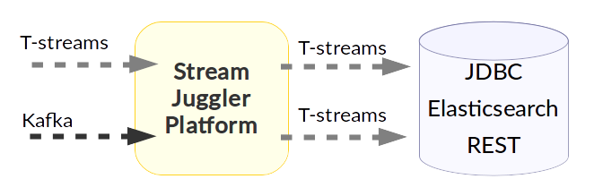

Stream Juggler Platform Overview
================================

Introduction to Stream Juggler Platform
----------------------------

Stream Juggler Platform (**SJ-Platform**) is an open source, scalable solution for real-time and micro-batched unbounded streams processing. The system fits for building a event processing systems and allows a developer to construct connected pipelines for analyzing data streams. **Stream** is unbound sequence of events processed sequentially from the oldest ones to newest ones. SJ-Platform is built to be smooth and easy to understand and learn for an average developer who knows Scala language. The system doesn't require any specific knowledge of mathematical concepts like some competing require. Thus it makes it easy for a common type engineer to solve stream processing tasks.

Basically, SJ-Platform is inspired by `Apache Samza <http://samza.apache.org/>`_, but has a lot of features which Samza doesn't provide, like exactly-once processing capability, integrated RESTful API and Web UI and lots of others.

Stream Processing Systems are widely used in the modern world. There are a lot of cases where developers should use stream processing systems. All those cases are usually involve large data streams which can not be handled by single computer effectively, specific requirements applied to computations like processing idempotence, exactly-once processing and predictable behaviour in case of crashes. Every stream processing platform is a framework which enforces certain code restrictions guaranteeng that the processing is stable and results are reproduceable if a developer follows the restrictions.

There are many systems which can compete today - Apache Spark, Apache Kafka, Apache Flink, Apache Storm are the most famous. Every system has its own strenghts and weaknesses, making it better or worse for certain cases. SJ-Platform also has such features. But we developed it to be universal and convinient for broad range of tasks. We hope the features of SJ-Platform make developers solve and support tasks faster and system engineers operate clusters easily. 

Every stream processing system must be fast and scalable. This is the most important requirement. SJ-Platform is fast and scalable as well. It is written in `Scala <https://www.scala-lang.org/>`_ language - well known JVM language which is fast and provides an access to lots of open source libraries and frameworks. From the other hand, horizontal scaling is vital for stream processing systems which require the capability to distribute computations between compute nodes. SJ-Platform achieves that goal with help of well-known distributed scheduler system Apache Mesos.

SJ-Platform stands on shoulders of well-known technologies which simplify the deployment and operation and support best industrial practices. Core SJ-Platform technologies are mentioned in following list:

1. `Apache Mesos <http://mesos.apache.org>`_ - universal distributed computational engine;
2. `Apache Zookeeper <http://zookeeper.apache.org>`_ - distributed configuration and coordination broker;
3. `Apache Kafka <http://kafka.apache.org>`_ - high performance message broker;
4. `Mesosphere Marathon <https://mesosphere.github.io/marathon/>`_ - universal framework for executing tasks on Mesos;
5. `MongoDB <https://www.mongodb.com/>`_ - highly available document database;
6. `Hazelcast <https://hazelcast.com/>`_ - leading in-memory grid.

Further in the documentation we explain how, why and when technologies mentioned above are used in the system.

Documentation Structure
-------------------------------
The documentation is organized in two big parts. The first one is tutorial part which guides a reader through the system in a way which motivates him/her to observe, try and explain every step in practice. The second part is a referential one, which explain specific topics and lists system specifications for administrative and programming API, RESTful interface and Web UI.

Preliminary Requirements to The Reader
-------------------------------
SJ-Platform is a quite complex system, but the tutorial tries to guide the reader as smooth as possible. So, there are quite small amount of requirements to a reader: to achieve the success the reader must have a knowledge of:

1. scala programming language and generic data structures;
2. basics of Docker.

Also, the reader should have working Linux host with 4-8GB of RAM and 4 CPU cores with Docker installed (in the tutorial the installation of Docker for Ubuntu 17.04 OS will be explained).

In the tutorial we will demonstrate the functionality of SJ-Platform and train the reader develop the modules for it using the example problem, which is listed further:

TODO PROBLEM DESCRIPTION

The problem is not a case of "heavy" task but it includes some problems which are very specific to stream processing tasks and introduces all SJ-Platform functionality step-by-step without deep knowledge requirements of specific problem domains.

Short Features List for Impatient
-------------------------------
Major features implemented in SJ-Platform are listed in the following list:

**Processes data in "exactly-once" mode**. This is a very critical requirement which is important for many systems. SJ-Platform supports exactly-once mode across the pipeline.

**Two kinds of processing - "per-event" and "micro-batch"**. These modes are widely used and cover requirements of all stream processing tasks.

3. stateful and stateless processing;
4. distributed synchronized data processing;
5. custom context-based batching methods;
6. use of Apache Kafka or TCP as input source of events;
7. JDBC/Elasticsearch/RESTful interface as output destination for processing data;
8. performance metrics.

These features will be explained in the documentation in depth.

What can Stream Juggler Do?
-------------------------------

Streams can be very intensive and all events can not be handled by a single server of arbitrary performance. The system allows **scaling** the computations horizontally to handle increasing demands. Infrastructure scalability of the platform is handled by `Apache Mesos <http://mesos.apache.org/>`_ –  a well-known and production-ready ecosystem which represents clusters as a single supercomputer with a pool of resources.

The platform preforms a **real-time** **processing** that means the system can handle events as soon as they are available inside the system without specific delay. The other end includes batch processing systems which organize data into batches before processing them.

Data queues are implemented with `Apache Kafka <https://kafka.apache.org/>`_ and `T-streams <http://t-streams.com/>`_. Kafka is a high-performance queue engine, which performs scaling very well. T-streams is another open-source queue broker project which was developed as the core of SJ-Platform. T-streams engine is designed to provide transactional, exactly-once processing across the pipeline. 

SJ provides a developer with **comprehensive** **API** and **UI**, which allow him to develop event processing pipeline.

The Stream Juggler provides a developer with three generic event processor types, which handle data streams:

1. **Input Stream Processor** (ISP) – handles external inputs, does data deduplication, transforms raw data into objects, currently TCP Input Stream Processor; 

2. **Output Stream Processor** (OSP) – handles external output from event processing pipeline to external data destinations (Elasticsearch, JDBC, etc.);

3. **Pipeline Stream Processor** (PSP) – handles data processing inside the pipeline, two types of PSP exist: 

  - *Regular* – the most generic processor which receives event, does some data transformation and sends transformation to the next processing step. 

  - *Windowed (Batch)* – the processor which organizes incoming data into batches and processing is done with a sliding window. Windowed PSP may be used to implement streaming joins and processing where algorithm must observe a range of input messages rather than current one. 

A processor contains Module with an executor and a validator and Engine that uses module settings to handle data flow making it into streams. The data elements in a stream are assembled in partitions. A **partition** is a part of a data stream allocated for convenience in operation.  Upon creation, every stream gets a name and a certain amount of partitions. The streams with many partitions allow handling the idea of **parallelism** properly. In such case, an engine divides existing partitions fairly among executors and it enables to scale the data processing. Partitions are also helpful in distributing processing load between several workers.

The PSP modules perform **checkpoint** and, if the module has a **state**, stores the variables in a state. That fulfills the idea of Platform`s fault-tolerance. In case of the live datastream processing failure, the variables stored in the state are recovered and the module is restarted.

The modules fulfill a **group** **checkpoint** conception. It means that all producers and consumers are bunched into a group and do a checkpoint automatically fixing the current state. This is the key idea of exactly-once processing.

Thus, Stream Juggler Platform is a platform that enables high-throughput, fault-tolerant stream processing of live data streams. Data can be ingested from different sources like Kafka, or TCP sockets, and can be processed using complex algorithms. Finally, processed data can be pushed out to filesystems, external databases.

In general, the main ideas of the Stream Juggler Platform are:

- Two ways of data processing: streaming and batch
- Strict exactly-once processing on arbitrary processing graph
- Ability to build sophisticated processing graphs
- Ready-to-use components which can be reused in different pipelines
- Ability to decompose the task on small processing pieces and develop, upgrade and maintain them separately
- Integrated REST and UI for DevOps
- Integrated performance metrics
- Able to scale horizontally to thousands of nodes
- Relies on open source technologies

To find more about the platform, please, visit the pages below:

:ref:`Architecture` - here the architecture of the Stream Juggler Platform is presented, its components, connections between them, necessary services and other prerequisits for the Platform operation are described.

:ref:`Modules` - here more information on modules is given: what module types are supported in the Stream Juggler Platform, how they work, etc.

:ref:`REST_API` - the REST API service is described here to work with the platform without the UI.

:ref:`UI_Guide` - the section is devoted to the UI and its basic features.
