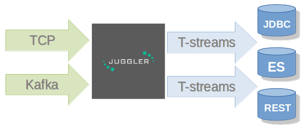

Stream Juggler Platform Overview
================================

Stream Juggler (SJ) is an open source, scalable solution for real-time and batched stream processing. The system fits for building a Complex Event Processing systems (CEP) and allows a developer to construct pipelines for analyzing data streams.

**CEP** (Complex Event Processing) is a general concept describing software systems that are used for sophisticated processing of streams of events.

A **stream** is unbounded series of events organized in the chronological way.

In sophisticated processing an algorithm can overview series of events to find dependencies, correlations, trends, etc. rather than just one event in a time

Streams can be very intensive and all events can not be handled by a single server of arbitrary performance. The system allows **scaling** the computations horizontally to handle increasing demands. Infrastructure scalability of the platform is handled by `Apache Mesos <http://mesos.apache.org/>`_ –  a well-known and production-ready ecosystem which represents clusters as a single supercomputer with a pool of resources.

The platform preforms a **real-time** **processing** that means the system can handle events as soon as they are available inside the system without specific delay. The other end includes batch processing systems which organize data into batches before processing them.

Data queues are implemented with `Apache Kafka <https://kafka.apache.org/>`_ and `T-streams <http://t-streams.com/>`_. Kafka is a high-performance queue engine, which performs scaling very well. T-streams is another open-source queue broker project which was developed as the core of SJ-Platform. T-streams engine is designed to provide transactional, exactly-once processing across the pipeline. 

SJ provides a developer with **comprehensive** **API** and **UI**, which allow him to develop event processing pipeline.

Thus, Stream Juggler is a platform that enables high-throughput, fault-tolerant stream processing of live data streams. Data can be ingested from different sources like Kafka, or TCP sockets, and can be processed using complex algorithms. Finally, processed data can be pushed out to filesystems, external databases.

In general, the main ideas of the Stream Juggler platform are:

- Strict exactly-once processing on arbitrary processing graph
- Ability to build sophisticated processing graphs
- Ready-to-use components which can be reused in different pipelines
- Ability to decompose the task on small processing pieces and develop, upgrade and maintain them separately
- Ready-to-use system (not constructor). 
- Integrated REST and UI for DevOps
- Integrated performance metrics
- Able to scale horizontally to thousands of nodes
- Relies on open source technologies

General Concepts
----------------------

The Stream Juggler provides a developer with three generic event processor types, which handle data streams:

1. *Input Stream Processor* (ISP) – handles external inputs, does data deduplication, transforms raw data to objects, currently TCP Input Stream Processor; 

2. *Output Stream Processor* (OSP) – handles external output from event processing pipeline to external data destinations (Elasticsearch, JDBC, etc.);

3. *Pipeline Stream Processor* (PSP) – handles data processing inside the pipeline, two types of PSP exist: 

- Regular – the most generic processor which receives event, does some data transformation and (probably) sends transformation to the next processing step. 

- Windowed (Batch)– the processor which organizes incoming data into batches and processing is done with sliding window. Windowed PSP may be used to implement streaming joins and processing where algorithm must observe range of input messages rather than current one. 

A module handles data flow making it into streams. The data elements in a stream are assembled in partitions. A **partition** is a part of a data stream allocated for convenience in operation.  Upon creation, every stream gets a name and a certain amount of partitions. The streams with many partitions allow to handle the idea of **parallelism** properly. In such case, an engine divides existing partitions fairly among executors and it enables to scale the data processing. Partitions are also helpful in distributing processing load between several workers.

 
The PSP modules perform **checkpoint** and, if the module has a state, stores the variables in a state. That fulfills the idea of Platform`s fault-tolerance. In case of the live datastream processing failure the variables stored in the state are recovered and the module is restarted.
The modules also fulfill a **group** **checkpoint** conception. It means that all producers and consumers are bunched into a group and do a checkpoint automatically fixing the current state. This is the key idea of exactly-once processing.

Read more about:
 
`Platform Architecture`_

`Modules: types, structure, pipeline`_

`Stream Juggler REST API Guide`_

`Stream Juggler UI Guide`_
