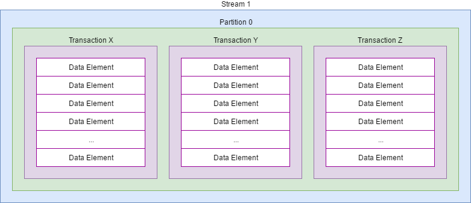

.. _Streaming:

Streams in SJ-Platform
=============================

SJ-Platform enables scalable, high-throughput, fault-tolerant stream processing of live data streams. 

Stream Conception in SJ-Platform 
-------------------------------------------

The streaming component is essential in SJ-Platform. The data are fed to the system, transferred between modules and exported to an external storage via streams.

The system receives data via **TCP** or **Apache Kafka**. Within SJ-Platform modules exchange data via **T-streams**. The results are exported to an external storage via output streams which type is determined by the type of the storage. For now, **Elasticsearch**, **SQL-database** and **RESTful** output stream types are supported. 

The table below shows what types of streams are required as input/output streams for a particular module type.

===============  ================================================  ===============================================
Module type      Input stream                                      Output stream
===============  ================================================  ===============================================
*Input*            TCP                                               T-streams 
                                                  
                                       
                                                                      

*Regular/Batch*    T-streams                                         T-streams
               
                   
                   Apache Kafka
              
                  

*Output*           T-streams                                         Elasticsearch

                   

                                                                     SQL database

                                                                        
                                                                   
                                                                     RESTful
                                                                   
===============  ================================================  ===============================================

Input Streams
~~~~~~~~~~~~~~~~~~~~~~~~~~~~
The data can be received from different sources. Currently, the platform supports obtaining data from Apache Kafka and via TCP connections.

SJ-Platform supports `Apache Kafka <https://kafka.apache.org/documentation/>`_ as a standard providing a common interface for the integration of many applications.

In case of using TCP as a source, there arises a need in an input module to transform the input data into a stream and transfer them for further processing. At the project `repository <https://github.com/bwsw/sj-platform/tree/develop>`_ two ready-to-use input modules are available for users - a CSV input module and a Regex input module - that transform text data into a message format acceptable for T-streams. 

Internal Streams
~~~~~~~~~~~~~~~~~~~~~~~~~~~~~

Within the platform, the data are transferred to and from modules via *transactional streams* or T-streams. It is a message broker which is native to SJ-Platform and designed primarily for exactly-once processing. More information on T-streams can be found at the `project site <http://t-streams.com/>`_. Some general information on T-streams you can find below.

The easiest way to try T-streams and dive into basic operations with T-streams is to download `T-streams-hello <http://t-streams.com/getting-started/>`_.  It demonstrates basic operations which help to understand how to use T-streams in general. 

The image below illustrates the data design format in T-streams. The stream consists of partitions. Each partition holds a number of transactions with data elements inside. 

Data elements are time-sorted within a transaction. 

Transactions are used to write or read data from T-streams. The transaction is also a basic recovery element. This means, that in case of a crash, the processing can recover from a transaction.

Transactions are iterated from the earliest to the latest and data are read from every transaction. After a transaction (or transaction set) is handled properly, the checkpoint is performed which means that even in case of a crash or for another reason the processing will continue with the transaction which is the next to the processed one.

T-streams allows exactly-once processing due to a checkpoint group. The **CheckpointGroup** is a special entity which allows a developer to do atomic checkpoint for a group of producers and consumers. Several producers and consumers can be bunched up into a group, which can do a checkpoint atomically. This means  all producers and consumers in that group fix the current state. This is the key component of exactly-once data processing in SJ-Platform. Find more information in the `official documentation <http://t-streams.com/docs/architecture/#Agents>`_. 

Output streams
~~~~~~~~~~~~~~~~~~~~~~

Output streams are streams which are a destination for results.

The processed data are put into T-streams.

The data are retrieved from T-streams using an output module. The output module puts the data from T-streams to the streams of the type which is suitable for the type of the external data storage.

For now, SJ-Platform supports the following types of output streams:

- Elasticsearch, to save data to Elasticsearch;
- SQL database, to save data to JDBC-compatible databases;
- RESTful, to save data to a RESTful storage.

.. _Streaming_Infrastructure:

Streaming Infrastructure
-----------------------------------

Streams need infrastructure: providers and services. They make streams flexible. Streaming flexibility lies in the one-to-many connection between providers and services, streams and modules. One provider works with many services (of various types). One stream type can be used by different module instances. Different types of streams and instances can be created on the base of a common infrastructure. There is no need to duplicate the settings for each individual entity.

A **provider** is an entity which contains general information to access a physical service.

A **service** is an entity which contains specific information to access a physical service.

They can be of different types. The types of modules and streams in the pipeline determine the type of providers and services that are necessary in a particular case.

The diagram for interconnections of the platform entities can be useful in selecting the types of providers and services. Please, visit the :ref:`Entities_Correlation` section for more information.

Firstly, decide what types of modules will perform data transformation and processing in the pipeline. The determined module types will help to clarify which streams are required for them.

Secondly, find in the diagram at :ref:`Entities_Correlation` what services are necessary for these types of streams. 

Finally, when services are determined, it is easy to see what types of providers should be created. 

Start creating the infrastructure from providers, then proceed with services and then streams. 

Detailed instructions on stream creation can be found in the :ref:`Tutorial` (for creating infrastructure via REST API) or in the `UI Guide section <http://streamjuggler.readthedocs.io/en/develop/SJ_UI_Guide.html>`_ for creating streams through the Web UI.

