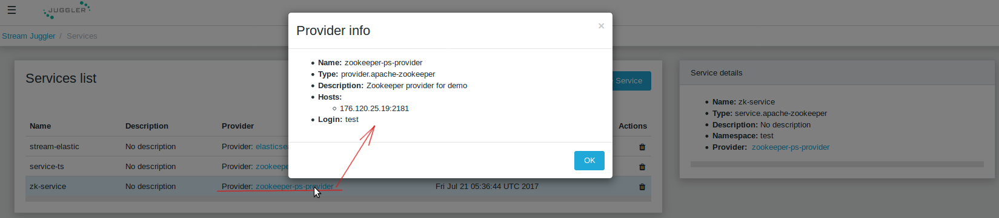
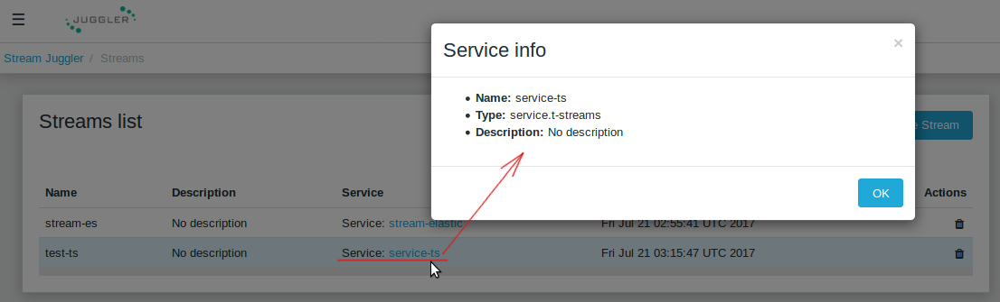
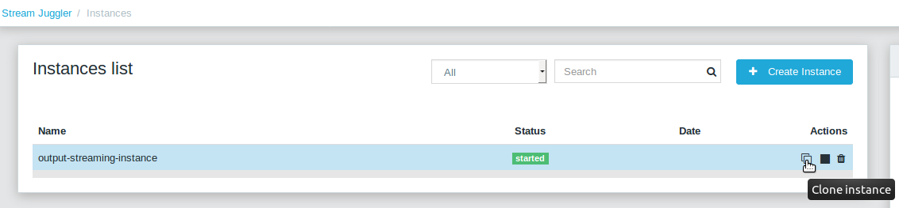
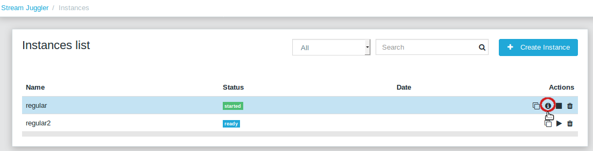
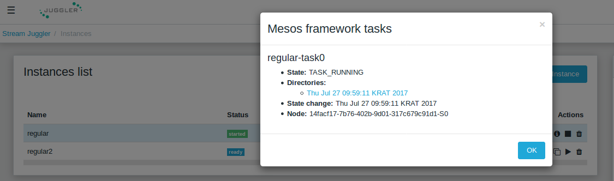

.. _UI_Guide:

UI Guide
=======================

.. contents:: Contents

Get Started
-----------

The Stream Juggler Platform has a user-friendly UI to create a processing sequence of arbitrary complexity, monitor it in action and manage it using pre-created modules with flexible functionality. 

If you are a developer and you want to use the platform you need to know of some prerequisites for the platform. Make sure the following services are preliminarily deployed:

- Mesos
- Marathon 
- Apache Zookeeper
- MongoDB
- Apache Kafka as an input source (optional)
- an external storage: Elasticsearch, SQL database or RESTful (optional).

.. tip:: Find more about SJ-Platform architecture at :ref:`Architecture`. Follow the :ref:`Platform_Deployment` instructions to set up the services.

Once everything is ready, you can proceed to the Stream Juggler Platform.

SJ-Platform allows you to work with your own module, created in accordance with your requirements in order to solve your problem. How to create a module is described in detail in the :ref:`Custom_Module` section.

A module utilizes an instance/instances, i.e. a full range of settings for collaborative work of an engine and a module. See more information on a module structure at :ref:`Modules`.

The SJ-Platform allows you to upload your custom module for data stream processing with prerequisite engines and configuration settings. They are required to launch a module and define the processing in it. They are provided by SJ-Platform and can be uploaded from the `Maven repository <http://www.scala-sbt.org/1.x/docs/Using-Sonatype.html#cMaven+configuration+tips%E2%80%99n%E2%80%99tricks>`_. Find more information about uploading configurations in the `Configuration`_ and the :ref:`CustomFiles` sections of this document.

For correct module interaction a stream/streams are required. The :ref:`Streaming` section describes the streaming component of the system in detail.

Once you know what types of modules and instances you need to include into the pipeline, you can choose types of streams, providers and services which you need to create for them. Look at the diagram in the :ref:`Entities_Correlation` section. It may help you to understand the dependency of entity types in the platform.

For example, if you want to create a regular module that will process Apache Kafka input data streams you have to create Apache Kafka service with Apache Kafka and Apache Zookeeper providers for it.

Below you will find the information on uploading your module via the UI and launching data processing.

.. _Configuration:

Configuration 
----------------------

So, the first step is to upload necessary configurations to the platform.

Here are the basic settings required for the platform. In addition, we explain how to add configurations to the system.

Configurations are the settings necessary for the system work.
 
The configurations can be added under the *Configuration* tab of the main navigation bar. Please, click "Add Settings" in the upper-right corner above the list and fill in the form (the information on the required settings can be found in the table_ below):

1. *Name* *
        Enter a setting name here. 

2. *Value* *
        Enter a setting value here. 
	
	
3. *Domain* *
        Select a domain from the drop-down list. 
	
.. note:: Required fields are marked with an asterisk (*).

Once the fields are correctly filled in, click the "Create" button and see the parameter appeared in the list of settings.

Click "Cancel" to drop all the specified settings. The configuration will not be created then.

The list of configurations created in the system can be viewed under the *Configuration* section of the main navigation bar. 

It can be filtered by its type and/or a name using the search tool above the list.
 
Please, find the required configurations in the table below and make sure they are added to your platform so that your modules could work.

.. _table:

**Required** configurations:

.. csv-table:: 
  :header: "Config Domain","Name", "Description", "Example"
  :widths: 15, 20, 50, 15

  "system", "crud-rest-host", "REST interface host", "localhost"
  "system", "crud-rest-port", "REST interface port", "8080"
  "system", "marathon-connect", "Marathon address. Use to launch a framework which is responsible for running engine tasks and provides the information about applications that run on Mesos. Must begin with 'http://'.", "http://stream-juggler.z1.netpoint-dc.com:8080"
  "system", "marathon-connect-timeout", "Use when trying to connect by 'marathon-connect' (ms).", "60000"
  "system", "current-framework", "Indicates which file is used to run a framework. By this value, you can get a setting that contains a file name of framework jar.", "com.bwsw.fw-0.1"
  "system", "low-watermark", "A number of preloaded messages for batch engine processing.", "1000"
  "kafka", "subscriber-timeout", "The period of time (ms) spent waiting in poll if data are not available. Must not be negative", "100"
  "zk", "session.timeout", "Use when connect to Apache Zookeeper (ms). Usually when we are dealing with T-streams consumers/producers and Apache Kafka streams.", "3000"
.. "system", "current-transaction-generator", "Indicates what jar is used for running transaction generators. By this value you can get configuration setting that contains file name of transaction generator jar.", "com.bwsw.tg-0.1"
  "system", "transaction-generator-client-retry-period", "Time for connecting attempt to TG-server", "500"
  "system", "transaction-generator-server-retry-period", "Time for attempt to lock a server as master on ZK", "500"
  "system", "transaction-generator-retry-count", "Count of reconnections to TG-server", "10"
   "jdbs", "timeout", "Timeout connection to sql database in milliseconds", "30000"

The range of optional settings is presented below. They have default values in the system but can be overriden by a user.

**Optional** configurations:

.. csv-table:: 
  :header: "Config Domain","Name", "Description", "Default value"
  :widths: 15, 20, 50, 15
  
  "system", "framework-principal", "Framework principal for mesos authentication", "---"
  "system", "framework-secret",  "Framework secret for mesos authentication", "---"
  "system", "framework-backoff-seconds", "Seconds for first delay after crash", "7"
  "system", "framework-backoff-factor", "Factor for backoffSeconds parameter of following delays", "7.0"
  "system", "framework-max-launch-delay-seconds", "Max seconds for delay", "600"
  "system", "output-processor-parallelism", "A number of threads used to write data to an external datastorage (Elasticsearch or RESTful)", "8"

.. note::  In general 'framework-backoff-seconds', 'framework-backoff-factor' and 'framework-max-launch-delay-seconds' configure exponential backoff behavior when launching potentially sick apps. This prevents sandboxes associated with consecutively failing tasks from filling up the hard disk on Mesos slaves. The backoff period is multiplied by the factor for each consecutive failure until it reaches maxLaunchDelaySeconds. This applies also to tasks that are killed due to failing too many health checks.

Сonfiguration domain named 'configuration.apache-kafka' contains properties used to create an Apache Kafka consumer (see `the official documentation <https://kafka.apache.org/documentation/#consumerconfigs>`_). 

.. note:: You must not define properties such as 'bootstrap.servers', 'enable.auto.commit', 'key.deserializer' and 'value.deserializer' in order to avoid a system crash.

Сonfiguration domain named 'configuration.t-streams' contains properties used for a T-streams consumer/producer. 

.. note:: You must not define properties such as 'producer.bind-host', 'producer.bind-port', 'consumer.subscriber.bind-host' and 'consumer.subscriber.bind-port' to avoid a system crash. 

To see the properties list check the following links: for a `producer <http://t-streams.com/docs/a2-api/tstreams-factory-api/#TSF_DictionaryProducer_keyset>`_ and for a `consumer <http://t-streams.com/docs/a2-api/tstreams-factory-api/#TSF_DictionaryConsumer_keyset>`_ (you should use the textual constants to create a configuration).

For each uploaded custom jar a new configuration is added in the following format:: 

 key = {custom-jar-name}-{version}, value = {file-name}

Providers 
---------
Once all necessary configurations are added, a provider can be created.  

A **provider** is a part of streaming infrastructure. This is an entity which contains general information to access a physical service (Apache Kafka, Apache Zookeeper, T-streams, Elasticsearch, SQL-database, RESTful).

Please, in the *Providers* section, press «Create provider» and fill in the form where general fields and specific fields should be completed:

**General fileds:**

- *Type*  *

Select a type of the provider you are going to create from the drop-down list. The following options are available:

 - Elasticsearch;
  
 - Apache Zookeeper;

 - Apache Kafka;

 - RESTful;

 - SQL database.

The type of the provider is determined with the type of the stream and the instance you want to create.

- *Name* *
       Enter a name of the provider here. It should be unique, must consist of digits, lowercase letters or hyphens and start with a letter. 

- *Description* 
       Enter a description for the provider here.

- *Hosts* *
       Enter a provider host that is an endpoint of a physical service.
       Add more hosts by clicking the «Add Host» button and enter host names in the lines that appear.

**Specific fields:**

**SQL database Provider Type**

- *Login* 
       Enter a provider login here if necessary
        
- *Password* 
       Enter a password for the provider if necessary.

- *Driver* * 
       Enter a provider driver name for the SQL-database provider type. 

**Elasticsearch Provider Type**

- *Login* 
       Enter a provider login if necessary.
       
- *Password*
       Enter a password for the provider if necessary.
       
.. note:: Required fields are marked with an asterisk (*)

Click "Create" below and see the provider appeared in the providers list. Provider details are displayed to the right when clicking the provider in the list. 

Click "Cancel" to drop provider creation.

You can perform the following actions on each provider in the list:

#. **View** provider`s name, date of creation, description.

#. **Delete** a provider clicking on the corresponding icon in the Action block near the name of the provider you want to delete. 

.. note:: A provider that is connected with a service can not be deleted.

3. **Test Connection** to a provider.

The list of providers can be filtered by its type and/or a name using the search tool above the list.

Services
--------

The next step is to create services. **Services** are a part of streaming infrastructure. This is an entity which contains specific information to access a physical service (Apache Kafka, Apache Zookeeper, T-streams, Elasticsearch, SQL-database, RESTful).

Under the *Services* section of the main navigation bar you will find the list of services.

Please, press «Create Service» and fill out the form with general and specific fields:

**General fields:**

- *Type* *
        Select from the dropdown a type of the service:

 - Elasticsearch
 - SQL database
 - T-streams
 - Apache Kafka
 - Apache Zookeeper
 - RESTful

- *Name* *
       Enter a name of the services. It must consist of digits, lowercase letters or hyphens and start with a letter.

- *Description*
       Provide a description for the service here if necessary.

- *Provider* *
       This field appears once the service type is chosen.

       Select a provider for the service here. 
 
       Providers available in the dropdown are determined by the chosen service type.

**Specific fields:**

**Apache Zookeeper Service Type**

- *Namespace* *
        Please, specify a namespace here. It must consist of digits, lowercase letters or underscore and start with a letter. 

.. - *Http scheme* *
            Select the scheme of HTTP protocol from the dropdown ("http" is set by default). 

**Apache Kafka Service Type**

- *ZK provider* *
        Please, select a zookeeper provider for the service here. 

.. - *ZK namespace* *
        This field is required for filling in.

        Please, specify a zookeeper namespace for the services here. 
	
.. - *Http scheme* *
            Select the scheme of HTTP protocol from the dropdown ("http" is set by default). 
	     
**T-streams Service Type**

- *Prefix* *
        Here a ZooKeeper path where metadata of transactions, streams are located should be specified.

        Please, enter a prefix for the service here. 

- *Token* *
        A token is a unique key for getting access to the service. It must contain no more than 32 symbols.

        Please, enter a token for the service here. 

.. - *Http scheme* *
             Select the scheme of HTTP protocol from the dropdown ("http" is set by default). 

**Elasticsearch Service Type**

-  *Index* *
        Please, specify an index of the service here. It must consist of digits, lowercase letters or underscore and start with a letter. 

.. - *Login*
        This field is not required for filling in.

        Please, specify a login of the services here. 

.. - *Password*
       The field is not required for filling in.

       Please, specify a password of the services here. 

.. - *Http scheme* *
             Select the scheme of HTTP protocol from the dropdown ("http" is set by default). 
	     

**SQL database Service Type**

- *Database* *name* *
        Please, enter a database name for the service here. 

.. - *Http scheme* *
        Select 'http' or 'https' from the dropdown.
	     
**RESTful Service Type**

- *Http scheme* *
        Select the scheme of HTTP protocol from the dropdown ("http" is set by default). 

- *Http version* 
        Select a http protocol version from the dropdown ("1.1" is set by default).
	     
- *Base path*
        Enter a path to the storage.
	
- *Headers*
	Enter extra HTTP headers. The values in the JSON format must be of a String type only. 
	
.. note:: Required fields are marked with an asterisk (*)

Click "Create" below and you will see that the service appeared in the services list. Details of a service are displayed to the right when clicking the service in the list. 

Click "Cancel" to drop all the specified settings. The service will not be created then.

You can perform the following actions on each service in the list:

1. **View** service`s name and description, the date of creation.

2. **View** a provider for the service and get the provider`s information in a pop-up window by clicking on the active provider`s name in the «Provider» column.

3. **Delete** a service clicking on the corresponding icon in the Action block near the name of the services you want to delete.

.. note:: A service used by one of the streams can not be deleted.

The list of services can be filtered by its type and/or a name using the search tool above the list.

Streams
----------

The next step is to create a data stream. A stream is a sequence of events happening randomly at irregular intervals.

There are three kinds of streams in the SJ-Platform:

:Input streams: These are streams which provide new events to the system. There are two input stream types in the SJ-Platform: TCP or Apache Kafka.

:Internal streams: These are streams using which modules exchange data within the system. The only type of streams used for it is T-streams.

:Output streams: These are streams which are a destination point for results. Three types of output streams are available for sending the processed data into different external storages: RESTful, SQL database and Elasticsearch.

Under the *Streams* section of the main navigation bar you will find the list of streams.

Please, press «Create Stream» and fill in the form where general and specific fields should be completed:

**General fields:**

- *Type* *

Select from the dropdown a type of a stream:

 - T-streams — It is an input stream of the T-stream type

 - Apache Kafka - It is an input stream of the Kafka type

 - SQL database -It is an output stream of the SQL database type
 
 - Elasticsearch - It is an output stream of the Elasticsearch type
 
 - RESTful - It is an output stream of the REST type

- *Name* *
        Enter a stream name here. It must contain lowercase letters, digits or hyphens only.
	
	For 'jdbc-output' stream a name must contain lowercase letters, digits or underscores.

- *Description*
        Provide a description for the stream here if necessary.

- *Service* *
        Select a service from the dropdown. 

        The range of available services is determined by a selected stream type.

**Specific fields:**

**T-streams Stream Type**

- *Partitions count* *
        Partitions is a part of data stream. Partitions are a special conception which handle regular queues in multi-queues, e.g. a stream with one partition is a queue, but a stream with two partitions is like a two different queues. Using streams with many partitions allows to handle parallelism properly as engine instances divide existing partitions fairly.

        Enter a number of partitions. It must be a positive integer.

- *Force create*
        This field indicates if a stream should be removed and re-created by force (if it exists). Set it «True» or «False». It is set as «False» by default.

- *Tags*
        Enter a tag\tags for the stream here.

**Apache Kafka Stream Type**

- *Partitions count* *
        Partitions is a part of data stream. Partitions are a special conception which handle regular queues in multi-queues, e.g. a stream with one partition is a queue, but a stream with two partitions is like a two different queues. Using streams with many partitions allows to handle parallelism properly as engine instances divide existing partitions fairly.

        Enter a number of partitions. It must be a positive integer.

- *Force create*
        This field indicates if a stream should be removed and re-created by force (if it exists). Set it «True» or «False». It is set as «False» by default.

- *Tags*
        Enter a tag\tags for the stream here.
	
- *Replication* *Factor* *
       Replication factor is the number of zookeeper nodes to utilize.

       Enter a replication factor here. It must be an integer.
       
**SQL database Stream Type**

- *Partitions count* *
        Partitions is a part of data stream. Partitions are a special conception which handle regular queues in multi-queues, e.g. a stream with one partition is a queue, but a stream with two partitions is like a two different queues. Using streams with many partitions allows to handle parallelism properly as engine instances divide existing partitions fairly.

        Enter a number of partitions. It must be a positive integer.

- *Force create*
        This field indicates if a stream should be removed and re-created by force (if it exists). Set it «True» or «False». It is set as «False» by default.

- *Tags*
        Enter a tag\tags for the stream here.
	
- *Primary*
       Enter a primary key here. It is a primary key field name used in sql database.

**RESTful Stream Type**

- *Partitions count* *
        Partitions is a part of data stream. Partitions are a special conception which handle regular queues in multi-queues, e.g. a stream with one partition is a queue, but a stream with two partitions is like a two different queues. Using streams with many partitions allows to handle parallelism properly as engine instances divide existing partitions fairly.

        Enter a number of partitions. It must be a positive integer.

- *Force create*
        This field indicates if a stream should be removed and re-created by force (if it exists). Set it «True» or «False». It is set as «False» by default.

- *Tags*
        Enter a tag\tags for the stream here.
		
**Elasticsearch Stream Type**

- *Force create*
        This field indicates if a stream should be removed and re-created by force (if it exists). Set it «True» or "False". It is set as "False" by default.

- *Tags*
        Enter a tag\tags for the stream here.

.. note:: Required fields are marked with an asterisk (*)

Click "Create" at the bottom and see the stream is in the list of streams now. Details of the node are displayed to the right when clicking the stream in the list. 

Click "Cancel" to drop all the specified settings. The stream will not be created then.

In the list of streams the following actions can be performed:

1. **View** a stream` name, description, date of creation.

2. **View** a service for the stream and get the service`s information in a pop-up window by clicking on the active service`s name in the "Service" column.

3. **Delete** a stream clicking on the corresponding icon in the Actions block near the name of the stream you want to delete.

.. note:: A stream used by any instance can not be deleted.

The list of streams can be filtered by its type and/or a name using the search tool above the list.

Modules
-------

In the next section — *Modules* — you can upload and manage your own module(s). How to create a module is described in detail in the :ref:`Custom_Module` section.

The platform supports 4 types of modules:

1. Input-streaming
2. Regular-streaming (base type)
3. Batch-streaming
4. Output-streaming

In the table below the *specification fields* that should be specified in the module are described:

.. csv-table:: Specification fields
   :header: "Field", "Format", "Description"
   :widths: 25, 20, 40

   "name*", "String", "The unique name for a module"
   "description", "String", "The description for a module"
   "version*", "String", "The module version"
   "author", "String", "The module author"
   "license", "String", "The software license type for a module"
   "inputs*", "IOstream","The specification for the inputs of a module"
   "outputs*", "IOstream", "The specification for the outputs of a module"
   "module-type*", "String", "The type of a module. One of [input-streaming, output-streaming, batch-streaming, regular-streaming]"
   "engine-name*", "String", "The name of the computing core of a module"
   "engine-version*", "String", "The version of the computing core of a module"
   "validator-class*", "String", "The absolute path to class that is responsible for a validation of launch options"
   "executor-class*", "String", "The absolute path to class that is responsible for a running of module"
   "batch-collector-class**", "String", "The absolute path to class that is responsible for a batch collecting of batch-streaming module"
   
IOstream for inputs and outputs has the following structure:

.. csv-table:: **IOstream fields**
  :header: "Field", "Format",  "Description"
  :widths: 20, 20, 60

  "cardinality*", "Array[Int]", "The boundary of interval in which a number of inputs can change. Must contain 2 items."
  "types*", "Array[String]", "The enumeration of types of inputs. Can contain only [stream.t-streams, stream.apache-kafka, stream.elasticsearch, stream.sql-database, stream.restful, input]"

Before uploading a module make sure an engine of corresponding type is uploaded.

An **engine**  is a basic platform component providing basic I/O functionality. It runs an application code and handles data from an input stream providing results to an output stream.

Currently the following **engine types** are supported in the SJ-Platform:

1. TCP Input Engine
        It gets packages of data via TCP, handles them and produces series of events to T-streams. It can be used to program arbitrary TCP protocol recognition.
2. Regular Processing Engine 
        It gets events from Apache Kafka or T-stream input streams and produces results to T-Stream output streams.
3. Batch Processing Engine 
        It gets events from T-stream input streams, organizes them in batches and produces the results to T-stream output streams.
4. Output Engine   
         - ElasticSearch Output Engine - allows creating output endpoint and place processing results to Elasticsearch index.   
	 - SQL database Output Engine  - allows creating output endpoint and place processing results to 			MySQL, PostgreSQL, Oracle tables.

Engines should be uploaded as a .JAR file under the :ref:`CustomFiles` section in the "Custom Jars" tab.

After an engine is uploaded and a corresponding config settings file appears in the «Configuration» section, a module can be uploaded.

.. note:: Read more about necessary configuration settings in the `Configuration`_ section below.

Click the "Upload Module" button and select a .JAR file in the window to upload.  Press "Open" and wait for a few seconds till the module is uploaded.

If the module is uploaded correctly a success message appears and the uploaded module is in the list of modules.

In the list of modules the following actions can be performed:

1. **View** a module name, type, version and size, the date of uploading.

2. **Download** a module to your computer by clicking on the download icon in the Actions block near the name of the module you want to download. You need only to specify a folder where to store the module to and click the "Save" button.

3. **Delete** a module clicking on the corresponding icon in the Actions block near the name of the module you want to delete.

.. note:: A module used by any instance can not be deleted.

The list of modules can be filtered by its type and/or a name using the search tool above the list.

.. _CustomFiles:

Custom Files
-------------

A *Custom Files* section is a section where a user can upload custom .JAR files and other files that can be necessary for correct module performance.

Here you can find two tabs: **Custom Jars** and **Custom files**. Below you will find more information for each of these tabs.

Custom Jars
~~~~~~~~~~~

Under the «Custom Jars» tab the engine .JAR files can be uploaded that are necessary for module performance. Click the "Upload Jar" button and select the .JAR file to upload from your computer. Click "Open" in the modal window and wait for a few seconds before the .JAR is uploaded. If it is uploaded successfully a success message appears above the file list and the uploaded .JAR is added to the list of jars.

The following actions can be performed with the files in the list:

1. **View** a jar name, version and size, the date of uploading.

2. **Download** a jar file to your computer by clicking on the download icon in the Actions block near the name of the jar you want to download. You need only to specify a folder where to store the jar to and click the "Save" button.

3. **Delete** a jar clicking on the corresponding icon in the Actions block near the name of the jar you want to delete

The list of jars can be filtered by its name using the search tool above the list.

.. _Custom_Files:
Custom Files
~~~~~~~~~~~~

Under the "Custom files" tab any other files that are necessary for module/engine performance can be uploaded. Click the "Upload file" button and select the file to upload from your computer. Click "Open" in the modal window and wait for a few seconds before the file is uploaded. If it is uploaded successfully a success message appears above the file list and the uploaded file is added to the list of files.

The following actions can be performed with the files in the list:

1. **View** a file name, description, upload date and size

2. **Download** a file to your computer by clicking on the download icon in the Actions block near the name of the file you want to download. You need only to specify a folder where to store the file to and click the "Save" button.

3. **Delete** a file clicking on the corresponding icon in the Actions block near the name of the file you want to delete

The list of files can be filtered by its name using the search tool above the list.

Instances
---------
Module uses a specific **instance** as a full set of settings that determine the collaborative work of an engine and a module.

Before creating an instance make sure all necessary *configuration* *settings* are added to the system.

.. note:: Read more about necessary configuration settings in the `Configuration`_ section below.

Under the *Instances* section of the main navigation menu there is a list of instances.  In the upper-right corner click "Create Instance" and choose the module from the drop-down. This is the module an instance will be created for. 

The type of module will determine the type of instance that will be created: input-streaming, regular-streaming, batch-streaming or output-streaming. 

Each type of instance requires specific settings to be filled in alongside with general settings equal for all instances. This settings are to be specified in the form appearing after selecting a module type.

Please, review the tables with general and specific fields description below.

**General fields**
 
- Name *
    A unique name of an instance. Must contain only letters, digits or hyphens, and starts with a letter.
    
- Description
    Description of an instance
    
- Parallelism
    This field determines the number of tasks that will process the streams. For load reduction and the enhancement of velocity Parallelism should be over 1. Value may be integer or `max` string. If `max`, then parallelism equals minimum count of partitions of streams (1 by default). For an input streaming instance it can not exceed the total number of back-ups (Backup count + Async-backup-count)
    
- Options
    Json with options for the module. Validates by implementation of the Streaming Validator method in the module. That field can be set as required according to the Validator. 
    
- Per-Task-Cores
    Quantity of cores for task (1 by default).
    
- Per-Task-Ram
    Amount of RAM for task (1024 by default).
    
- JVM Options
    Json with jvm-options. It is important to emphasize that Mesos deletes a task if it uses more memory than it is specified in the ``perTaskRam`` parameter. There are no default options. The options defined in the example fit the Per-Task-Ram = 192 and it's recommended for launching modules. In general, the sum of the following parameters: `Xmx`, `XX:MaxDirectMemorySize` and `XX:MaxMetaspaceSize` should be less than `Per-Task-Ram`; `XX:MaxMetaspaceSize` must be grater or larger than `Xmx` by 32m.

- Node Attributes
    Json with map attributes for framework.
    
- Coordination Service*
    Service name of Apache ZooKeeper service.
    
-  Environment Variables
    Variables used in the framework.
    
- Performance Reporting Interval 
      Interval for creating a report of module performance metrics in ms (60000 by default).

**Input-streaming instance fields**
  
- Checkpoint Mode*
       Value must be 'time-interval' for checkpointing after a set period of time, or 'every-nth' for performing a checkpoint after a set number of events
       
- Checkpoint Interval* 
       Interval for performing the checkpoint. If Checkpoint Mode is  'time-interval' the value is set in ms.  If Checkpoint Mode is 'every-nth' the value is the number of events after which the checkpoint is done.
       
- Outputs*
       Names of output streams (must be stream.t-streams only).
       
- Duplicate Check
       The flag points if an envelope (an envelope key) has to be checked for duplication or not. False by default.

- Lookup History*
       How long a unique key of envelope can stay in a queue for checking envelopes for duplication (in seconds). If it does not equal to 0, entries that are older than this time and not updated for this time are evicted automatically accordingly to an eviction-policy. Valid values are integers between 0 and Integer.MAX VALUE. Default value is 0, which means infinite.
       
- Queue Max Size*
        Maximum size of the queue that contains the unique keys of envelopes. When maximum size is reached, the queue is evicted basing on the policy defined at default-eviction-policy.
	
- Default Eviction Policy
        Can be 'LRU' (Least Recently Used) or 'LFU' (Least Frequently Used) or 'NONE' (NONE by default).
  
- Eviction Policy
        An eviction policy of input envelope duplicates. Can be 'fix-time' for storing an envelope key for the period specified in Lookup History, or 'expanded-time' meaning that if a duplicate envelope appears the time of the presence of the key will be updated ('fix-time' by default).
	
- Backup Count 
       The number of backup copies you want to have (0 by default, maximum 6). Sync backup operations have a blocking cost which may lead to latency issues. You can skip this field if you do not want your entries to be backed up, e.g. if performance is more important than backing up.

- Async-Backup-Count
       The flag points if an envelope (an envelope key) has to be checked for duplication or not (0 by default). The backup operations are performed at some point in time (non-blocking operation). You can skip this field if you do not want your entries to be backed up, e.g. if performance is more important than backing up.

**Regular-streaming instance fields**

- Checkpoint Mode*
     Value must be 'time-interval' for checkpointing after a set period of time, or 'every-nth' for performing a checkpoint after a set number of events.
 
- Checkpoint Interval* 
     Interval for performing the checkpoint. If Checkpoint Mode is  'time-interval' the value is set in ms.  If Checkpoint Mode is 'every-nth' the value is the number of events after which the checkpoint is done.
     
- Inputs*
     Names of input streams. Requires an input mode: 'full' (if you want each task to process all partitions of the stream) or 'split' (if you want to divide stream's partitions among the tasks; it is a default value). The stream should exist in the database (it should be of stream.t-streams or stream.apache-kafka type).
     
- Outputs*
     Names of output streams (should be stream.t-stream only).
     
- Start From
     Value must be 'newest' (the system reads nothing, waits for new events), 'oldest' (the system reads all input stream events) or datetime (that requires specifying a timestamp and means the system reads events from the stream starting from the specified moment). If an instance have kafka input streams, then 'Start from' must be 'oldest' or 'newest' ('newest' is default). If an instance have kafka input streams, then 'Start from' must be 'oldest' or 'newest' ('newest' is default).

- State Management
     Must be 'ram' or 'none' ('none' is default).
     
- State Full Checkpoint
     Interval for full checkpoint (100 by default)
     
- Event-Wait-Idle Time
     Idle timeout, when not messages (1000 is default)
     
..  "InputAvroSchema", "Avro schema for input objects. Requires if input object is instance of 'org.apache.avro.generic.GenericRecord':https://avro.apache.org/docs/1.8.1/api/java/org/apache/avro/generic/GenericRecord.html@.", "{'type':'record', 'name':'rec', 'fields':[{'name':'f1','type':string'}]}"

**Batch-streaming instance fields**

- Outputs* 
     Names of output streams (must be stream.t-stream only).

- Window 
    Number of batches that will be contained in a window (1 by default). Must be greater than zero.
    
- Sliding Interval
    The interval at which a window will be shifted (count of batches that will be removed from the window after its processing). Must be greater than zero and less than or equal to the window (1 by default)
   
- Inputs*
    Names of input streams. Requires input mode: 'full' or 'split' ('split' is default). The stream must exist in database (must be stream.t-streams or stream.apache-kafka)
    
- Start From 
    Value must be 'newest' (the system reads nothing, waits for new events), 'oldest' (the system reads all input stream events) or datetime (that requires specifying a timestamp and means the system reads events from the stream starting from the specified moment). If an instance have kafka input streams, then 'Start from' must be 'oldest' or 'newest' ('newest' is default). If instance have kafka input streams, then the value here can be 'oldest' or 'newest' (newest is default).
    
- State Management
    Must be 'ram' or 'none' ('none' is default).

- State Full Checkpoint
    Interval for full checkpoint (100 is default).
    
- Event-Wait-Time
    Idle timeout, when there are no messages (1000 by default).
    
..  "InputAvroSchema", "Avro schema for input objects. Requires if input object is instance of 'org.apache.avro.generic.GenericRecord':https://avro.apache.org/docs/1.8.1/api/java/org/apache/avro/generic/GenericRecord.html@.", "{'type':'record', 'name':'rec', 'fields':[{'name':'f1','type':string'}]}"
  .. note:: Required fields are marked with an asterisk (*)
  
**Output-streaming instance fields**
   
- Checkpoint Mode*
      Value must be 'time-interval' for checkpointing after a set period of time, or 'every-nth' for performing a checkpoint after a set number of events. For output streams 'every-nth' is only available.
      
- Checkpoint Interval*
      Interval for performing the checkpoint. If Checkpoint Mode is 'time-interval' the value is set in ms.  If Checkpoint Mode is 'every-nth' the value is the number of events after which the checkpoint is done.
      
- Inputs* 
      Names of input stream. Must be only 't-stream' type. Stream for this type of module is 'split' only. Stream must exist in database.
      
- Outputs* 
     Names of output stream (must be streams.sql-database, streams.elasticsearch or streams.restful).
     
- Start From
     Value must be 'newest' (the system reads nothing, waits for new events), 'oldest' (the system reads all input stream events) or datetime (that requires specifying a timestamp and means the system reads events from the stream starting from the specified moment).
     
..  "InputAvroSchema", "Avro schema for input objects. Requires if input object is instance of 'org.apache.avro.generic.GenericRecord':https://avro.apache.org/docs/1.8.1/api/java/org/apache/avro/generic/GenericRecord.html@.", "{'type':'record', 'name':'rec', 'fields':[{'name':'f1','type':string'}]}
Click "Create" at the bottom and see the instance is in the list of instances now. 

Click "Cancel" to drop all the specified settings. The instance will not be created then.

**Instance Details**

Details of an instance are displayed to the right when clicking the instance in the list. 

Please, note, the details of an Instance show not only the instance settings but also:

- Stages
   Stages display information about current status of the framework that starts Instance. It allows you to follow the start or stop processes of Instance.
   
   The stages include:

    - state - Instance status
    - datetime - The time when a state has been changed 
    - duration  -  How long a stage has got a current state. This field makes sense if a state field is 'starting', 'stopping' or 'deleting'.
  
- Execution plan
    Execution plan consists of tasks. The number of tasks equals to a 'Parallelism' parameter. Each task has a unique name within the execution plan. Also the task has a set of Input stream names and their intervals of partitions. In general, it provides the information of the sources from which the data will be consumed.

- Tasks
    For a started instance the task name and address (host and port) is specified in the *Instance details* panel.
In the list of instances the following actions can be performed:

1. **Start** an instance by clicking the "Start" button in the Actions section. The instance status will first change to "Starting" and in a few seconds to "Started". That means the instance is launched and is working now.
2. **Stop** the instance that has been started i.e. has the "Started" status. Click at the "Stop" button and wait for a while till the status changes to "Stopping" and then to "Stopped".
3. **Clone** an instance. This fuтction enables instance creation by copying the settings of an existing instance. Just tick the "Clone instance" icon in the Actions block near the name of the instance you want to clone.

The form will show the settings of the selected instance. They can be edited and saved by clicking on the "Create" button. The new instance will appear in the list of instances.

4. **Delete** a stream clicking on the corresponding icon in the Actions block near the name of the stream you want to delete.

.. note:: An instance with statuses "Starting", "Started", "Stopping", "Deleting" can not be deleted.

4. **View** an instance`s name and status. An instance may have the following statuses:
     
- ready - a newly created instance and not started yet;

- starting - a recently launched instance but not started yet (right after the "Start" button is pushed);

- started - the launched instance started to work;

- stopped - an instance that has been stopped;

- deleting - an instance in the process of deleting (right after the "Delete" button is pressed);

- failed - an instance that has been launched but in view of some errors is not started;

- error - an error is detected when stopping the instance.

If an instance stuck in 'failed' or 'error' status, you should use the following instruction:

1) Check that all of the following settings exist (see the table_ for more information on Configuration):

- crud-rest-host (domain: system)
- crud-rest-port (domain: system)
- marathon-connect (domain: system)
- current-framework (domain: system)

2) Check that the rest address specified in the 'crud-rest-host' and 'crud-rest-port' is available
3) Check that the marathon address specified in the 'marathon-connect' is available
4) Check that there is a setting with name specified in the 'current-framework' and also a file with name and version (divide 'current-framework' by '-') is uploaded

If all described above is correct, but the "failed" or the "error" status still takes place, please contact the support team.

The *statistics* on the task execution is also available from the list of instances. 

Click at the "Information" icon next to the Instance name you want to get the statistics for. 

A window will pop-up to show the stats. 

It includes the following information for each task in the list:

- Task name
- State - Task status
- Directories - Directories of tasks of the instance. They are live references to the task change logs on Mesos.
- State change - The date of the last status change
- Reason - The reason of the status change
- Last node - Name of node that was used by a task before the status change (task failure)
- Node - Name of node used by the task

This is the statistic data from a Mesos framework that starts a module. The statistics is aggregated for started instances. 

The list of instances can be filtered by its type and/or a name using the search tool above the list.

