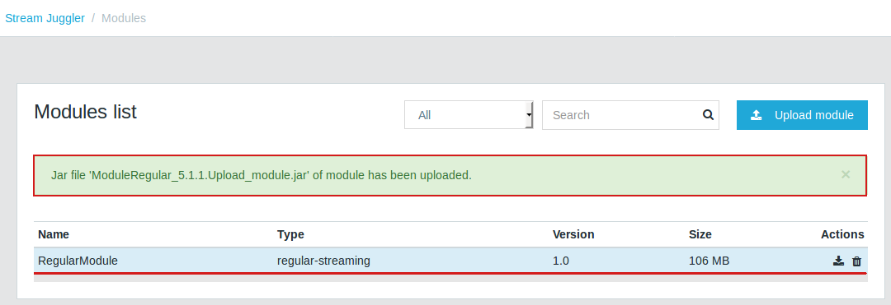

Stream Juggler
==============

UI Guide
========

|juggler-logo|

.. |juggler-logo| image:: https://bitworks.software/sites/default/files/logo-juggler-prj.png

Juggler is a real time stream processing platform designed for building both simple and complex event processing (CEP). 

Juggler uses Apache Messos, Kafka and T-streams to construct scalable and flexible processing algorithms. Juggler functions on the same principle as Apache Samza, but enables exactly-once processing and provides an integrated solution with a RESTful interface, JavaScript UI and an ad hoc repository for modules, services, streams and other data processing pipeline components.

Overview
--------

Juggler's architecture is designed so that exactly-once processing is performed not only within a single processing block but throughout the entire sequence, starting from the moment stream events are fed the system and up to the moment when the output data is stored to conventional data storage.

The approach based on loosely coupled blocks with exactly-once processing support throughout the entire sequence allows for decomposing data processing in order to provide better modularity, performance management and simplicity in development.
Juggler supports four models of feeding events for processing:

- no delay; this model dictates that the events be processed immediately after becoming available in the streams; 

- in a time slot where events are grouped into blocks, each a certain amount of seconds long; processing is scheduled based on overlapping or non-overlapping sliding time slots; 

- in a length-based slot where events are grouped into blocks, each a certain number of transactions long; processing is scheduled based on overlapping or non-overlapping sliding time slots;
 
- in a real-time slot where events are grouped into blocks, each including transactions in a certain time interval; processing is scheduled based on overlapping or non-overlapping sliding time slots; 

Juggler easily integrates with in-memory grid systems, for example, Hazelcast, Apache Ignite.

The systems is available under Apache License v2. 

Get Started
-----------
Juggler has a user-friendly UI to create a processing sequence of arbitrary complexity, watch it in action and manage it using pre-created modules with flexible functionality. 
For beginning go to the http://stream-juggler.z1.netpoint-dc.com:18080 and perform a registration process:

#. 

#. 

#. 

Now you are ready to work with the system. 

Providers 
---------
At the first step a provider should be created.  That is the provider of sevices for input data transformation into a stream.

.. figure:: _static/CreateProvider.png

Please, press the «Create provider» button and fill in the form:

#. *Choose* *type*  *

.. figure:: _static/CreateProvider_Type.png

  Select from the drop down a type of the provider you are aimed to create. The following options are available:

  - cassandra (temporarily is inactive)
  
  - aerospike  (temporarily is inactive)

  - zookeeper

  - kafka

  - Elastic Search

  - JDBC

  - REST

The type of the provider is determined with the type of the instance you want to create and work with at the end.

2. *Name* *

Enter  a name of the provider here. It should be unique, must contain digits, lowercase letters or hyphens and start with a letter. 

#. *Description* 

Enter a description for the provider here.

#. *Hosts* *

Enter a provider host that determines a file locaction.

Add more hosts clicking at the «Add Host» button and entering host names in the appeared lines.

#. *Login*

Enter a provider login here if necessary

#. *Password*

Enter a password for the provider if necessary.

.. note:: Required fields are marked with an asterisk (*)

Click «Create» at the bottom and see the provider is in the list of providers now. Details of the node are displayed to the right when clicking the provider in the list. 

.. figure:: _static/Providers_list.png

In the list of providers the following actions can be performed:

#. **View** provider`s name and description

#. **Delete** a provider clicking at the corresponding icon in the Action block near the name of the provider you want to delete

#. **Test** **Connection**

The list of providers can be filtered by its type and/or a name using the search tool above the list.

Services
--------

The next step is to create services. It is a service to perform an input data into a stream of an exact type. 

Under the Services section of the main navigation bar you will find the list of services.

.. figure:: _static/CreateService.png

Please, press the «Create services» button and fill in the form:

1.  *Choose* *type* *

Select from the dropdown a type of the services:

- CassDB (temporarily is unavailable)
- ESInd
- KfkQ
- TstrQ
- ZKCoord
- ArspkDB (temporarily is unavailable)
- JDBC
- REST

.. figure:: _static/CreateService_Type.png

2. *Name* *
 
Enter a name of the services.  It must contain digits, lowercase letters or hyphens and start with a letter.

3.  *Description*

Provide a description for the services here if necessary.

4. *Provider* *

This field appears once the service type is chosen.

Select a provider for the services here. 

The range of providers available in the dropdown is determined by the chosen services type.

5. *Namespace* *

It is a required field for the ZKCoord services type.

Please, specify a namespace here. It must contain digits, lowercase letters or underscore and start with a letter. 

6.  *Index* *

This field appears when the ESInd services type is selected and is required for filling in.

Please, specify an index of the services here. It must contain digits, lowercase letters or underscore and start with a letter. 

7. *Login*

This field appears when the ESInd services type is selected and is not required for filling in.

Please, specify a login of the services here. 

8. *Password*

This field appears when the ESInd services type is selected and is not required for filling in.

Please, specify a password of the services here. 

9. *ZK provider* *

This field appears when the KfkQ services type is selected and is required for filling in.

Please, select a zookeeper provider for the services here. 

10. *ZK namespace* *

This field appears when the KfkQ services type is selected and is required for filling in.

Please, specify a zookeeper namespace for the services here. 

11. *Prefix* *

This field appears when the TstrQ services type is selected and is required for filling in.

Please, enter a prefix for the services here. 

12. *Token* *

This field appears when the TstrQ services type is selected and is required for filling in.

Please, enter a token for the services here. It must contain no more than 32 symbols.

13. *Database* *name* *

This field appears when the JDBC services type is selected and is required for filling in.

Please, enter a database name for the services here. 

.. note:: Required fields are marked with an asterisk (*)

Click «Create» at the bottom and see the servces are in the list of services now. Details of the node are displayed to the right when clicking the services in the list. 

.. figure:: _static/ServicesList.png

In the list of services the following actions can be performed:

1. **View** services` name and description

2. **View** a provider for the services and get the provider`s information in a popup window by clicking at the active provider`s name in the «Providers» column.

.. figure:: _static/ServicesList_ProviderInfo.png

3. **Delete** a service clicking at the corresponding icon in the Action block near the name of the services you want to delete

The list of services can be filtered by its type and/or a name using the search tool above the list.

Streams
-------

The next step is to create a data stream. A stream is a sequence of events happening randomly at irregular intervals.

There are two kinds of streams in SJ-Platform

:An input stream: It is a stream which provides new events. There are two different input stream types in the SJ platform: Kafka and T-Stream

:An output stream: It is a stream which is a destination point for results. There is one output stream type supported in the SJ platform: T-Stream

Under the Streams section of the main navigation bar you will find the list of streams.

.. figure:: _static/CreateStreams.png

Please, press the «Create Stream» button and fill in the form:

1.  *Choose* *type* *

Select from the dropdown a type of a stream:

- stream.t-stream — It is an input stream of the T-Stream type
- stream.kafka - It is an input stream of the Kafka type
- jdbc-output -It is an output stream of the JDBC type
- elasticsearch-output - It is an output stream of the Elasticsearch type
- rest-output - It is an output stream of the REST type

.. figure:: _static/CreateStream_Type.png

2. *Name* *

Enter a stream name here. It must contain lowercase letters, digits or hyphens only.

3. *Description*

Provide a description for the stream here if necessary.

4. *Partitions* *

Partitions is a part of data stream. Partitions are a special conception which handle regular queues in multi-queues, e.g. a stream with one partition is a queue, but a stream with two partitions is like a two different queues. Using streams with many partitions allows to handle parallelism properly as engine instances divide existing partitions fairly.

Enter a number of partitions. It must be a positive integer.

This field is a required one for such stream types as *stream.t-stream*, *stream.kafka*, *jdbc-output* and *rest-output*.

5. *Service* *

Select a service from the dropdown. 

The range of available services is determined by a selected stream type.

6. *Force*

This field indicates if a stream should be removed and re-created by force (if it exists). Set it «True» or «False». It is set as «False» by default.

This field is available for such stream types as *stream.t-stream*, *stream.kafka*, *jdbc-output*. The field is optional.

7. *Tags*

Enter a tag\tags for the stream here.

This field is an available one for such stream types as *stream.t-stream*, *stream.kafka*, *jdbc-output*. The field is optional.

8. *Replication* *Factor* *

Replication factor is the number of zookeeper nodes to utilize.

Enter a replication factor here. It must be an integer.

This field is required for the *stream.kafka* stream type.

9. *Primary*

Enter a primary key here. It is a primary key field name used in sql database.

This field is available for *jdbc-output* stream type. The field is optional.

.. note:: Required fields are marked with an asterisk (*)

Click «Create» at the bottom and see the stream is in the list of streams now. Details of the node are displayed to the right when clicking the streams in the list. 

.. figure:: _static/StreamsList.png

In the list of streams the following actions can be performed:

1. **View** a stream` name and description

2. **View** a service for the stream and get the service`s information in a popup window by clicking at the active service`s name in the «Service» column.

.. figure:: _static/StreamsList_ServiceInfo.png

3. **Delete** a stream clicking at the corresponding icon in the Action block near the name of the stream you want to delete

The list of streams can be filtered by its type and/or a name using the search tool above the list.

Modules
-------

In the next section  — Modules — you can upload and manage your own module(s). 

The platform supports 4 types of modules:

1. Regular-streaming (base type)
2. Batch-streaming
3. Input-streaming
4. Output-streaming

A module must be a `.jar` file containing classes and specifications.

In the table below the *specification* *fields* that should be specified in the module are described:

.. csv-table:: Specification fields
   :header: "Field", "Format", "Description"
   :widths: 25, 20, 40

   "name*", "String", "The unique name for a module"
   "description", "String", "The description for a module"
   "version*", "String", "The module version"
   "author","String", "The module author"
   "license","String", "The software license type for a module"
   "inputs*","IOstream","The specification for the inputs of a module"
   "outputs*","IOstream", "The specification for the outputs of a module"
   "module-type*","String", "The type of a module. One of [input-streaming, output-streaming,         batch-streaming, regular-streaming]"
   "engine-name*", "String", "The name of the computing core of a module"
   "engine-version*", "String", "The version of the computing core of a module"
   "validator-class*", "String", "The absolute path to class that is responsible for a validation of launch options"
   "executor-class*", "String", "The absolute path to class that is responsible for a running of module"
   "batch-collector-class**", "String", "The absolute path to class that is responsible for a batch collecting of batch-streaming module"

Before uploading a module make sure an engine of corresponding type is uploaded.

An **engine** is a framework that performs processing of streams. It runs an application code and handles data from an input stream providing results to an output stream.

Currently the following **engine** **types** are supported in the platform:

1. TCP Imput Engine
        It gets packages of data from TCP, handles them and produces series of events to T-stream streams. It can be used to program arbitrary TCP protocol recognition.
2. Regular Processing Engine 
        It gets events from Kafka or T-stream input streams and produces results to T-Stream output streams.
3. Windowed Processing Engine 
        It gets events from T-stream input streams, organizes them in batches and produces the results to T-stream output streams.
4. Output Engine   
         - ElasticSearch Output Engine - allows creating output endpoint and place processing results 		to Elasticsearch index.   
	 - JDBC Output Engine  - allows creating output endpoint and place processing results to 			MySQL, PostgreSQL, Oracle tables.

After an engine is uploaded and a corresponding config settings file appears in the «Config Settings» section, a module can be uploaded.

Click the «Upload Module» button and select a `.jar` file in the window to upload.  Press «Open» and wait for a few seconds till the module is uploaded.

If the module is uploaded correctly a success message appears and the uploaded module is in the list of modules.

In the list of modules the following actions can be performed:

1. **View** a module name, type, version and size

2. **Download** a module to your computer by clicking at the download icon in the Action block near the name of the module you want to download. You need only to specify a folder where to store the module to and click the «Save» button.

3. **Delete** a module clicking at the corresponding icon in the Action block near the name of the module you want to delete

The list of modules can be filtered by its type and/or a name using the search tool above the list.

Instances
---------

Configuration Settings
----------------------

Custom Files
------------
