.. _Tutorial:

Tutorial
========================

.. Contents::

Introduction 
-----------------------

This tutorial is aimed to present SJ-Platform and give a quick start for a user to see the platform at work.

The demo projects presented below are example tasks developed to demonstrate a user how to run his/her first SJ module. A step-by-step guidance will help to deploy the system in a local mode (minimesos) or at a cluster (Mesos) and to implement a module example to a real-life task. 

Through an example project, a user will get to know the system structure, its key components and general concepts of the platform workflow.

SJ-Platform Overview
----------------------------------

In SJ-Platform the data are processed in modules where they are passed via streams. The result data are exported to an external storage.

A simplified structure of SJ-Platform can be presented as at the image below:

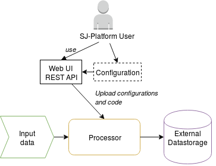

A **processor** represents a part of the pipeline where the data processing is performed.

Configurations uploaded to the system determine the mode of data processing in the modules.

The processing result is exported to an external storage. It can be Elasticsearch, RESTful endpoint or JDBC-compatible data storages.

Besides, SJ-Platform provides a user with a comprehensive RESTful API instrumentation and Web UI.

Below an example of a real-life task solution will demonstrate the platform at work for better understanding of how the data processing can be performed on the platform. Thus, the tutorial will provide you with:

1. a ready-to-use problem resolution of an example task on SJ-Platform base;

2. instructions on development, deployment and customization of your own code for your specific aims.

.. _fping-example-task:

Fping Example Task
----------------------------

Let’s introduce an example task which illustrates the platform workflow in the real-world use.

The demonstration code is responsible for collecting of aggregated information on the accessibility of nodes. 

The fping utility checks the list of provided IPs for accessibility. It sends a 64-bytes packet to each IP and waits for a return packet. If the connections are good and the node can be accessed, a good return packet will be received. The amount of time is also returned for how long it takes for a packet to make the complete trip. On the basis of this information the processor calculates the average response time for each node per 1 minute. The amount of successful responses by IP per 1 minute is calculated by the processing module as well. The result is exported to an external data store.  

Before providing a solution to the task, let’s have a look at the platform from the perspective of a processing pipeline.

Processing
~~~~~~~~~~~~~~~~~~~~~~~~~~~~~~~~~~~

A general processing workflow which system allows implementing is illustrated in the diagram below:

.. figure:: _static/ModulePipeline.png
   :scale: 80%

Green, yellow and purple blocks displayed in a rectangular area are managed and evaluated by SJ-Platform. They represent an input module, a processing module and an output module, respectively. The blocks outside the rectangular area represent external systems.

The input module receives raw data and transforms them into a data stream of a proper type compatible with the processing module type. In the fping demonstration example the input module is a regex input module. It processes input streams of strings using RegExp rules and convert them in Avro records.

The processing module performs data aggregation, transformations, filtering and enriching and sends the result to the output module. In the fping demonstration example the data aggregation is performed with a regular-streaming module. 

In the output module, the processed data are transformed into entities appropriate for storing into an external storage of a specified type. In the fping demonstration example the output module exports the result data into the Elasticsearch external data storage.
           
The illustrated pipeline is a common scenario for a lot of different tasks.

But the platform allows implementation of more complicated processing pipelines. So the pipeline can be expanded. More input streams can ingest raw data. Several input modules can be included in the pipeline to accept the raw data and transform it for passing further to the processing stage.

You can launch more than a single processing module. The data streams can be distributed among them in various ways.

A few output modules may receive the processed data and put them into a storage.

In the example task solution the processing workflow is formed in the following way:

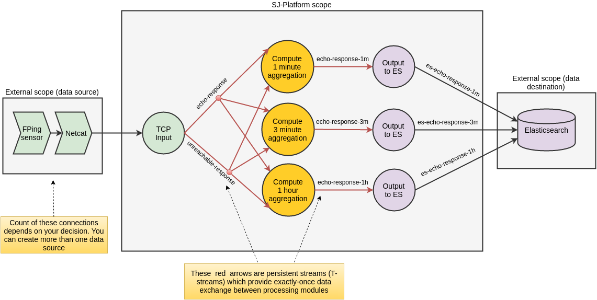

This diagram demonstrates the processing workflow of the demo. As a quick reminder, the task is to collect the aggregated information on the accessibility of nodes.

As you can see, the data come to a TCP input module through a pipeline of fping and netcat.

Then the input module parses ICMP echo responses (select IP and response time) and ICMP unreachable responses (select only IP) and puts parsed data into 'echo-response' stream and 'unreachable-response' stream, respectively.

After that, the processing module aggregates response time and a total amount of echo/unreachable responses by IP per 1 minute and sends aggregated data to 'echo-response-1m' stream.

Two more processing modules are embedded into the pipeline to calculate responses per 3 minutes and per 1 hour. Correspondingly, 'echo-response-3m' and 'echo-response-1h' streams are created for those processing modules to put the aggregated data on echo-responses to.

Finally, the output modules export aggregated data from echo-response streams to Elasticsearch. The result then can be visualized in a diagram using Kibana.

The data is fed to the system, passed from one module to another and exported from the system via streams. Read more about streams under the “Creating Streams” section.

In the demonstration project, the entities are added to the system via REST API as it is less time-consuming. The platform entities can be also created via the UI filling in the forms for each entity with necessary settings.

The result is easy-to-see via Web UI. Or send ‘GET’ API requests to return created entities in JSON.

Now, having the general idea on the platform workflow, we can dive into solving an example task on the base of SJ-Platform. 

And the first step is the system deployment.

.. _Step1-Deployment:

Step 1. Deployment 
~~~~~~~~~~~~~~~~~~~~~~~~~~~~~~~~

Though SJ-Platform is quite a complex system and it includes a range of necessary services, no special skills are required for its deployment. 

There are three options to deploy the platform. Please, read the description for each option and choose the most convenient for you.

**Option 1.** The easiest way is to deploy SJ-Platform on `a virtual machine <http://streamjuggler.readthedocs.io/en/develop/SJ_Demo_Deployment.html>`_. This is the most rapid way to get acquainted with the platform and assess its performance. 

We suggest deploying the platform locally via Vagrant with VirtualBox as a provider. It takes up to 30 minutes. 

The following technical requirements should be met:

- At least 8 GB of free RAM;
- VT-x must be enabled in BIOS;
- Vagrant 1.9.1 installed;
- VirtualBox 5.0.40 installed.

These requirements are provided for deployment on Ubuntu 16.04 OS.

The platform is deployed with all entities necessary to demonstrate the solution for the example task: providers, services, streams, configurations. So the instructions below for creating entities can be omitted. You may read about platform components here in the deployment step details and see the result in the UI.

**Option 2.** Another option is to deploy the platform on a cluster. Currently, the deployment on `Mesos  <http://streamjuggler.readthedocs.io/en/develop/SJ_Deployment.html#mesos-deployment>`_ as a universal distributed computational engine is supported.

The following technical requirements should be met:

- working Linux host with 4-8 GB of RAM and 4 CPU cores; 
- Docker installed (see `official documentation <https://docs.docker.com/engine/installation/linux/docker-ce/ubuntu/>`_);
- cURL;
- sbt installed (see `official documentation <http://www.scala-sbt.org/download.html>`_).  

The platform is deployed with no entities. Thus, the pipeline can be structured from scratch. 

This tutorial provides step-by-step instructions for demo project deployment on Mesos. At first step, Mesos with all the services will be deployed. Then entities will be added to the platform. Finally, modules will be launched and results will be rendered in a diagram.

**Option 3.** Also, you can run SJ-Platform locally deploying it on `minimesos <http://streamjuggler.readthedocs.io/en/develop/SJ_Deployment.html#minimesos-deployment>`_ as a testing environment.

The following technical requirements should be met: 

- git, 
- sbt (see `official documentation <http://www.scala-sbt.org/download.html>`_), 
- Docker (see `official documentation <https://docs.docker.com/engine/installation/linux/docker-ce/ubuntu/>`_),
- cURL.

For the example task, the instructions are provided for the system deployment **on Mesos**.

The deployment is performed via REST API.

Alongside with Apache Mesos, the system works on the basis of the following core technologies: Apache Zookeeper, Apache Kafka, Docker, MongoDB, Hazelcast, Elasticsearch, SQL database, REST.

To solve the example task we need to deploy:

1) Apache Mesos - for all computations;
2) Mesosphere Marathon - a framework for executing tasks on Mesos;
3) Apache Zookeeper -  for coordination;
4) Java
5) Docker
6) MongoDB - as a database;
7) T-streams - as a message broker; 
8) REST - for access to the UI;
9) Elasticsearch - as an external data storage;
10) Kibana - to visualize Elasticsearch data.

So, as a first step, you should deploy Mesos and other services.

1) Deploy Mesos, Marathon, Zookeeper. You can follow the instructions at the official `installation guide <http://www.bogotobogo.com/DevOps/DevOps_Mesos_Install.php>`_ .

Start Mesos and the services. Make sure you have access to Mesos interface, Marathon interface, and Zookeeper is running. 

For Docker deployment follow the instructions at the official `installation guide <https://docs.docker.com/engine/installation/linux/docker-ce/ubuntu/#install-docker-ce>`_ .

Install Java::
                                         
 sudo add-apt-repository ppa:webupd8team/java
 sudo apt-get update
 sudo apt-get install oracle-java8-installer
 sudo apt-get install oracle-java8-set-default

Find detailed instructions `here <https://tecadmin.net/install-oracle-java-8-ubuntu-via-ppa/>`_.

2) Create JSON files and a configuration file. Please, name them as specified here.

Replace <slave_advertise_ip> with the slave advertise IP.

Replace <zk_ip> and <zk_port> according to the Apache Zookeeper address.

.. _mongo.json:

**mongo.json**::

 {  
   "id":"mongo",
   "container":{  
      "type":"DOCKER",
      "docker":{  
         "image":"mongo:3.4.7",
         "network":"BRIDGE",
         "portMappings":[  
            {  
               "containerPort":27017,
               "hostPort":31027,
               "protocol":"tcp" 
            }
         ],
         "parameters":[  
            {  
               "key":"restart",
               "value":"always" 
            }
         ]
      }
   },
   "instances":1,
   "cpus":0.1,
   "mem":512
 }

.. _sj-rest.json:

**sj-rest.json**::

 {  
   "id":"sj-rest",
   "container":{  
      "type":"DOCKER",
      "docker":{  
         "image":"bwsw/sj-rest:dev",
         "network":"BRIDGE",
         "portMappings":[  
            {  
               "containerPort":8080,
               "hostPort":31080,
               "protocol":"tcp" 
            }
         ],
         "parameters":[  
            {  
               "key":"restart",
               "value":"always" 
            }
         ]
      }
   },
   "instances":1,
   "cpus":0.1,
   "mem":1024,
   "env":{
      "MONGO_HOSTS":"<slave_advertise_ip>:31027",
      "ZOOKEEPER_HOST":"<zk_ip>",
      "ZOOKEEPER_PORT":"<zk_port>" 
   }
 }

**elasticsearch.json**::

 {  
   "id":"elasticsearch",
   "container":{  
      "type":"DOCKER",
      "docker":{  
         "image":"docker.elastic.co/elasticsearch/elasticsearch:5.5.1",
         "network":"BRIDGE",
         "portMappings":[  
            {  
               "containerPort":9200,
               "hostPort":31920,
               "protocol":"tcp" 
            },
        {  
               "containerPort":9300,
               "hostPort":31930,
               "protocol":"tcp" 
            }
         ],
         "parameters":[  
            {  
               "key":"restart",
               "value":"always" 
            }
         ]
      }
   },
   "env":{  
      "ES_JAVA_OPTS":"-Xms256m -Xmx256m", 
      "http.host":"0.0.0.0",
      "xpack.security.enabled":"false",
      "transport.host":"0.0.0.0",
      "cluster.name":"elasticsearch" 
   },
   "instances":1,
   "cpus":0.2,
   "mem":256
 } 

**Config.properties**::

 key=pingstation
 active.tokens.number=100
 token.ttl=120

 host=0.0.0.0
 port=8080
 thread.pool=4

 path=/tmp
 data.directory=transaction_data
 metadata.directory=transaction_metadata
 commit.log.directory=commit_log
 commit.log.rocks.directory=commit_log_rocks

 berkeley.read.thread.pool = 2

 counter.path.file.id.gen=/server_counter/file_id_gen

 auth.key=dummy
 endpoints=127.0.0.1:31071
 name=server
 group=group

 write.thread.pool=4
 read.thread.pool=2
 ttl.add-ms=50
 create.if.missing=true
 max.background.compactions=1
 allow.os.buffer=true
 compression=LZ4_COMPRESSION
 use.fsync=true

 zk.endpoints=<zk_ip>
 zk.prefix=/pingstation
 zk.session.timeout-ms=10000
 zk.retry.delay-ms=500
 zk.connection.timeout-ms=10000

 max.metadata.package.size=100000000
 max.data.package.size=100000000
 transaction.cache.size=300

 commit.log.write.sync.value = 1
 commit.log.write.sync.policy = every-nth
 incomplete.commit.log.read.policy = skip-log
 commit.log.close.delay-ms = 200
 commit.log.file.ttl-sec = 86400
 stream.zookeeper.directory=/tts/tstreams
 
 ordered.execution.pool.size=2
 transaction-database.transaction-keeptime-min=70000
 subscribers.update.period-ms=500

.. _tts.json:

**tts.json** (replace <path_to_conf_directory> with an appropriate path to the configuration directory on your computer and <external_host> with a valid host)::

 {
    "id": "tts",
    "container": {
        "type": "DOCKER",
        "volumes": [
            {
                "containerPath": "/etc/conf/config.properties",
                "hostPath": "<path_to_conf_directory>",
                "mode": "RO" 
            }
        ],
        "docker": {
            "image": "bwsw/tstreams-transaction-server",
            "network": "BRIDGE",
            "portMappings": [
                {
                    "containerPort": 8080,
                    "hostPort": 31071,
                    "protocol": "tcp" 
                }
            ],
            "parameters": [
                {
                    "key": "restart",
                    "value": "always" 
                }
            ]
        }
    },
    "instances": 1,
    "cpus": 0.1,
    "mem": 512,
    "env": {
      "HOST":"<slave_advertise_ip>",
      "PORT0":"31071" 
    }
 }

**kibana.json**::

 {  
   "id":"kibana",
   "container":{  
      "type":"DOCKER",
      "docker":{  
         "image":"kibana:5.5.1",
         "network":"BRIDGE",
         "portMappings":[  
            {  
               "containerPort":5601,
               "hostPort":31561,
               "protocol":"tcp" 
            }
         ],
         "parameters":[  
            {  
               "key":"restart",
               "value":"always" 
            }
         ]
      }
   },
   "instances":1,
   "cpus":0.1,
   "mem":256,
   "env":{  
      "ELASTICSEARCH_URL":"https://<slave_advertise_ip>:31920" 
   }
 }

3) Run the services on Marathon:

**Mongo**::
 
 curl -X POST http://172.17.0.1:8080/v2/apps -H "Content-type: application/json" -d @mongo.json 

**Elasticsearch**:

Please, note that `vm.max_map_count` should be a slave::

 sudo sysctl -w vm.max_map_count=262144

Then launch Elasticsearch::

 curl -X POST http://172.17.0.1:8080/v2/apps -H "Content-type: application/json" -d 
 @elasticsearch.json

**SJ-rest**::

 сurl -X POST http://172.17.0.1:8080/v2/apps -H "Content-type: application/json" -d @sj-rest.json    
    
**T-Streams**::
 
 curl -X POST http://172.17.0.1:8080/v2/apps -H "Content-type: application/json" -d @tts.json 

**Kibana**::

 curl -X POST http://172.17.0.1:8080/v2/apps -H "Content-type: application/json" -d @kibana.json

Via the Marathon interface, make sure the services are deployed.

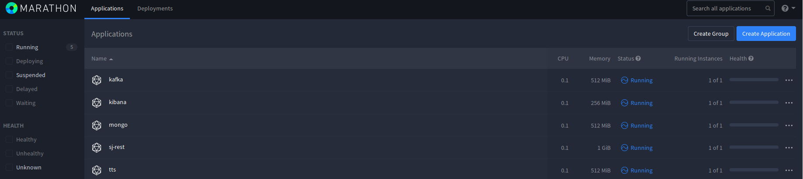

4) Copy the SJ-Platform project from the GitHub repository::

    git clone https://github.com/bwsw/sj-platform.git

5) Add the settings if running the framework on Mesos needs principal/secret:: 
 
    curl --request POST "http://$address/v1/config/settings" -H 'Content-Type: application/json' --data "{\"name\": \"framework-principal\",\"value\": <principal>,\"domain\": \"configuration.system\"}" 
    curl --request POST "http://$address/v1/config/settings" -H 'Content-Type: application/json' --data "{\"name\": \"framework-secret\",\"value\": <secret>,\"domain\": \"configuration.system\"}" 
 
6) Copy the demonstrational project repository::

    cd ..
    git clone https://github.com/bwsw/sj-fping-demo.git
    cd sj-fping-demo

Now make sure you have access to the Web UI. You will see the platform is deployed but it is not completed with any entities yet. They will be added in the next steps.

Next, the infrastructure for the modules can be created.

Step 2. Configurations and Engine Jars Uploading 
~~~~~~~~~~~~~~~~~~~~~~~~~~~~~~~~~~~~~~~~~~~~~~~~~~~~~~~~

An **engine** is required to start a module. A module can not process data without an engine (that is a .jar file containing required configuration settings). In fact, it is a framework that launches the module executor.

.. figure:: _static/engine.png
   :scale: 110%
   :align: center
   
To implement the processing workflow for the example task resolution the following jars should be uploaded:

1. a jar per each module type  - input-streaming, regular-streaming, output-streaming;

2. a jar for Mesos framework that starts the engine.

Thus, engines should be compiled and uploaded next.
 
Upload Engine Jars
""""""""""""""""""""""""

Please, download the engine jars for the three modules (input-streaming, regular-streaming, output-streaming) and the Mesos framework:: 

 wget http://c1-ftp1.netpoint-dc.com/sj/1.0-SNAPSHOT/sj-mesos-framework.jar
 wget http://c1-ftp1.netpoint-dc.com/sj/1.0-SNAPSHOT/sj-input-streaming-engine.jar
 wget http://c1-ftp1.netpoint-dc.com/sj/1.0-SNAPSHOT/sj-regular-streaming-engine.jar
 wget http://c1-ftp1.netpoint-dc.com/sj/1.0-SNAPSHOT/sj-output-streaming-engine.jar

Now upload the engine jars. Please, change <slave_advertise_ip> to the slave advertise IP::

 address=address=<slave_advertise_ip>:31080

 curl --form jar=@sj-mesos-framework.jar http://$address/v1/custom/jars
 curl --form jar=@sj-input-streaming-engine.jar http://$address/v1/custom/jars
 curl --form jar=@sj-regular-streaming-engine.jar http://$address/v1/custom/jars
 curl --form jar=@sj-output-streaming-engine.jar http://$address/v1/custom/jars

Now engine jars should appear in the UI under Custom Jars of the "Custom files" navigation tab.

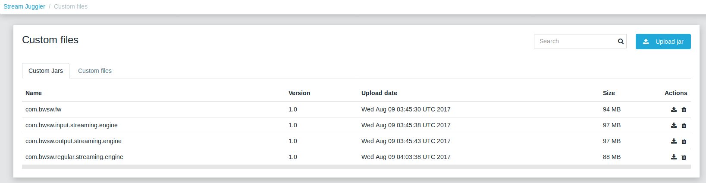

Setup configurations for engines
""""""""""""""""""""""""""""""""""""""""

The configurations will be added to the system via REST. 

The range of configurations includes required and optional ones. The full list of all configurations can be viewed at the :ref:`Configuration` page. 

To resolve the example task it is enough to upload the required configurations only.

For the Example Task
""""""""""""""""""""""

For solving the example task, we will upload the following configurations via REST:

- session.timeout - Use when connecting to Apache Zookeeper in milliseconds (usually when we are dealing with T-streams consumers/producers and Kafka streams)

- current-framework - Indicates what file is used to run a framework. By this value, you can get a setting that contains a file name of framework jar.

- crud-rest-host - For the host on the which the rest has launched.

- crud-rest-port - For the port on the which the rest has launched.

- marathon-connect - Use to launch a framework that is responsible for running engine tasks and provides the information about launched tasks. It should start with 'http://'.

- marathon-connect-timeout - Use when trying to connect by 'marathon-connect' (in milliseconds).

Send the next POST requests to upload the configs. Please, replace <slave_advertise_ip> with the slave advertise IP and <marathon_address> with the address of Marathon::

 curl --request POST "http://$address/v1/config/settings" -H 'Content-Type: application/json' --data "{\"name\": \"session-timeout\",\"value\": \"7000\",\"domain\": \"configuration.apache-zookeeper\"}" 
 curl --request POST "http://$address/v1/config/settings" -H 'Content-Type: application/json' --data "{\"name\": \"current-framework\",\"value\": \"com.bwsw.fw-1.0\",\"domain\": \"configuration.system\"}" 

 curl --request POST "http://$address/v1/config/settings" -H 'Content-Type: application/json' --data "{\"name\": \"crud-rest-host\",\"value\": \"<slave_advertise_ip>\",\"domain\": \"configuration.system\"}" 
 curl --request POST "http://$address/v1/config/settings" -H 'Content-Type: application/json' --data "{\"name\": \"crud-rest-port\",\"value\": \"31080\",\"domain\": \"configuration.system\"}" 

 curl --request POST "http://$address/v1/config/settings" -H 'Content-Type: application/json' --data "{\"name\": \"marathon-connect\",\"value\": \"http://<marathon_address>\",\"domain\": \"configuration.system\"}" 
 curl --request POST "http://$address/v1/config/settings" -H 'Content-Type: application/json' --data "{\"name\": \"marathon-connect-timeout\",\"value\": \"60000\",\"domain\": \"configuration.system\"}" 

Send the next POST requests to upload configurations for module validators::

 curl --request POST "http://$address/v1/config/settings" -H 'Content-Type: application/json' --data "{\"name\": \"regular-streaming-validator-class\",\"value\": \"com.bwsw.sj.crud.rest.instance.validator.RegularInstanceValidator\",\"domain\": \"configuration.system\"}"
 curl --request POST "http://$address/v1/config/settings" -H 'Content-Type: application/json' --data "{\"name\": \"input-streaming-validator-class\",\"value\": \"com.bwsw.sj.crud.rest.instance.validator.InputInstanceValidator\",\"domain\": \"configuration.system\"}"
 curl --request POST "http://$address/v1/config/settings" -H 'Content-Type: application/json' --data "{\"name\": \"output-streaming-validator-class\",\"value\": \"com.bwsw.sj.crud.rest.instance.validator.OutputInstanceValidator\",\"domain\": \"configuration.system\"}"

In the UI you can see the uploaded configurations under the “Configuration” tab of the main navigation.

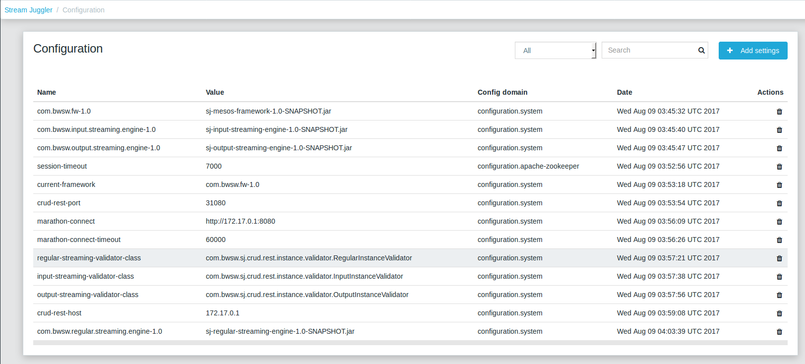

Step 3. Module Uploading 
~~~~~~~~~~~~~~~~~~~~~~~~~~~~~~~~~

Now as the system is deployed and necessary engines are added, modules can be uploaded to the system.

A **module** is a .jar file, containing a module specification and configurations.

.. figure:: _static/moduleExecutorAndValidator.png
   :scale: 120%
   :align: center
   
.. note:: Find more about modules at the :ref:`Modules` page.  A hello-world on a custom module can be found at the :ref:`Custom_Module` section.

For the stated example task the following modules will be uploaded:

- a TCP input module - *sj-regex-input* module - that accepts TCP input streams and transforms raw data to put them to T-streams and pass for processing;

- a processing module - *ps-process* module - which is a regular-streaming module that processes data element-by-element.

- an output module - *ps-output* module - that exports resulting data to Elasticsearch.

Download the modules from the Sonatype repository and upload it to the system following the instructions for the example task.

For the Example Task
"""""""""""""""""""""""""

Please, follow these steps to build and upload the modules of pingstation demonstration task.

To configure environment::
 
 cd sj-fping-demo
 
 address=<host>:<port>

<host>:<port> — SJ-Platform REST host and port.

**Module Downloading from Sonatype Repository**

- To download the *sj-regex-input* module from the sonatype repository::

   curl "https://oss.sonatype.org/content/repositories/snapshots/com/bwsw/sj-regex-input_2.12/1.0-SNAPSHOT/sj-regex-input_2.12-1.0-SNAPSHOT.jar" -o sj-regex-input.jar 

- To download the *ps-process* module from the sonatype repository::

   curl “https://oss.sonatype.org/content/repositories/snapshots/com/bwsw/ps-process_2.12/1.0-SNAPSHOT/ps-process_2.12-1.0-SNAPSHOT.jar” -o ps-process-1.0.jar

- To download the *ps-output* module from the sonatype repository::

   curl “https://oss.sonatype.org/content/repositories/snapshots/com/bwsw/ps-output_2.12/1.0-SNAPSHOT/ps-output_2.12-1.0-SNAPSHOT.jar” -o ps-output-1.0.jar

**Module Uploading**

Upload modules to the system::

 curl --form jar=@sj-regex-input.jar http://$address/v1/modules
 curl --form jar=@ps-process/target/scala-2.11/ps-process-1.0.jar http://$address/v1/modules
 curl --form jar=@ps-output/target/scala-2.11/ps-output-1.0.jar http://$address/v1/modules

Now in the UI, you can see the uploaded modules under the ‘Modules’ tab.

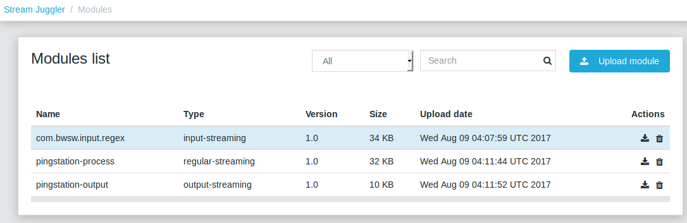

Step 4. Creating Streaming Layer 
~~~~~~~~~~~~~~~~~~~~~~~~~~~~~~~~~~~~~~~

The raw data is fed to the platform from different sources. And within the platform, the data is passed to and from a module in streams. Thus, in the next step, the streams for data ingesting and exporting will be created.

Different modules require different stream types for input and output.
                   
A module receives data from input streams from TCP or Kafka. 

Within the platform, the data is transported to and from modules via T-streams. It is a native streaming type for SJ-Platform that allows exactly-once data exchange between modules. 

The result data is exported from SJ-Platform to an external storage with streams of types corresponding to the type of that storage: Elasticsearch, SQL database and RESTful.

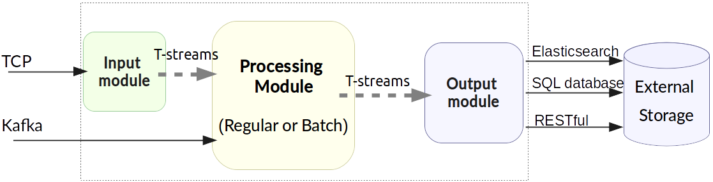

Prior to creating a stream, the infrastructure needs to be created for the streaming layer.

The infrastructure for streams includes **providers** and **services**. This is a required presetting without which streaming will not be so flexible. 

Streaming flexibility lies in a one-to-many connection between providers and services, services and streams. One provider works with many services (they can be of various types) as well as one service can provide several streams. These streams take necessary settings from the common infrastructure (providers and services). There is no need to duplicate the settings for each individual stream.

The types of providers and services are determined by the type of streams. Find more about types of platform entities at the Streaming_Infrastructure_ section.

In the example task solution the following stream types are implemented:

1. TCP input stream ingests the raw data into the system;

2. T-streams streaming passes the data to and from the processing module;

3. output modules export aggregated data and pass them in streams to Elasticsearch.

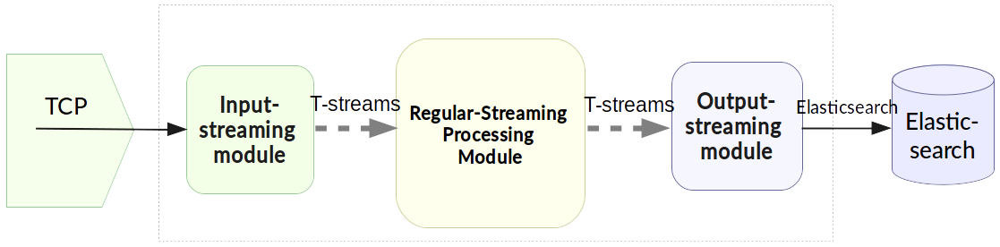

Below the steps for creating streaming infrastructure such as providers, services, and streams via REST API can be found.

Set Up Streaming Infrastructure
"""""""""""""""""""""""""""""""""""""""
Prior to creating streams, it is necessary to provide the infrastructure: providers and services.

They can be of different types. The types of platform entities in the pipeline determine the type of providers and services that are necessary in the particular case.

For the Example Task
"""""""""""""""""""""""

In the example task pipeline the modules of three types take place: the input-streaming, regular-streaming and output-streaming. For all types of modules, the Apache Zookeeper service is necessary. Thus, it requires the Apache Zookeeper provider.

Besides, the Apache Zookeeper provider is required for T-streams service that is in its turn needed for streams of T-streams type within the platform, and instances of the input-streaming and the regular-streaming modules.

The provider and the service of Elasticsearch type are required by the Elasticsearch output streams to put the result in the Elasticsearch data storage.

As a result, the following infrastructure is to be created:

- Providers of Apache Zookeeper and Elasticsearch types;
- Services of Apache Zookeeper, T-streams and Elasticsearch types.

1) Set up providers.

- Apache Zookeeper for T-streams streaming (‘echo-response’ and ‘unreachable-response’ streams) within the platform, for Zookeeper service necessary for all types of  instances::

   sed -i 's/176.120.25.19:2181/<zookeeper_address>/g' api-json/providers/zookeeper-ps-provider.json
   curl --request POST "http://$address/v1/providers" -H 'Content-Type: application/json' --data "@api-json/providers/zookeeper-ps-provider.json"

- Elasticsearch for output streaming (all ‘es-echo-response’ streams).

There is a default value of Elasticsearch IP (176.120.25.19) in json configuration files, so we need to change it appropriately via sed app before using::

   sed -i 's/176.120.25.19/elasticsearch.marathon.mm/g'  api-json/providers/elasticsearch-ps-provider.json
   curl --request POST "http://$address/v1/providers" -H 'Content-Type: application/json' --data "@api-json/providers /elasticsearch-ps-provider.json"

The created providers are available in the UI under the “Providers” tab.

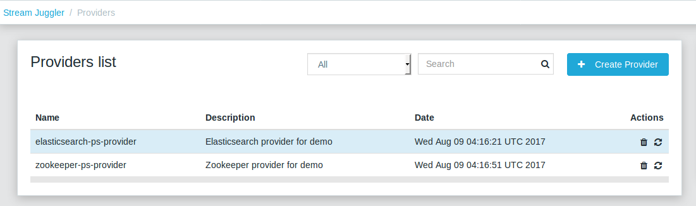

2) Next set up services:

- Apache Zookeeper service for all modules::

   curl --request POST "http://$address/v1/services" -H 'Content-Type: application/json' --data "@api-json/services/zookeeper-ps-service.json"

- T-streams service for T-streams streaming (all ‘echo-response’ streams and the ‘unreachable-response’ stream) within the platform and the instances of the input-streaming and the regular-streaming modules::

   curl --request POST "http://$address/v1/services" -H 'Content-Type: application/json' --data "@api-json/services/tstream-ps-service.json"

- Elasticsearch service for output streaming (all ‘es-echo-response’ streams) and the output-streaming module::

   curl --request POST "http://$address/v1/services" -H 'Content-Type: application/json' --data "@api-json/services/elasticsearch-ps-service.json"

Please, make sure the created services have appeared in the UI under the “Services” tab.

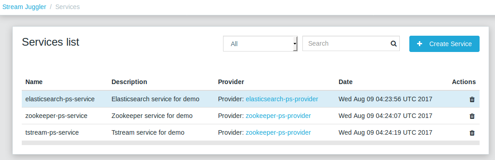

Creating Streams
""""""""""""""""""""""""""""""
Once streaming infrastructure is created, it is high time to create streams. Please, use the “POST” API requests below to create streams that will be used in the instances of input-streaming, regular-streaming and output-streaming modules.

For the Example task
""""""""""""""""""""""""

For **sj-regex-input module**:

Create an ‘echo-response’ output stream of the sj-regex-input module (consequently, an input stream of ps-process module). It will be used for keeping an IP and average time from ICMP echo-response and also a timestamp of the event::

 curl --request POST "http://$address/v1/streams" -H 'Content-Type: application/json' --data "@api-json/streams/echo-response.json"

Create an ‘unreachable response’ output stream of the sj-regex-input module (consequently, an input stream of the processing module). It will be used for keeping an IP from ICMP unreachable response and also a timestamp of the event::

 curl --request POST "http://$address/v1/streams" -H 'Content-Type: application/json' --data "@api-json/streams/unreachable-response.json"

These streams are of T-streams type.

For **ps-process module**:

Create output streams of the ps-process module (consequently, an input stream of the output module) named ‘echo-response-1m’, ‘echo-response-3m’ and ‘echo-response-1h’. They will be used for keeping the aggregated information about the average time of echo responses, the total amount of echo responses, the total amount of unreachable responses and the timestamp for each IP (per 1 minute, per 3 minutes and per 1 hour)::

 curl --request POST "http://$address/v1/streams" -H 'Content-Type: application/json' --data   "@api-json/streams/echo-response-1m.json"

 curl --request POST "http://$address/v1/streams" -H 'Content-Type: application/json' --data "@api-json/streams/echo-response-3m.json"

 curl --request POST "http://$address/v1/streams" -H 'Content-Type: application/json' --data "@api-json/streams/echo-response-1h.json"

These streams are of T-streams type.

For **ps-output module**:

Create output streams of the ps-output module named ‘es-echo-response-1m’, ‘es-echo-response-3m’, ‘es-echo-response-1h’. They will be used for keeping the aggregated information (per 1 minute, per 3 minutes and per 1 hour) from the previous stream including total amount of responses::

 curl --request POST "http://$address/v1/streams" -H 'Content-Type: application/json' --data "@api-json/streams/es-echo-response-1m.json"

 curl --request POST "http://$address/v1/streams" -H 'Content-Type: application/json' --data "@api-json/streams/es-echo-response-3m.json"

 curl --request POST "http://$address/v1/streams" -H 'Content-Type: application/json' --data "@api-json/streams/es-echo-response-1h.json"
 
These streams are of Elasticsearch type (as the external storage in the pipeline is Elasticsearch).

All the created streams should be available now in the UI under the “Streams” tab.

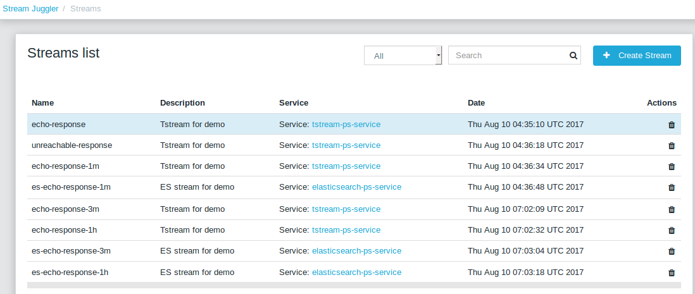

Step 5. Create Output Destination
~~~~~~~~~~~~~~~~~~~~~~~~~~~~~~~~~~~~~~~~~~

At this step all necessary indexes, tables and mapping should be created for storing the processed result.

For the Example task
""""""""""""""""""""""""""""""""""""""
In the provided example task the result data is stored to the Elasticsearch data storage.

Thus, it is necessary to create the index and mapping for ES.

Create the index and the mapping for Elasticsearch sending the PUT request::

 curl --request PUT "http://176.120.25.19:9200/pingstation" -H 'Content-Type: application/json' --data "@api-json/elasticsearch-index.json"

Step 6. Creating Instances 
~~~~~~~~~~~~~~~~~~~~~~~~~~~~~

Once the system is deployed, configurations and modules are uploaded, the streaming layer with necessary infrastructure is created, an instance is to be created in the next step.

A module uses a specific instance to personalize its work. An instance is a full range of settings to perform a specific executor type.

.. figure:: _static/instance.png
   :scale: 120%
   :align: center
   
An instance is created with specific parameters and is set to particular streams.
 
For each module, an instance should be created.

Creating Instances
"""""""""""""""""""""""""""""
For instance creation we will send the POST requests. See the instructions below for creating insatnces for the example task solution.

For the Example task
"""""""""""""""""""""""

For creating an instance of the *sj-regex-input* module send the following POST request::

 curl --request POST "http://$address/v1/modules/input-streaming/pingstation-input/1.0/instance" -H 'Content-Type: application/json' --data "@api-json/instances/pingstation-input.json"

For creating an instance of the *ps-process* module send the following POST request::

 curl --request POST "http://$address/v1/modules/regular-streaming/pingstation-process/1.0/instance" -H 'Content-Type: application/json' --data "@api-json/instances/pingstation-process.json"

Create two more instances for the *ps-process* module with different checkpoint intervals to process data every 3 minute and every hour. Remember to create them with different names::

 curl --request POST "http://$address/v1/modules/regular-streaming/pingstation-process/1.0/instance" -H 'Content-Type: application/json' --data "@api-json/instances/pingstation-echo-process-3m.json"

 curl --request POST "http://$address/v1/modules/regular-streaming/pingstation-process/1.0/instance" -H 'Content-Type: application/json' --data "@api-json/instances/pingstation-echo-process-1h.json"

For creating an instance of the *ps-output* module send the following POST request::

 curl --request POST "http://$address/v1/modules/output-streaming/pingstation-output/1.0/instance" -H 'Content-Type: application/json' --data "@api-json/instances/pingstation-output.json"
 
Create two more instances to receive data from the instances processing data every 3 minutes and every hour. Remember to create the JSON files with different names. Change the ‘input’ values to ‘echo-response-3m’ and ‘echo-response-1h’ respectively to receive data from these streams. 

Change the ‘output’ values to ‘es-echo-response-3m’ and ‘es-echo-response-1h’ correspondingly to put the result data to these streams:: 

 curl --request POST "http://$address/v1/modules/output-streaming/pingstation-output/1.0/instance" -H 'Content-Type: application/json' --data "@api-json/instances/pingstation-output-3m.json"

 curl --request POST "http://$address/v1/modules/output-streaming/pingstation-output/1.0/instance" -H 'Content-Type: application/json' --data "@api-json/instances/pingstation-output-1h.json"

The created instances should be available now in UI under the “Instances” tab. There they will appear with the “ready” status.

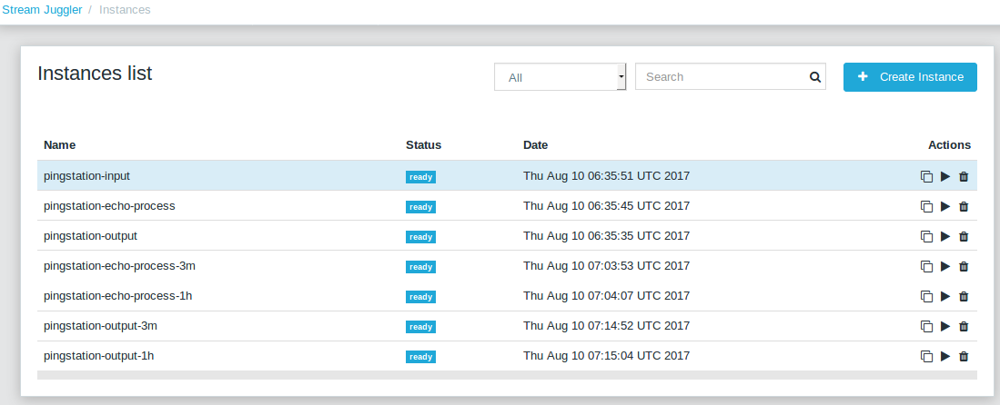

Ready! The module can be launched.

Launching Instances
~~~~~~~~~~~~~~~~~~~~~~~~~~~~~~

After the streaming layer with its infrastructure and instances are created you can start a module. 

The module starts working after it is launched. The input module starts receiving data, transform the data for T-streams to pass to the processing module. The processing module starts processing them and put to T-streams to pass to the output module. The output module starts storing the result in a data storage. 

In fact, it is not a module that is started. It is an instance of the module.

In the example case, there are three modules (input-streaming, regular-streaming and output-streaming modules) and each of them has its own instances. Thus, these instances should be launched one by one. 

For launching the **input module instance** send::

 curl --request GET "http://$address/v1/modules/input-streaming/pingstation-input/1.0/instance/pingstation-input/start"

For launching the **processing module instances** send::

 curl --request GET "http://$address/v1/modules/regular-streaming/pingstation-process/1.0/instance/pingstation-process/start"

 curl --request GET "http://$address/v1/modules/regular-streaming/pingstation-process/1.0/instance/pingstation-process-3m/start"

 curl --request GET "http://$address/v1/modules/regular-streaming/pingstation-process/1.0/instance/pingstation-process-1h/start" 

For launching the **output module instances** send::

 curl --request GET "http://$address/v1/modules/output-streaming/pingstation-output/1.0/instance/pingstation-output/start"

 curl --request GET "http://$address/v1/modules/output-streaming/pingstation-output/1.0/instance/pingstation-output-3m/start"

 curl --request GET "http://$address/v1/modules/output-streaming/pingstation-output/1.0/instance/pingstation-output-1h/start" 

To get a list of listening ports of input module instance::

 curl --request GET "http://$address/v1/modules/input-streaming/pingstation-input/1.0/instance/pingstation-input"

and look at the field named ‘tasks’, e.g. it may look as follows::

 "tasks": {
  "pingstation-input-task0": {
    "host": "176.120.25.19",
    "port": 31000
  },
  "pingstation-input-task1": {
    "host": "176.120.25.19",
    "port": 31004
  }
 }

And now you can **start a flow**. Please, replace `nc` with the host and port of your instance task::

 fping -l -g 91.221.60.0/23 2>&1 | nc 176.120.25.19 31000

If you have a look in the UI, you will see the launched modules with the “started” status.

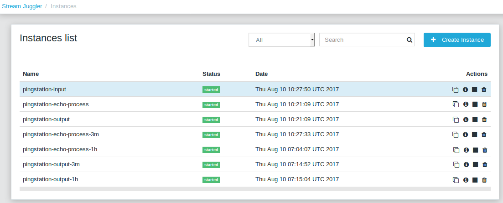

See the Results 
~~~~~~~~~~~~~~~~~~~~~~~~~~~~~~~

To see the processing results saved in Elasticsearch, please, go to Kibana. There the aggregated data can be rendered in a diagram.

The result can be viewed while the module is working. A necessary auto-refresh interval can be set for the diagram to update the graph.

Firstly, click the Settings tab and fill in the data entry field '*' instead of 'logstash-*'. 

Then there will appear another data entry field called 'Time-field name'. You should choose 'ts' from the combobox and press the create button. 

After that, click the Discover tab. 

Choose a time interval of 'Last 15 minutes' in the top right corner of the page, as well as an auto-refresh interval of 45 seconds, as an example. Now a diagram can be compiled. 

Select the parameters to show in the graph at the left-hand panel. 

The example below is compiled in Kibana v.5.5.1.

It illustrates the average time of echo-responses by IPs per a selected period of time (e.g. 1 min). As you can see, different nodes have the different average time of response. Some nodes respond faster than others. 

Lots of other parameter combinations can be implemented to view the results.

Instance Shutdown 
~~~~~~~~~~~~~~~~~~~~~~~~~

Once the task is resolved and necessary data is aggregated, the instance can be stopped. 

A stopped instance can be restarted again if it is necessary.

If there is no need for it anymore, a suspended instance can be deleted. On the basis of the uploaded modules and the whole created infrastructure (providers, services, streams) other instances can be created for other purposes.

To stop instances in the example task the following requests should be sent.

For suspending the **sj-regex-input module instance** send::

 curl --request GET "http://$address/v1/modules/input-streaming/pingstation-input/1.0/instance/pingstation-input/stop"

For suspending the **ps-process module instances** send::

 curl --request GET "http://$address/v1/modules/regular-streaming/pingstation-process/1.0/instance/pingstation-process/stop "

 curl --request GET "http://$address/v1/modules/regular-streaming/pingstation-process/1.0/instance/pingstation-process-3m/stop "

 curl --request GET "http://$address/v1/modules/regular-streaming/pingstation-process/1.0/instance/pingstation-process-1h/stop "

For suspending the **ps-output module instances** send::

 curl --request GET "http://$address/v1/modules/regular-streaming/pingstation-process/1.0/instance/pingstation-output/stop" 

 curl --request GET "http://$address/v1/modules/regular-streaming/pingstation-process/1.0/instance/pingstation-output-3m/stop"  

 curl --request GET "http://$address/v1/modules/regular-streaming/pingstation-process/1.0/instance/pingstation-output-1h/stop" 

In the UI, you will see the suspended instances with the “stopped” status.

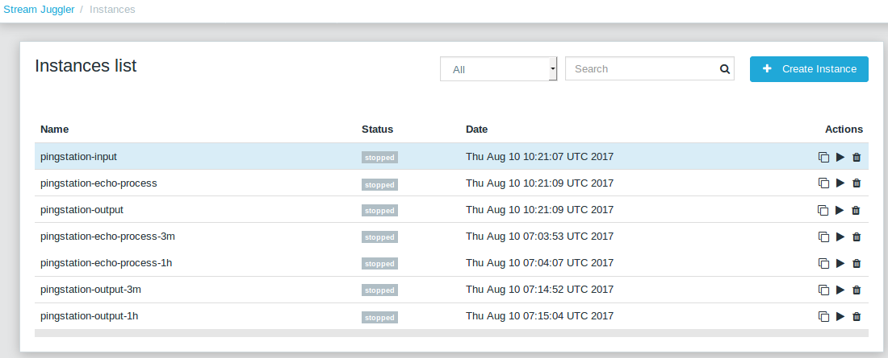

Deleting Instance
~~~~~~~~~~~~~~~~~~~~~~~~~~~~~~~~
A stopped instance can be deleted if there is no need for it anymore. An instance of a specific module can be deleted via REST API by sending a DELETE request (as described below). Or instance deleting action is available in the UI under the “Instances” tab.

Make sure the instances to be deleted are stopped and are not with one of the following statuses: «starting», «started», «stopping», «deleting».

The instances of the modules can be deleted one by one. 

For deleting the sj-regex-input module instance send::

 curl --request DELETE "http://$address/v1/modules/input-streaming/pingstation-input/1.0/instance/pingstation-input/"

For deleting the ps-process module instance send::

 curl --request DELETE "http://$address/v1/modules/regular-streaming/pingstation-process/1.0/instance/pingstation-process/"

 сurl --request DELETE "http://$address/v1/modules/regular-streaming/pingstation-process/1.0/instance/pingstation-process-3m/" 

 curl --request DELETE "http://$address/v1/modules/regular-streaming/pingstation-process/1.0/instance/pingstation-process-1h/"

For deleting the ps-output module instance send::

 curl --request DELETE "http://$address/v1/modules/output-streaming/pingstation-output/1.0/instance/pingstation-output/"

 curl --request DELETE "http://$address/v1/modules/output-streaming/pingstation-output/1.0/instance/pingstation-output-3m/"

 curl --request DELETE "http://$address/v1/modules/output-streaming/pingstation-output/1.0/instance/pingstation-output-1h/"

Via the UI you can make sure the instances are deleted.

.. _sflow-example-task:

Sflow Example Task
-------------------------

There is another example of the platform performance. It represents the processing workflow of demonstration task that is responsible for collecting sFlow information: 

- computes traffic for the source IP; 
- computes traffic between the source and the destination.

The processing pipeline includes an input module, a batch processing module and an output module. Within the platform, the data is transported with T-streams.

As an external data source, an sFlow reporter takes place. It sends data to the system in CSV format.

The CSV data are transformed by the input module and are sent for processing to the batch processing module. The data that can not be parsed by the input module are sent to the output module for incorrect data without processing.

The processed data is stored in the PostgreSQL database. It is exported from the platform via the output module with the streams of SQL-database type.

In general, the pipeline can be rendered as in the diagram below:

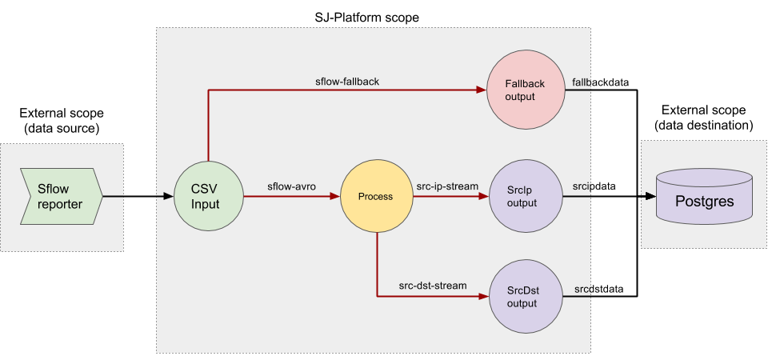

Green, yellow, purple and red blocks are executed with SJ-Platform. These are the *'sflow-csv-input'* module, the *'sflow-process'* module, the *'sflow-src-ip-output'* and the *'sflow-src-dst-output'* modules and the *'sflow-fallback-output'* module, respectively.

The data come to the CSV input module from the sFlow reporter. It sends sFlow records in CSV format to the input module. Then the input module parses CSV-lines into avro records and puts the parsed data into the *'sflow-avro'* stream of T-streams type. After that, the batch processing module parses avro records into sFlow records, and then:

- computes traffic for the source IP and puts it in *'src-ip-stream'*;
- computes traffic between the source and the destination and puts it in *'src-dst-stream'*.

Finally the *'sflow-src-ip-output'* module just displaces data from *'src-ip-stream'*  to the *'srcipdata'* table in PostgreSQL. The *'sflow-src-dst-output'* module displaces data from *'src-dst-stream'*  to the *'srcdstdata'*  table.

If the input module cannot parse an input line, then it puts data into the *'sflow-fallback'* stream. After that the *‘fallback-output’* module moves that incorrect line from *'sflow-fallback'* to the *'fallbackdata'* table in PostgreSQL.

Step 1. Deployment
~~~~~~~~~~~~~~~~~~~~~~~~~

For this demo project the following core systems and services are required:

1. Apache Mesos - for all computations;
2. Mesosphere Marathon - a framework for executing tasks on Mesos;
3. Apache Zookeeper - for coordination;
4. Java
5. Docker
6. MongoDB - as a database;
7. T-streams - as a message broker;
8. REST - for access to the UI;
9. PostgreSQL - as a destination.

Perform the steps for platform deployment from the Step1-Deployment_ section.

1) Deploy Mesos, Apache Zookeeper, Marathon.
   
2) Create json files for the services and run them:

- mongo.json_
- sj-rest.json_
- config.properties
  
  For the sFlow demostrational project the config.properties.json has the following content (remember to replace <zk_ip> with a valid Apache Zookeeper IP)::
  
   key=sflow
   active.tokens.number=100
   token.ttl=120

   host=0.0.0.0
   port=8080
   thread.pool=4

   path=/tmp
   data.directory=transaction_data
   metadata.directory=transaction_metadata
   commit.log.directory=commit_log
   commit.log.rocks.directory=commit_log_rocks

   berkeley.read.thread.pool = 2

   counter.path.file.id.gen=/server_counter/file_id_gen

   auth.key=dummy
   endpoints=127.0.0.1:31071
   name=server
   group=group

   write.thread.pool=4
   read.thread.pool=2
   ttl.add-ms=50
   create.if.missing=true
   max.background.compactions=1
   allow.os.buffer=true
   compression=LZ4_COMPRESSION
   use.fsync=true

   zk.endpoints=172.17.0.3:2181
   zk.prefix=/sflow
   zk.session.timeout-ms=10000
   zk.retry.delay-ms=500
   zk.connection.timeout-ms=10000

   max.metadata.package.size=100000000
   max.data.package.size=100000000
   transaction.cache.size=300

   commit.log.write.sync.value = 1
   commit.log.write.sync.policy = every-nth
   incomplete.commit.log.read.policy = skip-log
   commit.log.close.delay-ms = 200
   commit.log.file.ttl-sec = 86400
   stream.zookeeper.directory=/tts/tstreams

   ordered.execution.pool.size=2
   transaction-database.transaction-keeptime-min=70000
   subscribers.update.period-ms=500

- tts.json_

Via the Marathon interface, make sure the services are deployed.

Now look and make sure you have access to the Web UI. You will see the platform but it is not completed with any entities yet. They will be added in the next steps.

Next, the infrastructure for the module performance can be created.

Step 2. Configurations and Engine Jars Uploading
~~~~~~~~~~~~~~~~~~~~~~~~~~~~~~~~~~~~~~~~~~~~~~~~~~~~

Download the engine jars::

 wget http://c1-ftp1.netpoint-dc.com/sj/1.0-SNAPSHOT/sj-mesos-framework.jar
 wget http://c1-ftp1.netpoint-dc.com/sj/1.0-SNAPSHOT/sj-input-streaming-engine.jar
 wget http://c1-ftp1.netpoint-dc.com/sj/1.0-SNAPSHOT/sj-batch-streaming-engine.jar
 wget http://c1-ftp1.netpoint-dc.com/sj/1.0-SNAPSHOT/sj-output-streaming-engine.jar

And upload them to the system. Please, replace <host>:<port> with the SJ-Platform REST host and port::

 address=<slave_advertise_ip>:31080
 
 curl --form jar=@sj-mesos-framework.jar http://$address/v1/custom/jars
 curl --form jar=@sj-input-streaming-engine.jar http://$address/v1/custom/jars
 curl --form jar=@sj-batch-streaming-engine.jar http://$address/v1/custom/jars
 curl --form jar=@sj-output-streaming-engine.jar http://$address/v1/custom/jars

Check out in the UI the engines are uploaded:

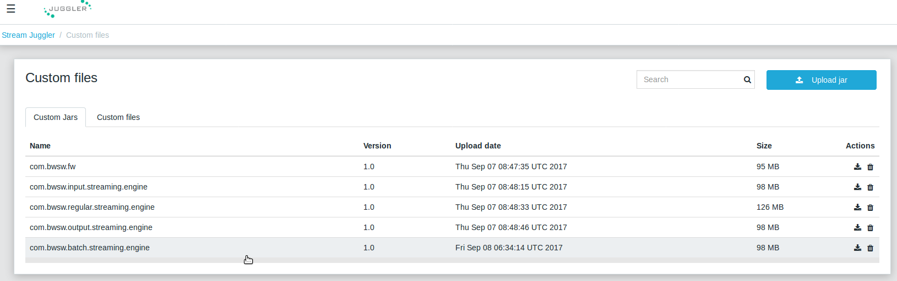

Setup settings for the engines. Please, replace <slave_advertise_ip> with the IP of the REST and <marathon_address> with the address of Marathon::

 curl --request POST "http://$address/v1/config/settings" -H 'Content-Type: application/json' --data "{\"name\": \"session-timeout\",\"value\": \"7000\",\"domain\": \"configuration.apache-zookeeper\"}" 
 curl --request POST "http://$address/v1/config/settings" -H 'Content-Type: application/json' --data "{\"name\": \"current-framework\",\"value\": \"com.bwsw.fw-1.0\",\"domain\": \"configuration.system\"}" 

 curl --request POST "http://$address/v1/config/settings" -H 'Content-Type: application/json' --data "{\"name\": \"crud-rest-host\",\"value\": \"<slave_advertise_ip>",\"domain\": \"configuration.system\"}" 
 curl --request POST "http://$address/v1/config/settings" -H 'Content-Type: application/json' --data "{\"name\": \"crud-rest-port\",\"value\": \"8080\",\"domain\": \"configuration.system\"}" 

 curl --request POST "http://$address/v1/config/settings" -H 'Content-Type: application/json' --data "{\"name\": \"marathon-connect\",\"value\": \"<marathon_address>",\"domain\": \"configuration.system\"}" 
 curl --request POST "http://$address/v1/config/settings" -H 'Content-Type: application/json' --data "{\"name\": \"marathon-connect-timeout\",\"value\": \"60000\",\"domain\": \"configuration.system\"}" 
 curl --request POST "http://$address/v1/config/settings" -H 'Content-Type: application/json' --data "{\"name\": \"kafka-subscriber-timeout\",\"value\": \"100\",\"domain\": \"configuration.system\"}" 
 curl --request POST "http://$address/v1/config/settings" -H 'Content-Type: application/json' --data "{\"name\": \"low-watermark\",\"value\": \"100\",\"domain\": \"configuration.system\"}" 

 curl --request POST "http://$address/v1/config/settings" -H 'Content-Type: application/json' --data "{\"name\": \"batch-streaming-validator-class\",\"value\": \"com.bwsw.sj.crud.rest.instance.validator.BatchInstanceValidator\",\"domain\": \"configuration.system\"}" 
 curl --request POST "http://$address/v1/config/settings" -H 'Content-Type: application/json' --data "{\"name\": \"input-streaming-validator-class\",\"value\": \"com.bwsw.sj.crud.rest.instance.validator.InputInstanceValidator\",\"domain\": \"configuration.system\"}" 
 curl --request POST "http://$address/v1/config/settings" -H 'Content-Type: application/json' --data "{\"name\": \"output-streaming-validator-class\",\"value\": \"com.bwsw.sj.crud.rest.instance.validator.OutputInstanceValidator\",\"domain\": \"configuration.system\"}" 

You can see in the UI the configurations are uploaded:

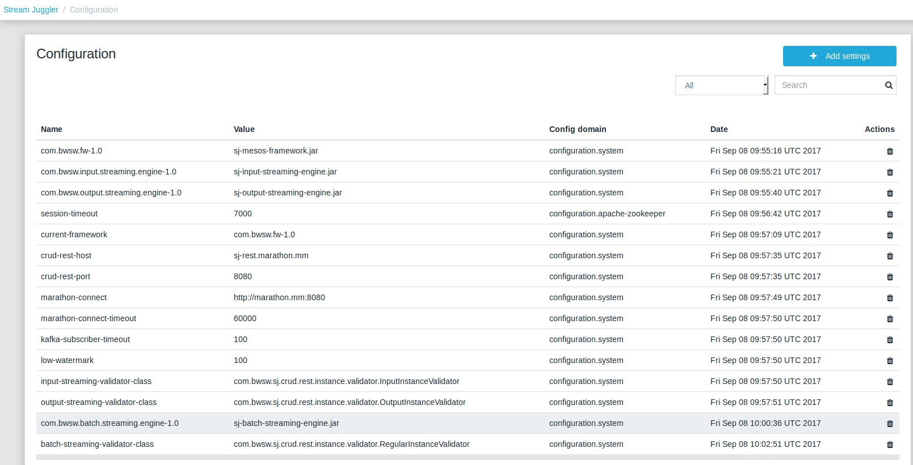

Step 3. Modules Uploading
~~~~~~~~~~~~~~~~~~~~~~~~~~~~~~~~~~

Now let's upload modules for data processing::
 
 cd ..
 git clone https://github.com/bwsw/sj-fping-demo.git
 cd sj-sflow-demo
 sbt assembly

Then, upload the ready-to-use CSV-input module from the sonatype repository::

 curl "https://oss.sonatype.org/content/repositories/snapshots/com/bwsw/sj-csv-input_2.12/1.0-SNAPSHOT/sj-csv-input_2.12-1.0-SNAPSHOT.jar" -o sj-csv-input.jar
 curl --form jar=@sj-csv-input.jar http://$address/v1/modules

Then, build and upload the batch processing and the output modules of the sFlow demo project. 

From the directory of the demo project set up the batch processing module::
 
 curl --form jar=@sflow-process/target/scala-2.12/sflow-process-1.0.jar http://$address/v1/modules

Next, set up the output modules::

 curl --form jar=@sflow-output/src-ip/target/scala-2.12/sflow-src-ip-output-1.0.jar http://$address/v1/modules
 curl --form jar=@sflow-output/src-dst/target/scala-2.12/sflow-src-dst-output-1.0.jar http://$address/v1/modules
 curl --form jar=@sflow-fallback-output/target/scala-2.12/sflow-fallback-output-1.0.jar http://$address/v1/modules
 
The uploaded modules have appeared in the UI:

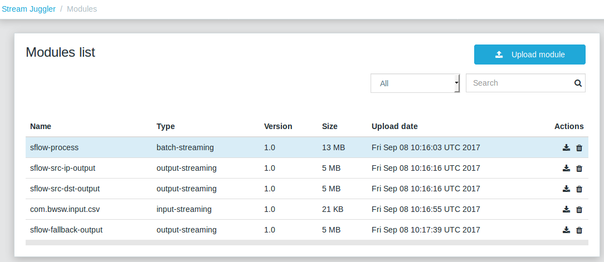

Now upload the GeoIP database which is required for the processing module::

 curl "http://download.maxmind.com/download/geoip/database/asnum/GeoIPASNum.dat.gz" -O
 gunzip GeoIPASNum.dat.gz
 curl --form file=@GeoIPASNum.dat http://$address/v1/custom/files

Then, upload and configure JDBC driver (determine <driver_name>)::

 curl "https://jdbc.postgresql.org/download/postgresql-42.0.0.jar" -O
 curl --form file=@postgresql-42.0.0.jar http://$address/v1/custom/files
 curl --request POST "http://$address/v1/config/settings" -H 'Content-Type: application/json' --data "{\"name\": \"driver.<driver_name>\",\"value\": \"postgresql-42.0.0.jar\",\"domain\": \"configuration.sql-database\"}" 
 curl --request POST "http://$address/v1/config/settings" -H 'Content-Type: application/json' --data "{\"name\": \"driver.<driver_name>.class\",\"value\": \"org.postgresql.Driver\",\"domain\": \"configuration.sql-database\"}" 
 curl --request POST "http://$address/v1/config/settings" -H 'Content-Type: application/json' --data "{\"name\": \"driver.<driver_name>.prefix\",\"value\": \"jdbc:postgresql\",\"domain\": \"configuration.sql-database\"}"

Now you can see the settings are added to the configuration list:

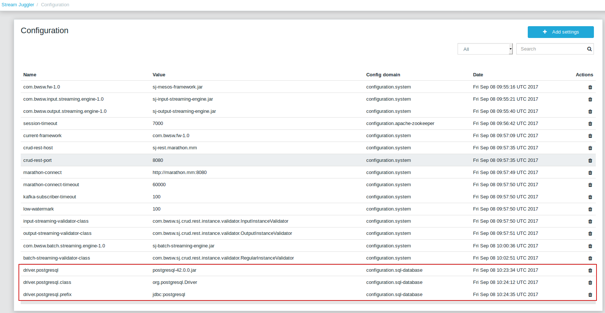

Remember to replace <driver_name> in jdbc-sflow-provider.json_ when creating providers in the next step.

Step 3. Streaming Creation
~~~~~~~~~~~~~~~~~~~~~~~~~~~~~~~~~~

Let’s create streams to transport data from and to the modules.

Creating Infrastructure
"""""""""""""""""""""""""""""""

The streaming needs the infrastructure - providers and services. Two types of providers are necessary for the demo: Apache Zookeeper and SQL database. 

Services of three types are required: T-streams, Apache Zookeeper and SQL-database.

Providers creation
'''''''''''''''''''''''''

For creation of providers you should create json files with the following content:

.. _jdbc-sflow-provider.json:

**jdbc-sflow-provider.json**::

 { 

   "name": "jdbc-sflow-provider",
   "description": "JDBC provider for demo",
   "type": "provider.sql-database",
   "login": "<login>",
   "password": "<password>",
   "hosts": [
     "<host>:<port>"
   ],
   "driver": "<driver_name>"
 }

**zookeeper-sflow-provider.json** (remember to replace <host>:<port> with a valid Apache Zookeeper IP)::

 {

   "name": "zookeeper-sflow-provider",
   "description": "Zookeeper provider for demo",
   "type": "provider.apache-zookeeper",
   "hosts": [
     "<host>:<port>"
   ]
 }
  
.. note:: Please, replace the placeholders in the json files: <login>, <password>, <host> and <port>. Remove "login" and "password" fields if you do not need authentication to an appropriate server.

Then create providers::

 curl --request POST "http://$address/v1/providers" -H 'Content-Type: application/json' --data "@api-json/providers/jdbc-sflow-provider.json" 
 curl --request POST "http://$address/v1/providers" -H 'Content-Type: application/json' --data "@api-json/providers/zookeeper-sflow-provider.json"

Check out they have appeared in the UI:

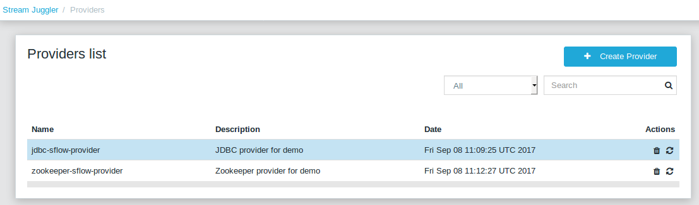

Services creation
'''''''''''''''''''''''''

Once providers are created, we can create services. Services of three types are required: T-streams, Apache Zookeeper and SQL-database.

To create services::

 curl --request POST "http://$address/v1/services" -H 'Content-Type: application/json' --data "@api-json/services/jdbc-sflow-service.json"
 curl --request POST "http://$address/v1/services" -H 'Content-Type: application/json' --data "@api-json/services/tstream-sflow-service.json"
 curl --request POST "http://$address/v1/services" -H 'Content-Type: application/json' --data "@api-json/services/zookeeper-sflow-service.json"

Check out the services have appeared in the UI:

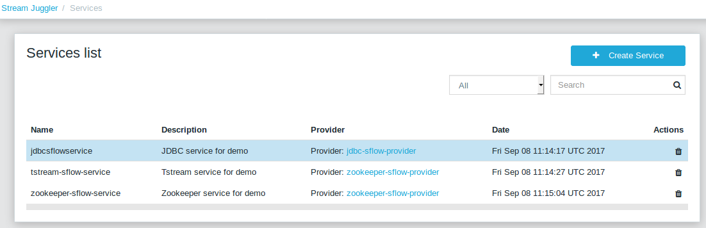

Streams creation
''''''''''''''''''''''''''

Now you can create streams that will be used by the instances of input, processing, output and fallback-output modules.

To create output streams of the input module:

- sflow-avro — the stream for correctly parsed sFlow records;
- sflow-fallback — the stream for incorrect inputs.

::

 curl --request POST "http://$address/v1/streams" -H 'Content-Type: application/json' --data "@api-json/streams/sflow-avro.json"
 curl --request POST "http://$address/v1/streams" -H 'Content-Type: application/json' --data "@api-json/streams/sflow-fallback.json"

To create output streams of the processing module that will be used for keeping  information about source and destination IP addresses and traffic::

 curl --request POST "http://$address/v1/streams" -H 'Content-Type: application/json' --data "@api-json/streams/src-ip-stream.json"
 curl --request POST "http://$address/v1/streams" -H 'Content-Type: application/json' --data "@api-json/streams/src-dst-stream.json"

To create output streams of the output modules that will be used for storing information to the database::

 curl --request POST "http://$address/v1/streams" -H 'Content-Type: application/json' --data "@api-json/streams/src-ip-data.json"
 curl --request POST "http://$address/v1/streams" -H 'Content-Type: application/json' --data "@api-json/streams/src-dst-data.json"

To create an output stream of the fallback-output module that will be used for storing incorrect inputs to the database::

 curl --request POST "http://$address/v1/streams" -H 'Content-Type: application/json' --data "@api-json/streams/fallback-data.json
 
See they have appeared in the UI:

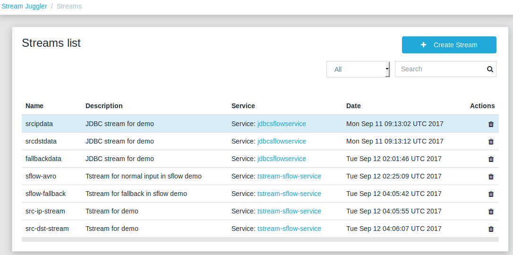

Step 4. Output SQL Tables Creation
~~~~~~~~~~~~~~~~~~~~~~~~~~~~~~~~~~~~~~~~~~~

SQL tables for the output data should be created in the *sflow* database. To create tables::

 CREATE TABLE srcipdata (
    id SERIAL PRIMARY KEY,
    src_ip VARCHAR(32),
    traffic INTEGER,
    txn BIGINT
 );

 CREATE TABLE srcdstdata (
    id SERIAL PRIMARY KEY,
    src_as INTEGER,
    dst_as INTEGER,
    traffic INTEGER,
    txn BIGINT
 );

 CREATE TABLE fallbackdata (
    id SERIAL PRIMARY KEY,
    line VARCHAR(255),
    txn BIGINT
 );

Step 5. Creating Instances
~~~~~~~~~~~~~~~~~~~~~~~~~~~~~~~~~~~~~~~~~~

An instance should be created for each module as its individual performance. 

In the demo case, there are three output modules. Thus, we will create three instances for the output.

To create an instance of the input module::

 curl --request POST "http://$address/v1/modules/input-streaming/com.bwsw.input.csv/1.0/instance" -H 'Content-Type: application/json' --data "@api-json/instances/sflow-csv-input.json"

To create an instance of the processing module::

 curl --request POST "http://$address/v1/modules/batch-streaming/sflow-process/1.0/instance" -H 'Content-Type: application/json' --data "@api-json/instances/sflow-process.json"

To create instances of the output modules::

 curl --request POST "http://$address/v1/modules/output-streaming/sflow-src-ip-output/1.0/instance" -H 'Content-Type: application/json' --data "@api-json/instances/sflow-src-ip-output.json"
 curl --request POST "http://$address/v1/modules/output-streaming/sflow-src-dst-output/1.0/instance" -H 'Content-Type: application/json' --data "@api-json/instances/sflow-src-dst-output.json"

To create an instance of the fallback-output module::

 curl --request POST "http://$address/v1/modules/output-streaming/sflow-fallback-output/1.0/instance" -H 'Content-Type: application/json' --data "@api-json/instances/sflow-fallback-output.json"
 
View them in the UI:

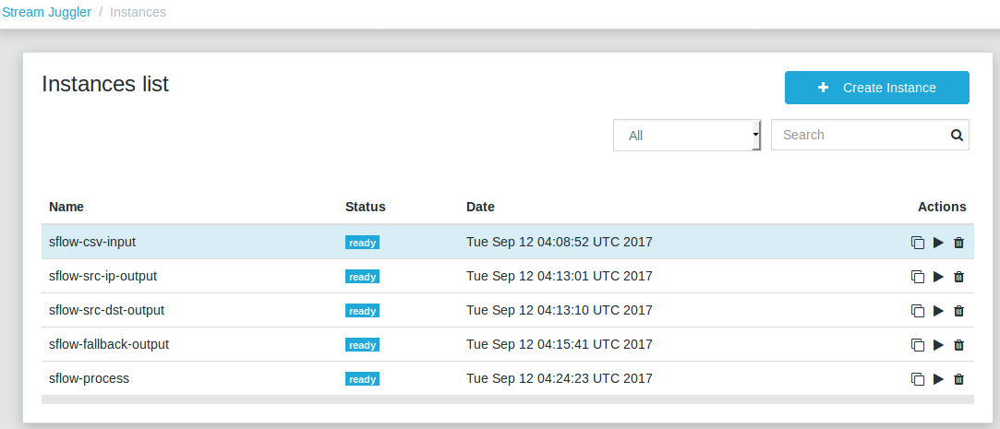

Launching Instances
~~~~~~~~~~~~~~~~~~~~~~

Now you can launch every instance.

To launch the input module instance::

 curl --request GET "http://$address/v1/modules/input-streaming/com.bwsw.input.csv/1.0/instance/sflow-csv-input/start"

To launch the processing module instance::

 curl --request GET "http://$address/v1/modules/batch-streaming/sflow-process/1.0/instance/sflow-process/start"

To launch output module instances::

 curl --request GET "http://$address/v1/modules/output-streaming/sflow-src-ip-output/1.0/instance/sflow-src-ip-output/start"
 curl --request GET "http://$address/v1/modules/output-streaming/sflow-src-dst-output/1.0/instance/sflow-src-dst-output/start"

To launch the fallback-output module instance::

 curl --request GET "http://$address/v1/modules/output-streaming/sflow-fallback-output/1.0/instance/sflow-fallback-output/start"

Pay attention to the host and port of the input module. This host and port should be specified when starting the flow of data. 

To get the list of listening ports of the input module send the following command::

 curl --request GET "http://$address/v1/modules/input-streaming/com.bwsw.input.csv/1.0/instance/sflow-csv-input"

and look at the field named ``tasks``. It may look as follows::

 "tasks": {
  "sflow-csv-input-task0": {
    "host": "176.120.25.19",
    "port": 31000
  }
 }

Or, in the UI, click at the input module instance in the "Instances" section and unfold the **Tasks** section of the *Instance Details* panel:

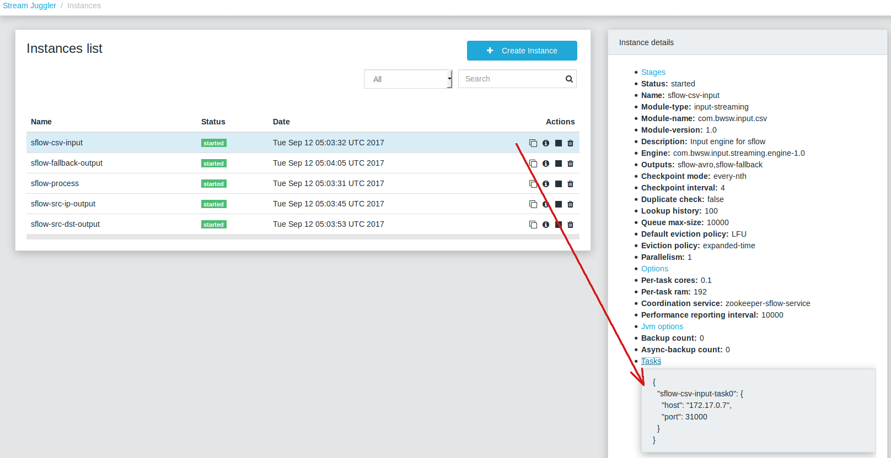

And now you can start the flow (replace <host> and <port> by values for the input module task host and port)::

 python send_sflow.py -p <port> -h <host> sflow_example.csv
 
See the Results
~~~~~~~~~~~~~~~~~~

To see the results execute the query in the database::

 SELECT * FROM srcipdata;
 SELECT * FROM srcdstdata;
 SELECT * FROM fallbackdata;

You should see a table similar to the one below::

 sflow=# SELECT * FROM srcipdata;
                   id                  |    src_ip    | traffic |        txn        
 --------------------------------------+--------------+---------+-------------------
  84cf5fad-aa64-4081-a9bc-3ce51110953d | 66.77.88.99  | 1055750 | 14918948733750000
  65dcbeb2-7a6c-4a2b-a622-b030e13ef546 | 11.22.33.44  |  588000 | 14918948733750000
  6b26b6cf-f4a8-4334-839f-86e1404bca16 | 11.73.81.44  |  660500 | 14918948733750000
  5492c762-b536-49b5-8088-1649cc09f0fb | 11.22.33.201 |  310500 | 14918948733750000
 (4 rows)

 sflow=# SELECT * FROM srcdstdata;
                   id                  | src_as | dst_as | traffic |        txn        
 --------------------------------------+--------+--------+---------+-------------------
  4b18d026-de4c-43fa-a765-8b308c28f75b |      0 |      0 |  100000 | 14918948736400000
  a43f0243-3ba7-4305-9664-3d0938bad394 |      0 |      0 | 1148500 | 14918948736400000
  cc326d39-8de5-487b-bfff-87b3202ef645 |    209 |    209 |  293250 | 14918948736400000
  236942d4-a334-4f4f-845f-c288bca6cebd |      0 |      0 |  310500 | 14918948736400000
  afca82ab-5f30-4e09-886c-a689554621c7 |    209 |    209 |  172500 | 14918948736400000
  d8a34274-db5b-480b-8b6c-bd36b991d131 |    209 |    209 |  590000 | 14918948736400000
 (6 rows)

 sflow=# SELECT * FROM fallbackdata;
                   id                  |                      line                       |        txn        
 --------------------------------------+-------------------------------------------------+-------------------
  31652ea0-7437-4c48-990c-22ceab50d6af | 1490234369,sfr6,10.11.12.13,4444,5555,INCORRECT | 14911974375950000
 (1 row)

Instance Shutdown
~~~~~~~~~~~~~~~~~~~~~~~~~~~

To stop the input module instance::

 curl --request GET "http://$address/v1/modules/input-streaming/com.bwsw.input.csv/1.0/instance/sflow-csv-input/stop"

To stop the processing module instance::

 curl --request GET "http://$address/v1/modules/batch-streaming/sflow-process/1.0/instance/sflow-process/stop"

To stop the output module instances::
 
 curl --request GET "http://$address/v1/modules/output-streaming/sflow-src-ip-output/1.0/instance/sflow-src-ip-output/stop"
 curl --request GET "http://$address/v1/modules/output-streaming/sflow-src-dst-output/1.0/instance/sflow-src-dst-output/stop"
 
To stop the fallback-output module instance::

 curl --request GET "http://$address/v1/modules/output-streaming/sflow-fallback-output/1.0/instance/sflow-fallback-output/stop"
 
Deleting Instances
~~~~~~~~~~~~~~~~~~~~~~~

A stopped instance can be deleted if there is no need for it anymore. An instance of a specific module can be deleted via REST API by sending a DELETE request (as described below). Or an instance deleting action is available in the UI under the “Instances” tab.

Make sure the instances to be deleted are stopped and are not with one of the following statuses: «starting», «started», «stopping», «deleting».

The instances of the modules can be deleted one by one. 

To delete the input module instance::

 curl --request DELETE "http://$address/v1/modules/input-streaming/com.bwsw.input.csv/1.0/instance/sflow-csv-input/"
 
To delete the process module instance::

 curl --request DELETE "http://$address/v1/modules/batch-streaming/sflow-process/1.0/instance/sflow-process/"

To delete output module instances::

 curl --request DELETE "http://$address/v1/modules/output-streaming/sflow-src-ip-output/1.0/instance/sflow-src-ip-output/"
 curl --request DELETE "http://$address/v1/modules/output-streaming/sflow-src-dst-output/1.0/instance/sflow-src-dst-output/"

To launch the fallback-output module instance::

 curl --request DELETE "http://$address/v1/modules/output-streaming/sflow-fallback-output/1.0/instance/sflow-fallback-output/"
 
Via the UI you can make sure the instances are deleted.

Find more information about SJ-platform and its entities at: 

:ref:`Modules` - more about module structure.

:ref:`Custom_Module` - how to create a module.

:ref:`Architecture` - the structure of the platform.


