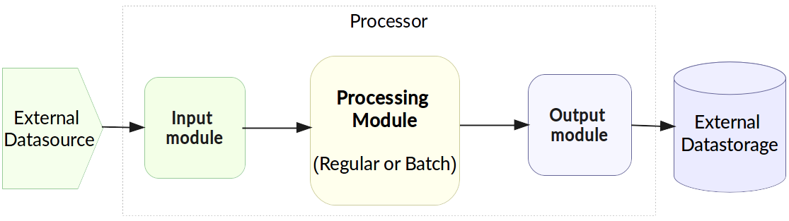
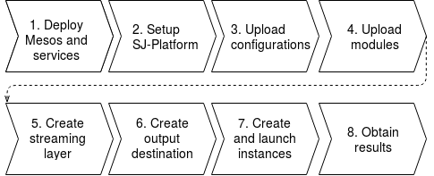
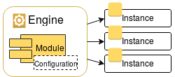
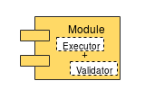

.. _Tutorial:

Tutorial
========================

.. Contents::
   :depth: 3

Introduction 
-----------------------

This tutorial is aimed to present SJ-Platform and give a quick start for a user to see the platform at work.

The demo projects presented below are example tasks introduced to demonstrate how to run user's first SJ module. A step-by-step guidance will help to deploy the system in a local mode (minimesos) or at a cluster (Mesos) and to implement SJ-Platform to a real-life task. 

Through an example task, a user will get to know the system structure, its key components and general concepts of the platform workflow.

SJ-Platform Overview
----------------------------------

Stream Juggler Platform (**SJ-Platform**) provides a solution for stream and micro-batched processing of unbounded data streams.  A **processor** transforms and processes data streams in SJ-Platform.  Configurations uploaded to the system determine the mode of data processing in the pipeline. The result data are exported to an external storage.

To configure and monitor the system, SJ-Platform provides a user with a comprehensive RESTful API and Web UI.

A simplified structure of SJ-Platform can be presented as at the image below:

   Picture 1

Let’s have a look at the platform from the perspective of a processing pipeline.

Data Processing in SJ-Platform
~~~~~~~~~~~~~~~~~~~~~~~~~~~~~~~~~~~
A processor can be represented by a processing module or a set of modules. Modules form a pipeline.

Alongside with a processing module the pipeline may include an input module that receives data and transforms them into streams, and an output module that exports the result.

General processing workflow which the system allows implementing is illustrated in the scheme below:

   
   Picture 2
   
Green, yellow and purple blocks displayed in a rectangular area are managed and evaluated by SJ-Platform. They represent an input module, a processing module and an output module, respectively. The blocks outside the rectangular area represent external systems (a data source and a data store).

The input module receives raw data and transforms them into a data stream of a proper type compatible with the processing module type. The processing module performs data aggregation, transformations, filtering and enriching and sends the result to the output module. In the output module, the processed data are transformed into entities appropriate for storing into an external storage of a specified type. It can be Elasticsearch, RESTful endpoint or JDBC-compatible data storages.
          
The illustrated pipeline is a common scenario for a lot of different tasks.

But the platform allows implementation of more complicated processing pipelines. So the pipeline can be expanded.  Several input modules can be included in the pipeline to accept the raw data and transform them for passing further to the processing stage.

You can launch more than a single processing module. Data streams can be distributed among them in various ways.

A few output modules may receive processed data and put them into a storage/storages. This case is described in the :ref:`sflow-example-task`.

To configure and monitor the system, SJ-Platform provides a user with a comprehensive RESTful API and Web UI.

Further we will go through a couple of real-life tasks to demonstrate the platform workflow. It will help you to understand how the platform processes data. 

Thus, the tutorial will provide you with a ready-to-use problem solution of example tasks on SJ-Platform base. Perform the steps to get acquainted with the platform functionality.

If you would like to continue studying the platform, proceed with reading the documentation. There you will find instructions on development, deployment and customization of your own code for your specific aims.

Examples Introduction
--------------------------------------

The example tasks that will be presented are different. But the steps we will perform to solve the tasks are common for both of them (see Picture 3). Before starting with the steps, it is important to note that to complete your job using SJ-Platform you should definitely know how the pipeline is going to look, what data format will be delivered into the system. The modules for data processing should be preliminarily created.

   
   Picture 3

What we are going to do for the examples is:

1. Deploy Mesos and other services. We suggest deploying the platform to Mesos using Marathon. Among other services we will run:

   - Apache Zookeeper - for coordination of task execution;
   - Java - a computer software that provides a system for developing application software and deploying it in a cross-platform computing environment;
   - Docker - a software container platform that allows a flexible system configuration;
   - MongoDB - as a database;
   - T-streams - as a message broker ensuring exactly-once data processing;
   - RESTful API - for accessing and monitoring the platform;
   - Elasticsearch, PostgreSQL - as external data storages;
   - Kibana - to visualize Elasticsearch data.
 
2. Download and set up the platform and demo project. We'll set up the platform and the demo repositories downloading it from GitHub. 

3. Upload configurations and engines. The configurations should be uploaded to determine module performance.  The full list of all configurations can be viewed at the :ref:`Configuration` page. 

   Engines are necessary for modules as they handle data flow making it into streams.

   An **engine** is required to start a module. A module can not process data without an engine. It is a .jar file for each type of modules that determins the way of data flow transformation into streams and back to the flow. In fact, this is a framework that launches a module.

.. figure:: _static/engine.png
   :scale: 110%
   :align: center
   
   Picture 4
   
   We will upload an engine jar file per each module in a pipeline.

.. note:: Find more about engines at the :ref:`Engines` page.

4. Upload modules. Module is some code for processing data streams. In the example tasks we will upload ready-to-use modules of three types - input modules, processing modules (regular, batch) and output modules. 

   To solve your tasks, you may upload your custom modules in this step. 
   
.. note:: Find more about modules at the :ref:`Modules` page.  A hello-world on a custom module can be found at the :ref:`Custom_Module` section.

5. Create streaming layer. The data are passed to and from a module in streams. Within the platform, T-streams are used for message transportation allowing exactly-once data exchange. The result data are exported from SJ-Platform to an external storage with streams of types corresponding to the type of that storage: Elasticsearch, SQL database or RESTful.

   
   Picture 5
   
   Streaming requires the infrastructure: providers and services. For both example tasks we will need Apache Zookeeper, Elasticsearch and SQL-database types of providers, and Apache Zookeeper, Elasticsearch, SQL-database and T-streams types of services. On the base of the infrastructure we will create streams of corresponding types.
   
.. note:: Find more about streams and the streaming infrastructure at the :ref:`Streaming` section.

6. Create output destination. At this step all necessary tables and mapping should be created for storing the processed result in an external data store.

7. Create and launch instances. For each module we will create instances. That is a range of settings to perform an exact module type. 

   
   Picture 6
   
An instance is created with specific parameters. It will use particular streams specified for it as input and output streams.

Launching instances we will start data processing in the platform.

8. Obtain and store the result. The result of processing will be stored to an external storage. Besides, in the fping example we will visualise resulting data using Kibana.

Now as you have general idea of the workscope to do, let's dive into the example tasks.

.. _fping-example-task:

Fping Example Task
----------------------------

The first example task we'd like to introduce illustrates the platform workflow in the real-world use.

The issue we are going to solve using our platform is to collect aggregated information on the accessibility of nodes using `fping <https://fping.org/>`_ utility. It checks accessibility of provided IPs sending a 64-bytes packet to each IP and waiting for a return packet. If the node can be accessed, a good return packet will be received. Also it returs the amount of time needed for a package to reach the node and return back. On the basis of this information the processor calculates the average response time for each node per 1 minute. The amount of successful responses by IP per 1 minute is calculated by the processing module as well. The result is exported to an external data store.  

In the example task solution the processing workflow is formed in the following way:

   
   Picture 7
   
This diagram demonstrates the processing workflow of the demo. As you can see, the data come to a TCP input module through a pipeline of fping and netcat. The TCP input module is a regular module that performs per-event processing. We provide two off-the-shelf modules - CSV and regex - for two most general input data formats. Find more information about them at the :ref:`input-module` section. For the fping example task we will use a regex input module. It processes an input stream which contains text data using a set of regular expressions, and then serializes them with Apache Avro.

Then the input module parses ICMP echo responses (IP and response time are selected) and ICMP unreachable responses (IPs only are selected) and puts the parsed data into 'echo-response' stream and 'unreachable-response' stream, respectively.

After that, the instance of a processing module aggregates response time and a total amount of echo/unreachable responses by IP per 1 minute and sends aggregated data to 'echo-response-1m' stream. In the fping demonstration example the data aggregation is performed with the processing module of a regular-streaming type. 

We add two more instances to the processing module to calculate responses per 3 minutes and per 1 hour. Correspondingly, 'echo-response-3m' and 'echo-response-1h' streams are created for these instances to put there the aggregated data on echo-responses.

Finally, the output module exports aggregated data from echo-response streams to Elasticsearch. The result is visualized using Kibana. 

The data are fed to the system, passed from one module to another and exported from the system via streams. Read more about streams under the :ref:`Creating_Streams` section.

Platform entities can be created via Web UI filling up all needed fields in corresponding forms. In the demonstration task, we suggest adding the entities to the system via REST API as it is the easiest and quickest way. You can use Web UI to see the added entities. 

Now, having the general idea on the platform workflow, we can dive into solving an example task on the base of SJ-Platform. 

And we start with the system deployment.

.. _Step1-Deployment:

Step 1. Deployment 
~~~~~~~~~~~~~~~~~~~~~~~~~~~~~~~~

Though SJ-Platform is quite a complex system and it includes a range of services to be deployed, no special skills are required for its setting up. 

There are three options to deploy the platform. Please, read the description for each option and choose the most convenient for you.

**Option 1.** The easiest way is to deploy SJ-Platform on `a virtual machine <http://streamjuggler.readthedocs.io/en/develop/SJ_Demo_Deployment.html>`_. This is the most rapid way to get acquainted with the platform and assess its performance. 

We suggest deploying the platform locally via Vagrant with VirtualBox as a provider. It takes up to 30 minutes. 

Minimum system requirements in this case are as follows:

- At least 8 GB of free RAM;
- VT-x must be enabled in BIOS;
- Vagrant 1.9.1 installed;
- VirtualBox 5.0.40 installed.

These requirements are provided for deployment on Ubuntu 16.04 OS.

The platform is deployed with all entities necessary to demonstrate the solution for the example task: providers, services, streams, configurations. So the instructions below for creating entities can be omitted. You may read about platform components here in the deployment steps (Step 1 - Step 6) and see the result in the UI.

**Option 2.** Another option is to deploy the platform on a cluster. Currently, the deployment on `Mesos  <http://streamjuggler.readthedocs.io/en/develop/SJ_Deployment.html#mesos-deployment>`_ as a universal distributed computational engine is supported.

Minimum system requirements in this case are as follows:

- working Linux host with 4-8 GB of RAM and 4 CPU cores; 
- Docker installed (see `official documentation <https://docs.docker.com/engine/installation/linux/docker-ce/ubuntu/>`_);
- cURL installed;
- sbt installed (see `official documentation <http://www.scala-sbt.org/download.html>`_).  

The platform is deployed with no entities. Thus, the pipeline should be built from scratch. 

This tutorial provides step-by-step instructions to deploy the demo project to Mesos using Marathon. At first step, Mesos with all the services will be deployed. Then entities will be added to the platform. Finally, modules will be launched and results will be visualised using Kibana.

**Option 3.** Also, you can run SJ-Platform locally deploying it on `minimesos <http://streamjuggler.readthedocs.io/en/develop/SJ_Deployment.html#minimesos-deployment>`_ as a testing environment.

Minimum system requirements in this case are as follows: 

- git, 
- sbt (see `official documentation <http://www.scala-sbt.org/download.html>`_), 
- Docker (see `official documentation <https://docs.docker.com/engine/installation/linux/docker-ce/ubuntu/>`_),
- cURL.

For the example task we provide instructions to deploy the platform **to Mesos** using Marathon.

The deployment is performed via REST API.

So, let's start with deploying Mesos and other services.

1) Deploy Mesos, Marathon, Zookeeper. You can follow the instructions at the official `installation guide <http://www.bogotobogo.com/DevOps/DevOps_Mesos_Install.php>`_ .

   To deploy Docker follow the instructions at the official `installation guide <https://docs.docker.com/engine/installation/linux/docker-ce/ubuntu/#install-docker-ce>`_ .

   Install Java 1.8. Find detailed instructions `here <https://tecadmin.net/install-oracle-java-8-ubuntu-via-ppa/>`_.

   Please, note, the deployment described here is for one default Mesos-slave with available ports [31000-32000]. Mesos-slave must support Docker containerizer. The technical requirements to Mesos-slave are the following: 

      - 2 CPUs, 
      - 4096 memory.

.. note:: If you are planning to launch a module with a greater value of the "parallelizm" parameter, i.e. to run tasks on more than 1 node, you need to increase the "executor_registration_timeout" parameter for Mesos-slave.

   Start Mesos and the services. 

2) Create JSON files and a configuration file. Please, name them as specified here.

   Replace <slave_advertise_ip> with the slave advertise IP.

   Replace <zk_ip> and <zk_port> according to the Apache Zookeeper address.

.. _mongo.json:

**mongo.json**::

 {  
   "id":"mongo",
   "container":{  
      "type":"DOCKER",
      "docker":{  
         "image":"mongo:3.4.7",
         "network":"BRIDGE",
         "portMappings":[  
            {  
               "containerPort":27017,
               "hostPort":31027,
               "protocol":"tcp" 
            }
         ],
         "parameters":[  
            {  
               "key":"restart",
               "value":"always" 
            }
         ]
      }
   },
   "instances":1,
   "cpus":0.1,
   "mem":512
 }

.. _sj-rest.json:

**sj-rest.json**::

 {  
   "id":"sj-rest",
   "container":{  
      "type":"DOCKER",
      "docker":{  
         "image":"bwsw/sj-rest:dev",
         "network":"BRIDGE",
         "portMappings":[  
            {  
               "containerPort":8080,
               "hostPort":31080,
               "protocol":"tcp" 
            }
         ],
         "parameters":[  
            {  
               "key":"restart",
               "value":"always" 
            }
         ]
      }
   },
   "instances":1,
   "cpus":0.1,
   "mem":1024,
   "env":{
      "MONGO_HOSTS":"<slave_advertise_ip>:31027",
      "ZOOKEEPER_HOST":"<zk_ip>",
      "ZOOKEEPER_PORT":"<zk_port>" 
   }
 }

**elasticsearch.json**::

 {  
   "id":"elasticsearch",
   "container":{  
      "type":"DOCKER",
      "docker":{  
         "image":"docker.elastic.co/elasticsearch/elasticsearch:5.5.1",
         "network":"BRIDGE",
         "portMappings":[  
            {  
               "containerPort":9200,
               "hostPort":31920,
               "protocol":"tcp" 
            },
        {  
               "containerPort":9300,
               "hostPort":31930,
               "protocol":"tcp" 
            }
         ],
         "parameters":[  
            {  
               "key":"restart",
               "value":"always" 
            }
         ]
      }
   },
   "env":{  
      "ES_JAVA_OPTS":"-Xms256m -Xmx256m", 
      "http.host":"0.0.0.0",
      "xpack.security.enabled":"false",
      "transport.host":"0.0.0.0",
      "cluster.name":"elasticsearch" 
   },
   "instances":1,
   "cpus":0.2,
   "mem":256
 } 

**config.properties**::

 key=pingstation
 active.tokens.number=100
 token.ttl=120

 host=0.0.0.0
 port=8080
 thread.pool=4

 path=/tmp
 data.directory=transaction_data
 metadata.directory=transaction_metadata
 commit.log.directory=commit_log
 commit.log.rocks.directory=commit_log_rocks

 berkeley.read.thread.pool = 2

 counter.path.file.id.gen=/server_counter/file_id_gen

 auth.key=dummy
 endpoints=127.0.0.1:31071
 name=server
 group=group

 write.thread.pool=4
 read.thread.pool=2
 ttl.add-ms=50
 create.if.missing=true
 max.background.compactions=1
 allow.os.buffer=true
 compression=LZ4_COMPRESSION
 use.fsync=true

 zk.endpoints=<zk_ip>
 zk.prefix=/pingstation
 zk.session.timeout-ms=10000
 zk.retry.delay-ms=500
 zk.connection.timeout-ms=10000

 max.metadata.package.size=100000000
 max.data.package.size=100000000
 transaction.cache.size=300

 commit.log.write.sync.value = 1
 commit.log.write.sync.policy = every-nth
 incomplete.commit.log.read.policy = skip-log
 commit.log.close.delay-ms = 200
 commit.log.file.ttl-sec = 86400
 stream.zookeeper.directory=/tts/tstreams
 
 ordered.execution.pool.size=2
 transaction-database.transaction-keeptime-min=70000
 subscribers.update.period-ms=500

.. _tts.json:

**tts.json** (replace <path_to_conf_directory> with an appropriate path to the configuration directory on your computer and <external_host> with a valid host)::

 {
    "id": "tts",
    "container": {
        "type": "DOCKER",
        "volumes": [
            {
                "containerPath": "/etc/conf/config.properties",
                "hostPath": "<path_to_conf_directory>",
                "mode": "RO" 
            }
        ],
        "docker": {
            "image": "bwsw/tstreams-transaction-server",
            "network": "BRIDGE",
            "portMappings": [
                {
                    "containerPort": 8080,
                    "hostPort": 31071,
                    "protocol": "tcp" 
                }
            ],
            "parameters": [
                {
                    "key": "restart",
                    "value": "always" 
                }
            ]
        }
    },
    "instances": 1,
    "cpus": 0.1,
    "mem": 512,
    "env": {
      "HOST":"<slave_advertise_ip>",
      "PORT0":"31071" 
    }
 }

**kibana.json**::

 {  
   "id":"kibana",
   "container":{  
      "type":"DOCKER",
      "docker":{  
         "image":"kibana:5.5.1",
         "network":"BRIDGE",
         "portMappings":[  
            {  
               "containerPort":5601,
               "hostPort":31561,
               "protocol":"tcp" 
            }
         ],
         "parameters":[  
            {  
               "key":"restart",
               "value":"always" 
            }
         ]
      }
   },
   "instances":1,
   "cpus":0.1,
   "mem":256,
   "env":{  
      "ELASTICSEARCH_URL":"https://<slave_advertise_ip>:31920" 
   }
 }

3) Run the services on Marathon:

   **Mongo**::
 
      curl -X POST http://172.17.0.1:8080/v2/apps -H "Content-type: application/json" -d @mongo.json 

   **Elasticsearch**:

      Please, note that command should be executed on Master-slave machine::

         sudo sysctl -w vm.max_map_count=262144

   Then launch Elasticsearch::

         curl -X POST http://172.17.0.1:8080/v2/apps -H "Content-type: application/json" -d 
         @elasticsearch.json

   **SJ-rest**::

      сurl -X POST http://172.17.0.1:8080/v2/apps -H "Content-type: application/json" -d @sj-rest.json    
    
   **T-Streams**::
 
      curl -X POST http://172.17.0.1:8080/v2/apps -H "Content-type: application/json" -d @tts.json 

   **Kibana**::

      curl -X POST http://172.17.0.1:8080/v2/apps -H "Content-type: application/json" -d @kibana.json

   Via the Marathon interface, make sure the services have a *running* status.

.. figure:: _static/ServicesOnMarathon.png

Step 2. SJ-Platform Setting Up 
~~~~~~~~~~~~~~~~~~~~~~~~~~~~~~~~~~~~~~~~~~~~~~~~~~~~~~~~

1) Copy the SJ-Platform repository from GitHub::

    git clone https://github.com/bwsw/sj-platform.git

2) Add the credential settings if Mesos requires that frameworks must be authenticated:: 
 
    curl --request POST "http://$address/v1/config/settings" -H 'Content-Type: application/json' --data "{\"name\": \"framework-principal\",\"value\": <principal>,\"domain\": \"configuration.system\"}" 
    curl --request POST "http://$address/v1/config/settings" -H 'Content-Type: application/json' --data "{\"name\": \"framework-secret\",\"value\": <secret>,\"domain\": \"configuration.system\"}" 
 
3) Copy the demonstrational task repository from GitHub::

    cd ..
    git clone https://github.com/bwsw/sj-fping-demo.git
    cd sj-fping-demo

Now make sure you have access to the Web UI. You will see the platform is deployed but there are no entities yet created. We will create them in next steps.

Step 3. Configurations and Engine Jars Uploading 
~~~~~~~~~~~~~~~~~~~~~~~~~~~~~~~~~~~~~~~~~~~~~~~~~~~~~~~~

To implement the processing workflow for the example task resolution the following JAR files should be uploaded:

1. a JAR file per each module type: input-streaming, regular-streaming, output-streaming;

2. a JAR file for Mesos framework that starts engines.

Thus, engines should be compiled and uploaded next.
 
Upload Engine Jars
""""""""""""""""""""""""

Please, download the engine JARs for each module type (input-streaming, regular-streaming, output-streaming) and the Mesos framework:: 

 wget http://c1-ftp1.netpoint-dc.com/sj/1.0-SNAPSHOT/sj-mesos-framework.jar
 wget http://c1-ftp1.netpoint-dc.com/sj/1.0-SNAPSHOT/sj-input-streaming-engine.jar
 wget http://c1-ftp1.netpoint-dc.com/sj/1.0-SNAPSHOT/sj-regular-streaming-engine.jar
 wget http://c1-ftp1.netpoint-dc.com/sj/1.0-SNAPSHOT/sj-output-streaming-engine.jar

Now upload the engine JARs. Please, change <slave_advertise_ip> to the slave advertise IP::

 address=address=<slave_advertise_ip>:31080

 curl --form jar=@sj-mesos-framework.jar http://$address/v1/custom/jars
 curl --form jar=@sj-input-streaming-engine.jar http://$address/v1/custom/jars
 curl --form jar=@sj-regular-streaming-engine.jar http://$address/v1/custom/jars
 curl --form jar=@sj-output-streaming-engine.jar http://$address/v1/custom/jars

Now engine JARs should appear in the UI under Custom Jars of the "Custom files" navigation tab.

Setup Configurations for Engines
""""""""""""""""""""""""""""""""""""""""

For the example task, we upload the following configurations via REST:

- session.timeout -  use when connect to Apache Zookeeper (ms). Usually when we are dealing with T-streams consumers/producers and Apache Kafka streams.

- current-framework - indicates which file is used to run a framework. By this value, you can get a setting that contains a file name of framework jar.

- crud-rest-host - REST interface host.

- crud-rest-port - REST interface port.

- marathon-connect - Marathon address. Use to launch a framework that is responsible for running engine tasks and provides the information about launched tasks. It should start with 'http://'.

- marathon-connect-timeout - use when trying to connect by 'marathon-connect' (ms).

Send the next requests to upload the configurations. Please, replace <slave_advertise_ip> with the slave advertise IP and <marathon_address> with the address of Marathon::

 curl --request POST "http://$address/v1/config/settings" -H 'Content-Type: application/json' --data "{\"name\": \"session-timeout\",\"value\": \"7000\",\"domain\": \"configuration.apache-zookeeper\"}" 
 curl --request POST "http://$address/v1/config/settings" -H 'Content-Type: application/json' --data "{\"name\": \"current-framework\",\"value\": \"com.bwsw.fw-1.0\",\"domain\": \"configuration.system\"}" 

 curl --request POST "http://$address/v1/config/settings" -H 'Content-Type: application/json' --data "{\"name\": \"crud-rest-host\",\"value\": \"<slave_advertise_ip>\",\"domain\": \"configuration.system\"}" 
 curl --request POST "http://$address/v1/config/settings" -H 'Content-Type: application/json' --data "{\"name\": \"crud-rest-port\",\"value\": \"31080\",\"domain\": \"configuration.system\"}" 

 curl --request POST "http://$address/v1/config/settings" -H 'Content-Type: application/json' --data "{\"name\": \"marathon-connect\",\"value\": \"http://<marathon_address>\",\"domain\": \"configuration.system\"}" 
 curl --request POST "http://$address/v1/config/settings" -H 'Content-Type: application/json' --data "{\"name\": \"marathon-connect-timeout\",\"value\": \"60000\",\"domain\": \"configuration.system\"}" 

Send the next requests to upload configurations for instance validators::

 curl --request POST "http://$address/v1/config/settings" -H 'Content-Type: application/json' --data "{\"name\": \"regular-streaming-validator-class\",\"value\": \"com.bwsw.sj.crud.rest.instance.validator.RegularInstanceValidator\",\"domain\": \"configuration.system\"}"
 curl --request POST "http://$address/v1/config/settings" -H 'Content-Type: application/json' --data "{\"name\": \"input-streaming-validator-class\",\"value\": \"com.bwsw.sj.crud.rest.instance.validator.InputInstanceValidator\",\"domain\": \"configuration.system\"}"
 curl --request POST "http://$address/v1/config/settings" -H 'Content-Type: application/json' --data "{\"name\": \"output-streaming-validator-class\",\"value\": \"com.bwsw.sj.crud.rest.instance.validator.OutputInstanceValidator\",\"domain\": \"configuration.system\"}"

In the UI you can see the uploaded configurations under the “Configuration” tab of the main navigation bar.

Step 4. Module Uploading 
~~~~~~~~~~~~~~~~~~~~~~~~~~~~~~~~~

Now as the system is deployed and necessary engines are added, modules can be uploaded to the system.

A **module** is a JAR file, containing a module specification. It handles data streams, performs data transformation, aggregation, filtering. 

   
.. note:: Find more about modules at the :ref:`Modules` page.  A hello-world on a custom module can be found at the :ref:`Custom_Module` section.

For the stated example task we upload the following modules:

- a TCP input module - *sj-regex-input* module - that accepts TCP input streams and transforms raw data to put them to T-streams and transmit for processing;

- a processing module - *ps-process* module - which is a regular-streaming module that processes data element-by-element.

- an output module - *ps-output* module - that exports resulting data to Elasticsearch.

Please, follow these steps to build and upload the modules.

First, configure the environment::
 
 cd sj-fping-demo
 
 address=<host>:<port>

<host>:<port> — SJ-Platform REST host and port.

Now **download modules** from Sonatype Repository:

- To download the *sj-regex-input* module from the sonatype repository::

   curl "https://oss.sonatype.org/content/repositories/snapshots/com/bwsw/sj-regex-input_2.12/1.0-SNAPSHOT/sj-regex-input_2.12-1.0-SNAPSHOT.jar" -o sj-regex-input.jar 

- To download the *ps-process* module from the sonatype repository::

   curl “https://oss.sonatype.org/content/repositories/snapshots/com/bwsw/ps-process_2.12/1.0-SNAPSHOT/ps-process_2.12-1.0-SNAPSHOT.jar” -o ps-process-1.0.jar

- To download the *ps-output* module from the sonatype repository::

   curl “https://oss.sonatype.org/content/repositories/snapshots/com/bwsw/ps-output_2.12/1.0-SNAPSHOT/ps-output_2.12-1.0-SNAPSHOT.jar” -o ps-output-1.0.jar

**Upload modules**

Upload modules to the system::

 curl --form jar=@sj-regex-input.jar http://$address/v1/modules
 curl --form jar=@ps-process/target/scala-2.11/ps-process-1.0.jar http://$address/v1/modules
 curl --form jar=@ps-output/target/scala-2.11/ps-output-1.0.jar http://$address/v1/modules

Now in the UI, you can see the uploaded modules under the ‘Modules’ tab in UI.

.. figure:: _static/ModulesUploaded.png

.. _Creating_Streams:

Step 5. Creating Streaming Layer 
~~~~~~~~~~~~~~~~~~~~~~~~~~~~~~~~~~~~~~~

The raw data are fed to the platform from different sources. And within the platform, the data are transported to and from modules via streams. Thus, in the next step, the streams for data ingesting and exporting will be created.

Different modules require different stream types for input and output.
                   
In the example task solution the following stream types are implemented:

1. TCP input stream feed the raw data into the system;

2. T-streams streaming passes the data to and from the processing module;

3. output modules export aggregated data and transfer them in streams to Elasticsearch.

Prior to creating a stream, we need to create infrastructure for the streaming layer. The infrastructure for streams includes **providers** and **services**. This is a required presetting.

The types of providers and services are determined by the type of streams. Find more about types of providers and services at the :ref:`Streaming_Infrastructure` section.

There are steps below to create streaming infrastructure using REST API: providers, services, and streams.

Set Up Streaming Infrastructure
"""""""""""""""""""""""""""""""""""""""
At this step we will create the infrastructure: providers and services.

In the example task pipeline the modules of three types take place - input-streaming, regular-streaming and output-streaming. For all types of modules, the Apache Zookeeper service is necessary. Thus, it is required to create the Apache Zookeeper provider.

Besides, the Apache Zookeeper provider is required for T-streams service that is in its turn needed for streams of T-streams type within the system, and for instances of the input-streaming and the regular-streaming modules.

The provider and the service of Elasticsearch type are required by the Elasticsearch output streams to put the result into the Elasticsearch data storage.

As a result, we have the following infrastructure to be created:

- Providers of Apache Zookeeper and Elasticsearch types;
- Services of Apache Zookeeper, T-streams and Elasticsearch types.

1) Set up providers.

Before sending a request, please, note there is a default value of Elasticsearch IP (176.120.25.19) in json configuration files. So we need to change it appropriately via sed app before using.

- Create Apache Zookeeper provider for ‘echo-response’ and ‘unreachable-response’ T-streams used within the platform, as well as for Apache Zookeeper service required for all types of instances::

   sed -i 's/176.120.25.19:2181/<zookeeper_address>/g' api-json/providers/zookeeper-ps-provider.json
   curl --request POST "http://$address/v1/providers" -H 'Content-Type: application/json' --data "@api-json/providers/zookeeper-ps-provider.json"

- Create Elasticsearch provider for output streaming (all ‘es-echo-response’ streams)::

   sed -i 's/176.120.25.19/elasticsearch.marathon.mm/g'  api-json/providers/elasticsearch-ps-provider.json
   curl --request POST "http://$address/v1/providers" -H 'Content-Type: application/json' --data "@api-json/providers /elasticsearch-ps-provider.json"

The created providers are available in the UI under the “Providers” tab.

2) Next, we will set up services:

- Apache Zookeeper service for all modules::

   curl --request POST "http://$address/v1/services" -H 'Content-Type: application/json' --data "@api-json/services/zookeeper-ps-service.json"

- T-streams service for T-streams (all ‘echo-response’ streams and the ‘unreachable-response’ stream) within the system and for the instances of the input-streaming and the regular-streaming modules::

   curl --request POST "http://$address/v1/services" -H 'Content-Type: application/json' --data "@api-json/services/tstream-ps-service.json"

- Elasticsearch service for output streams (all ‘es-echo-response’ streams) and the output-streaming module::

   curl --request POST "http://$address/v1/services" -H 'Content-Type: application/json' --data "@api-json/services/elasticsearch-ps-service.json"

Please, make sure the created services have appeared in the UI under the “Services” tab.

Creating Streams
""""""""""""""""""""""""""""""
Once the infrastructure is ready, it is time to create streams. 

For **sj-regex-input module**:

Create an ‘echo-response’ output stream of the input-streaming module (consequently, an input stream of the regular-streaming module). It will be used for keeping an IP and average time from ICMP echo-response and also a timestamp of the event::

 curl --request POST "http://$address/v1/streams" -H 'Content-Type: application/json' --data "@api-json/streams/echo-response.json"

Create one more output stream - an ‘unreachable response’ output stream - of the input-streaming module. It will be used for keeping an IP from ICMP unreachable response and also a timestamp of the event::

 curl --request POST "http://$address/v1/streams" -H 'Content-Type: application/json' --data "@api-json/streams/unreachable-response.json"

These streams are of T-streams type.

For **ps-process module**:

Create output streams of the regular-streaming module (consequently, an input stream of the output-streaming module) named ‘echo-response-1m’, ‘echo-response-3m’ and ‘echo-response-1h’. They will be used for keeping the aggregated information about the average time of echo responses, the total amount of echo responses, the total amount of unreachable responses and the timestamp for each IP (per 1 minute, per 3 minutes and per 1 hour)::

 curl --request POST "http://$address/v1/streams" -H 'Content-Type: application/json' --data   "@api-json/streams/echo-response-1m.json"

 curl --request POST "http://$address/v1/streams" -H 'Content-Type: application/json' --data "@api-json/streams/echo-response-3m.json"

 curl --request POST "http://$address/v1/streams" -H 'Content-Type: application/json' --data "@api-json/streams/echo-response-1h.json"

These streams are of T-streams type.

For **ps-output module**:

Create output streams of the output-streaming module named ‘es-echo-response-1m’, ‘es-echo-response-3m’, ‘es-echo-response-1h’. They will be used for keeping the aggregated information (per 1 minute, per 3 minutes and per 1 hour) from the previous stream including total amount of responses::

 curl --request POST "http://$address/v1/streams" -H 'Content-Type: application/json' --data "@api-json/streams/es-echo-response-1m.json"

 curl --request POST "http://$address/v1/streams" -H 'Content-Type: application/json' --data "@api-json/streams/es-echo-response-3m.json"

 curl --request POST "http://$address/v1/streams" -H 'Content-Type: application/json' --data "@api-json/streams/es-echo-response-1h.json"
 
These streams are of Elasticsearch type (as the external storage in the pipeline is Elasticsearch).

All the created streams should be available now in the UI under the “Streams” tab.

Step 6. Create Output Destination
~~~~~~~~~~~~~~~~~~~~~~~~~~~~~~~~~~~~~~~~~~

At this step all necessary indexes, tables and mapping should be created for storing the processed result.

In the provided example task the result data are saved to the Elasticsearch data storage.

Thus, it is necessary to create the index and mapping for Elasticsearch.

Create the index and the mapping for Elasticsearch sending the PUT request::

 curl --request PUT "http://176.120.25.19:9200/pingstation" -H 'Content-Type: application/json' --data "@api-json/elasticsearch-index.json"

Step 7. Creating Instances 
~~~~~~~~~~~~~~~~~~~~~~~~~~~~~

Once the system is deployed, configurations and modules are uploaded, the streaming layer with necessary infrastructure is created, we are going to create instances in the next step.
 
An individual instance should be created for each module.

See the instructions below for creating instances for the example task.

To create an instance of the *sj-regex-input* module send the following request::

 curl --request POST "http://$address/v1/modules/input-streaming/pingstation-input/1.0/instance" -H 'Content-Type: application/json' --data "@api-json/instances/pingstation-input.json"

To create an instance of the *ps-process* module send the following request::

 curl --request POST "http://$address/v1/modules/regular-streaming/pingstation-process/1.0/instance" -H 'Content-Type: application/json' --data "@api-json/instances/pingstation-process.json"

Create two more instances for the *ps-process* module with different checkpoint intervals to process data every 3 minutes and every hour. Remember to create them with different names::

 curl --request POST "http://$address/v1/modules/regular-streaming/pingstation-process/1.0/instance" -H 'Content-Type: application/json' --data "@api-json/instances/pingstation-echo-process-3m.json"

 curl --request POST "http://$address/v1/modules/regular-streaming/pingstation-process/1.0/instance" -H 'Content-Type: application/json' --data "@api-json/instances/pingstation-echo-process-1h.json"

To create an instance of the *ps-output* module send the following request::

 curl --request POST "http://$address/v1/modules/output-streaming/pingstation-output/1.0/instance" -H 'Content-Type: application/json' --data "@api-json/instances/pingstation-output.json"
 
Create two more instances to receive data from the instances processing data every 3 minutes and every hour. Remember to create the JSON files with different names. Change the ‘input’ values to ‘echo-response-3m’ and ‘echo-response-1h’ respectively to receive data from these streams. 

Change the ‘output’ values to ‘es-echo-response-3m’ and ‘es-echo-response-1h’ correspondingly to put the result data to these streams:: 

 curl --request POST "http://$address/v1/modules/output-streaming/pingstation-output/1.0/instance" -H 'Content-Type: application/json' --data "@api-json/instances/pingstation-output-3m.json"

 curl --request POST "http://$address/v1/modules/output-streaming/pingstation-output/1.0/instance" -H 'Content-Type: application/json' --data "@api-json/instances/pingstation-output-1h.json"

The created instances should be available now in UI under the “Instances” tab. There they will appear with the “ready” status.

Ready! The modules can be launched.

Launching Instances
~~~~~~~~~~~~~~~~~~~~~~~~~~~~~~

After the streaming layer with its infrastructure and instances are ready you can start a module. 

The module starts working after its instance is launched. An input module begins to receive data, transforms the data for T-streams to transfer them to the processing module. A processing module begins to process them and put to T-streams to transfer them to the output module. An output module begins to store the result in a data storage. 

In the example case, there are three modules and each of them has its own instances. Thus, these instances should be launched one by one. 

To launch the **input module instance** send::

 curl --request GET "http://$address/v1/modules/input-streaming/pingstation-input/1.0/instance/pingstation-input/start"
 
To launch the **processing module instances** send::

 curl --request GET "http://$address/v1/modules/regular-streaming/pingstation-process/1.0/instance/pingstation-process/start"

 curl --request GET "http://$address/v1/modules/regular-streaming/pingstation-process/1.0/instance/pingstation-process-3m/start"

 curl --request GET "http://$address/v1/modules/regular-streaming/pingstation-process/1.0/instance/pingstation-process-1h/start" 

To launch the **output module instances** send::

 curl --request GET "http://$address/v1/modules/output-streaming/pingstation-output/1.0/instance/pingstation-output/start"

 curl --request GET "http://$address/v1/modules/output-streaming/pingstation-output/1.0/instance/pingstation-output-3m/start"

 curl --request GET "http://$address/v1/modules/output-streaming/pingstation-output/1.0/instance/pingstation-output-1h/start" 

If you take a look at the UI, you will see the launched instances with the “started” status.

To get a list of ports that are listened by the input module instance send the request::

 curl --request GET "http://$address/v1/modules/input-streaming/pingstation-input/1.0/instance/pingstation-input"

and look at the field named ‘tasks’, e.g. it may look as follows::

 "tasks": {
  "pingstation-input-task0": {
    "host": "176.120.25.19",
    "port": 31000
  },
  "pingstation-input-task1": {
    "host": "176.120.25.19",
    "port": 31004
  }
 }

And now you can **start a flow**. Please, replace value of `nc` operands with the host and port of your instance task::

 fping -l -g 91.221.60.0/23 2>&1 | nc 176.120.25.19 31000

See the Results 
~~~~~~~~~~~~~~~~~~~~~~~~~~~~~~~

To see the processing results saved in Elasticsearch, please, go to Kibana. There the aggregated data can be rendered on a plot.

The result can be viewed while the module is working. A necessary auto-refresh interval can be set for the diagram to update the graph.

Firstly, click the Settings tab and fill in the data entry field '*' instead of 'logstash-*'. 

Then there will appear another data entry field called 'Time-field name'. You should choose 'ts' from the combobox and press the "Create" button. 

After that, click the Discover tab. 

Choose a time interval of 'Last 15 minutes' in the top right corner of the page, as well as an auto-refresh interval of 45 seconds, as an example. Now a diagram can be compiled. 

Select the parameters to show in the graph at the left-hand panel. 

The example below is compiled in Kibana v.5.5.1.

It illustrates the average time of echo-responses by IPs per a selected period of time (e.g. 1 min). As you can see, different nodes have different average response times. Some nodes respond faster than others. 

   Picture 8

Many other parameter combinations can be implemented to view the results.

Instance Shutdown 
~~~~~~~~~~~~~~~~~~~~~~~~~

Once the task is resolved and necessary data are aggregated, the instances can be stopped. 

A stopped instance can be restarted again if it is necessary.

If there is no need for it anymore, a stopped instance can be deleted. On the basis of the uploaded modules and the whole created infrastructure (providers, services, streams) other instances can be created for other purposes.

To stop instances in the example task the following requests should be sent.

To stop the **sj-regex-input module instance** send::

 curl --request GET "http://$address/v1/modules/input-streaming/pingstation-input/1.0/instance/pingstation-input/stop"

To stop the **ps-process module instances** send::

 curl --request GET "http://$address/v1/modules/regular-streaming/pingstation-process/1.0/instance/pingstation-process/stop "

 curl --request GET "http://$address/v1/modules/regular-streaming/pingstation-process/1.0/instance/pingstation-process-3m/stop "

 curl --request GET "http://$address/v1/modules/regular-streaming/pingstation-process/1.0/instance/pingstation-process-1h/stop "

To stop the **ps-output module instances** send::

 curl --request GET "http://$address/v1/modules/regular-streaming/pingstation-process/1.0/instance/pingstation-output/stop" 

 curl --request GET "http://$address/v1/modules/regular-streaming/pingstation-process/1.0/instance/pingstation-output-3m/stop"  

 curl --request GET "http://$address/v1/modules/regular-streaming/pingstation-process/1.0/instance/pingstation-output-1h/stop" 

In the UI, you will see the stopped instances with the “stopped” status.

Deleting Instance
~~~~~~~~~~~~~~~~~~~~~~~~~~~~~~~~
A stopped instance can be deleted if there is no need for it anymore. An instance of a specific module can be deleted via REST API by sending a DELETE request (as described below). Or instance deleting action is available in the UI under the “Instances” tab.

Make sure the instances to be deleted are stopped and are not with one of the following statuses: «starting», «started», «stopping», «deleting».

The instances of the modules can be deleted one by one. 

To delete the *sj-regex-input* module instance send::

 curl --request DELETE "http://$address/v1/modules/input-streaming/pingstation-input/1.0/instance/pingstation-input/"

To delete the *ps-process* module instance send::

 curl --request DELETE "http://$address/v1/modules/regular-streaming/pingstation-process/1.0/instance/pingstation-process/"

 сurl --request DELETE "http://$address/v1/modules/regular-streaming/pingstation-process/1.0/instance/pingstation-process-3m/" 

 curl --request DELETE "http://$address/v1/modules/regular-streaming/pingstation-process/1.0/instance/pingstation-process-1h/"

To delete the *ps-output* module instance send::

 curl --request DELETE "http://$address/v1/modules/output-streaming/pingstation-output/1.0/instance/pingstation-output/"

 curl --request DELETE "http://$address/v1/modules/output-streaming/pingstation-output/1.0/instance/pingstation-output-3m/"

 curl --request DELETE "http://$address/v1/modules/output-streaming/pingstation-output/1.0/instance/pingstation-output-1h/"

Via the UI you can make sure the instances are deleted.

.. _sflow-example-task:

Sflow Example Task
-------------------------

There is another example of the platform performance. It represents the processing workflow developed for the demonstration task that is responsible for collecting `sFlow <https://sflow.org/>`_ information. The aggregated information can be valuable for monitoring the current traffic and predicting of possible problems. The solution represents a scalable system for aggregation and analysis of big data in continuous streams. That is extreamly important for large computer systems and platforms.

The suggested processing pipeline includes an input module, a batch processing module and an output module. Within the platform, the data are transported with T-streams.

As an external data source, an sFlow reporter takes place. It sends data to the system in CSV format.

The CSV data are transformed by the input module and sent for processing to the batch processing module. The data that can not be parsed by the input module are sent to the output module for incorrect data without processing.

The processed data are stored in the PostgreSQL database. It is exported from the platform via the output module with the streams of SQL-database type.

A complete pipeline can be rendered as in the diagram below:

.. figure:: _static/SflowDemo.png

Green, yellow, purple and red blocks are managed and evaluated by SJ-Platform. These are the *'sflow-csv-input'* module, the *'sflow-process'* module, the *'sflow-src-ip-output'* and the *'sflow-src-dst-output'* modules and the *'sflow-fallback-output'* module, respectively.

The blocks beyond the SJ-Platform area represent external systems. The data come to the CSV input module from the sFlow reporter. It sends sFlow records in CSV format to the input module. Then the input module parses CSV-lines into avro records and puts the parsed data into the *'sflow-avro'* stream of T-streams type. After that, the batch processing module parses avro records into sFlow records, and then:

- computes traffic for the source IP and puts it in *'src-ip-stream'*;
- computes traffic between the source and the destination and puts it in *'src-dst-stream'*.

Finally, the *'sflow-src-ip-output'* module just displaces data from *'src-ip-stream'*  to the *'srcipdata'* table in PostgreSQL. The *'sflow-src-dst-output'* module displaces data from *'src-dst-stream'*  to the *'srcdstdata'*  table.

If the input module cannot parse an input line, then it puts data into the *'sflow-fallback'* stream. After that the *‘fallback-output’* module moves that incorrect line from *'sflow-fallback'* to the *'fallbackdata'* table in PostgreSQL.

Step 1. Deployment
~~~~~~~~~~~~~~~~~~~~~~~~~

For this demo project the following core systems and services are required:

1. Apache Mesos - a cluster for all computations;
2. Mesosphere Marathon - a framework for executing tasks on Mesos;
3. Apache Zookeeper - for coordination of task execution;
4. Java - a computer software that provides a system for developing application software and deploying it in a cross-platform computing environment;
5. Docker - a software container platform that allows a flexible system configuration;
6. MongoDB - as a database;
7. T-streams - as a message broker ensuringe exactly-once data processing;
8. RESTful API - for accessing and monitoring the platform;
9. PostgreSQL - as a destination data store.

For a start, perform the steps for platform deployment from the Step1-Deployment_ section.

1) Deploy Mesos, Apache Zookeeper, Marathon.
   
2) Create json files for the services and run them:

- mongo.json_
- sj-rest.json_
- config.properties
  
  For the sFlow demostrational project the config.properties.json has the following content (remember to replace <zk_ip> with a valid Apache Zookeeper IP)::
  
   key=sflow
   active.tokens.number=100
   token.ttl=120

   host=0.0.0.0
   port=8080
   thread.pool=4

   path=/tmp
   data.directory=transaction_data
   metadata.directory=transaction_metadata
   commit.log.directory=commit_log
   commit.log.rocks.directory=commit_log_rocks

   berkeley.read.thread.pool = 2

   counter.path.file.id.gen=/server_counter/file_id_gen

   auth.key=dummy
   endpoints=127.0.0.1:31071
   name=server
   group=group

   write.thread.pool=4
   read.thread.pool=2
   ttl.add-ms=50
   create.if.missing=true
   max.background.compactions=1
   allow.os.buffer=true
   compression=LZ4_COMPRESSION
   use.fsync=true

   zk.endpoints=172.17.0.3:2181
   zk.prefix=/sflow
   zk.session.timeout-ms=10000
   zk.retry.delay-ms=500
   zk.connection.timeout-ms=10000

   max.metadata.package.size=100000000
   max.data.package.size=100000000
   transaction.cache.size=300

   commit.log.write.sync.value = 1
   commit.log.write.sync.policy = every-nth
   incomplete.commit.log.read.policy = skip-log
   commit.log.close.delay-ms = 200
   commit.log.file.ttl-sec = 86400
   stream.zookeeper.directory=/tts/tstreams

   ordered.execution.pool.size=2
   transaction-database.transaction-keeptime-min=70000
   subscribers.update.period-ms=500

- tts.json_

Via the Marathon interface, make sure the services are deployed and run properly.

Now look and make sure you have access to the Web UI. You will see the platform but it is not completed with any entities yet. They will be added in the next steps.

Step 2. SJ-Platform Setting Up 
~~~~~~~~~~~~~~~~~~~~~~~~~~~~~~~~~~~~~~~~~~~~~~~~~~~~~~~~

1) Copy the SJ-Platform repository from GitHub::

    git clone https://github.com/bwsw/sj-platform.git

Next, the infrastructure for the module performance can be created.

Step 3. Configurations and Engine Jars Uploading
~~~~~~~~~~~~~~~~~~~~~~~~~~~~~~~~~~~~~~~~~~~~~~~~~~~~

Download the engine jars::

 wget http://c1-ftp1.netpoint-dc.com/sj/1.0-SNAPSHOT/sj-mesos-framework.jar
 wget http://c1-ftp1.netpoint-dc.com/sj/1.0-SNAPSHOT/sj-input-streaming-engine.jar
 wget http://c1-ftp1.netpoint-dc.com/sj/1.0-SNAPSHOT/sj-batch-streaming-engine.jar
 wget http://c1-ftp1.netpoint-dc.com/sj/1.0-SNAPSHOT/sj-output-streaming-engine.jar

And upload them to the system. Please, replace <host>:<port> with the SJ-Platform REST host and port::

 address=<slave_advertise_ip>:31080
 
 curl --form jar=@sj-mesos-framework.jar http://$address/v1/custom/jars
 curl --form jar=@sj-input-streaming-engine.jar http://$address/v1/custom/jars
 curl --form jar=@sj-batch-streaming-engine.jar http://$address/v1/custom/jars
 curl --form jar=@sj-output-streaming-engine.jar http://$address/v1/custom/jars

Check out in the UI the engines are uploaded:

Setup settings for the engines. Please, replace <slave_advertise_ip> with the IP of the REST and <marathon_address> with the address of Marathon::

 curl --request POST "http://$address/v1/config/settings" -H 'Content-Type: application/json' --data "{\"name\": \"session-timeout\",\"value\": \"7000\",\"domain\": \"configuration.apache-zookeeper\"}" 
 curl --request POST "http://$address/v1/config/settings" -H 'Content-Type: application/json' --data "{\"name\": \"current-framework\",\"value\": \"com.bwsw.fw-1.0\",\"domain\": \"configuration.system\"}" 

 curl --request POST "http://$address/v1/config/settings" -H 'Content-Type: application/json' --data "{\"name\": \"crud-rest-host\",\"value\": \"<slave_advertise_ip>",\"domain\": \"configuration.system\"}" 
 curl --request POST "http://$address/v1/config/settings" -H 'Content-Type: application/json' --data "{\"name\": \"crud-rest-port\",\"value\": \"8080\",\"domain\": \"configuration.system\"}" 

 curl --request POST "http://$address/v1/config/settings" -H 'Content-Type: application/json' --data "{\"name\": \"marathon-connect\",\"value\": \"<marathon_address>",\"domain\": \"configuration.system\"}" 
 curl --request POST "http://$address/v1/config/settings" -H 'Content-Type: application/json' --data "{\"name\": \"marathon-connect-timeout\",\"value\": \"60000\",\"domain\": \"configuration.system\"}" 
 curl --request POST "http://$address/v1/config/settings" -H 'Content-Type: application/json' --data "{\"name\": \"kafka-subscriber-timeout\",\"value\": \"100\",\"domain\": \"configuration.system\"}" 
 curl --request POST "http://$address/v1/config/settings" -H 'Content-Type: application/json' --data "{\"name\": \"low-watermark\",\"value\": \"100\",\"domain\": \"configuration.system\"}" 

 curl --request POST "http://$address/v1/config/settings" -H 'Content-Type: application/json' --data "{\"name\": \"batch-streaming-validator-class\",\"value\": \"com.bwsw.sj.crud.rest.instance.validator.BatchInstanceValidator\",\"domain\": \"configuration.system\"}" 
 curl --request POST "http://$address/v1/config/settings" -H 'Content-Type: application/json' --data "{\"name\": \"input-streaming-validator-class\",\"value\": \"com.bwsw.sj.crud.rest.instance.validator.InputInstanceValidator\",\"domain\": \"configuration.system\"}" 
 curl --request POST "http://$address/v1/config/settings" -H 'Content-Type: application/json' --data "{\"name\": \"output-streaming-validator-class\",\"value\": \"com.bwsw.sj.crud.rest.instance.validator.OutputInstanceValidator\",\"domain\": \"configuration.system\"}" 

You can see in the UI the configurations are uploaded:

Step 4. Module Uploading
~~~~~~~~~~~~~~~~~~~~~~~~~~~~~~~~~~

Now let's upload modules for data processing. 

First, copy the demo project repository from GitHub::
 
 cd ..
 git clone https://github.com/bwsw/sj-fping-demo.git
 cd sj-sflow-demo
 sbt assembly

Then, upload the ready-to-use CSV-input module from the sonatype repository::

 curl "https://oss.sonatype.org/content/repositories/snapshots/com/bwsw/sj-csv-input_2.12/1.0-SNAPSHOT/sj-csv-input_2.12-1.0-SNAPSHOT.jar" -o sj-csv-input.jar
 curl --form jar=@sj-csv-input.jar http://$address/v1/modules

Then, build and upload the batch processing and the output modules of the sFlow demo project. 

From the directory of the demo project set up the batch processing module::
 
 curl --form jar=@sflow-process/target/scala-2.12/sflow-process-1.0.jar http://$address/v1/modules

Next, set up the output modules::

 curl --form jar=@sflow-output/src-ip/target/scala-2.12/sflow-src-ip-output-1.0.jar http://$address/v1/modules
 curl --form jar=@sflow-output/src-dst/target/scala-2.12/sflow-src-dst-output-1.0.jar http://$address/v1/modules
 curl --form jar=@sflow-fallback-output/target/scala-2.12/sflow-fallback-output-1.0.jar http://$address/v1/modules
 
The uploaded modules have appeared in the UI:

Now upload the GeoIP database which is required for the processing module::

 curl "http://download.maxmind.com/download/geoip/database/asnum/GeoIPASNum.dat.gz" -O
 gunzip GeoIPASNum.dat.gz
 curl --form file=@GeoIPASNum.dat http://$address/v1/custom/files

Then, upload and configure JDBC driver (determine <driver_name>)::

 curl "https://jdbc.postgresql.org/download/postgresql-42.0.0.jar" -O
 curl --form file=@postgresql-42.0.0.jar http://$address/v1/custom/files
 curl --request POST "http://$address/v1/config/settings" -H 'Content-Type: application/json' --data "{\"name\": \"driver.<driver_name>\",\"value\": \"postgresql-42.0.0.jar\",\"domain\": \"configuration.sql-database\"}" 
 curl --request POST "http://$address/v1/config/settings" -H 'Content-Type: application/json' --data "{\"name\": \"driver.<driver_name>.class\",\"value\": \"org.postgresql.Driver\",\"domain\": \"configuration.sql-database\"}" 
 curl --request POST "http://$address/v1/config/settings" -H 'Content-Type: application/json' --data "{\"name\": \"driver.<driver_name>.prefix\",\"value\": \"jdbc:postgresql\",\"domain\": \"configuration.sql-database\"}"

Now you can see the settings are added to the configuration list:

Remember to replace <driver_name> in jdbc-sflow-provider.json_ when creating providers in the next step.

Step 5. Creating Streaming Layer
~~~~~~~~~~~~~~~~~~~~~~~~~~~~~~~~~~

Let’s create streams to transport data from and to the modules.

Creating Infrastructure
"""""""""""""""""""""""""""""""

The streaming needs the infrastructure - providers and services. Two types of providers are necessary for the demonstration task: Apache Zookeeper and SQL database. 

Services of three types are required: T-streams, Apache Zookeeper and SQL-database.

Providers creation
'''''''''''''''''''''''''

For creation of providers you should create json files with the following content:

.. _jdbc-sflow-provider.json:

**jdbc-sflow-provider.json**::

 { 

   "name": "jdbc-sflow-provider",
   "description": "JDBC provider for demo",
   "type": "provider.sql-database",
   "login": "<login>",
   "password": "<password>",
   "hosts": [
     "<host>:<port>"
   ],
   "driver": "<driver_name>"
 }

**zookeeper-sflow-provider.json** (remember to replace <host>:<port> with a valid Apache Zookeeper IP)::

 {

   "name": "zookeeper-sflow-provider",
   "description": "Zookeeper provider for demo",
   "type": "provider.apache-zookeeper",
   "hosts": [
     "<host>:<port>"
   ]
 }
  
.. note:: Please, replace the placeholders in the json files: <login>, <password>, <host> and <port>. Remove "login" and "password" fields if you do not need authentication to an appropriate server.

Then create providers::

 curl --request POST "http://$address/v1/providers" -H 'Content-Type: application/json' --data "@api-json/providers/jdbc-sflow-provider.json" 
 curl --request POST "http://$address/v1/providers" -H 'Content-Type: application/json' --data "@api-json/providers/zookeeper-sflow-provider.json"

Check out they have appeared in the UI:

Services creation
'''''''''''''''''''''''''

Once providers are created, we can create services. Services of three types are required: T-streams, Apache Zookeeper and SQL-database.

To create services::

 curl --request POST "http://$address/v1/services" -H 'Content-Type: application/json' --data "@api-json/services/jdbc-sflow-service.json"
 curl --request POST "http://$address/v1/services" -H 'Content-Type: application/json' --data "@api-json/services/tstream-sflow-service.json"
 curl --request POST "http://$address/v1/services" -H 'Content-Type: application/json' --data "@api-json/services/zookeeper-sflow-service.json"

Check out the services have appeared in the UI:

Streams creation
''''''''''''''''''''''''''

Now you can create streams that will be used by the instances of input, processing, output and fallback-output modules.

First, we will create output streams of the input module:

- sflow-avro — the stream for correctly parsed sFlow records;
- sflow-fallback — the stream for incorrect inputs.

Run the following commands::

 curl --request POST "http://$address/v1/streams" -H 'Content-Type: application/json' --data "@api-json/streams/sflow-avro.json"
 curl --request POST "http://$address/v1/streams" -H 'Content-Type: application/json' --data "@api-json/streams/sflow-fallback.json"

To create output streams of the processing module that will be used for keeping information about the source and the destination IP addresses and traffic run the following commands::

 curl --request POST "http://$address/v1/streams" -H 'Content-Type: application/json' --data "@api-json/streams/src-ip-stream.json"
 curl --request POST "http://$address/v1/streams" -H 'Content-Type: application/json' --data "@api-json/streams/src-dst-stream.json"

To create output streams of the output modules that will be used for storing information to the database run the following commands::

 curl --request POST "http://$address/v1/streams" -H 'Content-Type: application/json' --data "@api-json/streams/src-ip-data.json"
 curl --request POST "http://$address/v1/streams" -H 'Content-Type: application/json' --data "@api-json/streams/src-dst-data.json"

To create an output stream of the fallback-output module that will be used for storing incorrect inputs to the database run the command below::

 curl --request POST "http://$address/v1/streams" -H 'Content-Type: application/json' --data "@api-json/streams/fallback-data.json
 
See they have appeared in the UI:

Step 6. Output SQL Tables Creation
~~~~~~~~~~~~~~~~~~~~~~~~~~~~~~~~~~~~~~~~~~~

SQL tables for the output data should be created in the *sflow* database. To create tables::

 CREATE TABLE srcipdata (
    id SERIAL PRIMARY KEY,
    src_ip VARCHAR(32),
    traffic INTEGER,
    txn BIGINT
 );

 CREATE TABLE srcdstdata (
    id SERIAL PRIMARY KEY,
    src_as INTEGER,
    dst_as INTEGER,
    traffic INTEGER,
    txn BIGINT
 );

 CREATE TABLE fallbackdata (
    id SERIAL PRIMARY KEY,
    line VARCHAR(255),
    txn BIGINT
 );

Step 7. Creating Instances
~~~~~~~~~~~~~~~~~~~~~~~~~~~~~~~~~~~~~~~~~~

An instance should be created for each module as its individual performance. 

In the demo case, there are three output modules. Thus, we will create three instances for the output.

To create an instance of the input module::

 curl --request POST "http://$address/v1/modules/input-streaming/com.bwsw.input.csv/1.0/instance" -H 'Content-Type: application/json' --data "@api-json/instances/sflow-csv-input.json"

To create an instance of the processing module::

 curl --request POST "http://$address/v1/modules/batch-streaming/sflow-process/1.0/instance" -H 'Content-Type: application/json' --data "@api-json/instances/sflow-process.json"

To create instances of the output modules::

 curl --request POST "http://$address/v1/modules/output-streaming/sflow-src-ip-output/1.0/instance" -H 'Content-Type: application/json' --data "@api-json/instances/sflow-src-ip-output.json"
 curl --request POST "http://$address/v1/modules/output-streaming/sflow-src-dst-output/1.0/instance" -H 'Content-Type: application/json' --data "@api-json/instances/sflow-src-dst-output.json"

To create an instance of the fallback-output module::

 curl --request POST "http://$address/v1/modules/output-streaming/sflow-fallback-output/1.0/instance" -H 'Content-Type: application/json' --data "@api-json/instances/sflow-fallback-output.json"
 
View them in the UI:

Launching Instances
~~~~~~~~~~~~~~~~~~~~~~

Now you can launch every instance.

To launch the input module instance::

 curl --request GET "http://$address/v1/modules/input-streaming/com.bwsw.input.csv/1.0/instance/sflow-csv-input/start"

To launch the processing module instance::

 curl --request GET "http://$address/v1/modules/batch-streaming/sflow-process/1.0/instance/sflow-process/start"

To launch output module instances::

 curl --request GET "http://$address/v1/modules/output-streaming/sflow-src-ip-output/1.0/instance/sflow-src-ip-output/start"
 curl --request GET "http://$address/v1/modules/output-streaming/sflow-src-dst-output/1.0/instance/sflow-src-dst-output/start"

To launch the fallback-output module instance::

 curl --request GET "http://$address/v1/modules/output-streaming/sflow-fallback-output/1.0/instance/sflow-fallback-output/start"

Pay attention to the host and port of the input module. This host and port should be specified when starting the flow of data. 

To get the list of listening ports of the input module send the following command::

 curl --request GET "http://$address/v1/modules/input-streaming/com.bwsw.input.csv/1.0/instance/sflow-csv-input"

and look at the field named ``tasks``. It may look as follows::

 "tasks": {
  "sflow-csv-input-task0": {
    "host": "176.120.25.19",
    "port": 31000
  }
 }

Or, in the UI, click at the input module instance in the "Instances" section and unfold the **Tasks** section of the *Instance Details* panel:

And now you can start the flow (replace <host> and <port> by values for the input module task host and port)::

 python send_sflow.py -p <port> -h <host> sflow_example.csv
 
See the Results
~~~~~~~~~~~~~~~~~~

To see the results execute the query in the database::

 SELECT * FROM srcipdata;
 SELECT * FROM srcdstdata;
 SELECT * FROM fallbackdata;

You should see a table similar to the one below::

 sflow=# SELECT * FROM srcipdata;
                   id                  |    src_ip    | traffic |        txn        
 --------------------------------------+--------------+---------+-------------------
  84cf5fad-aa64-4081-a9bc-3ce51110953d | 66.77.88.99  | 1055750 | 14918948733750000
  65dcbeb2-7a6c-4a2b-a622-b030e13ef546 | 11.22.33.44  |  588000 | 14918948733750000
  6b26b6cf-f4a8-4334-839f-86e1404bca16 | 11.73.81.44  |  660500 | 14918948733750000
  5492c762-b536-49b5-8088-1649cc09f0fb | 11.22.33.201 |  310500 | 14918948733750000
 (4 rows)

 sflow=# SELECT * FROM srcdstdata;
                   id                  | src_as | dst_as | traffic |        txn        
 --------------------------------------+--------+--------+---------+-------------------
  4b18d026-de4c-43fa-a765-8b308c28f75b |      0 |      0 |  100000 | 14918948736400000
  a43f0243-3ba7-4305-9664-3d0938bad394 |      0 |      0 | 1148500 | 14918948736400000
  cc326d39-8de5-487b-bfff-87b3202ef645 |    209 |    209 |  293250 | 14918948736400000
  236942d4-a334-4f4f-845f-c288bca6cebd |      0 |      0 |  310500 | 14918948736400000
  afca82ab-5f30-4e09-886c-a689554621c7 |    209 |    209 |  172500 | 14918948736400000
  d8a34274-db5b-480b-8b6c-bd36b991d131 |    209 |    209 |  590000 | 14918948736400000
 (6 rows)

 sflow=# SELECT * FROM fallbackdata;
                   id                  |                      line                       |        txn        
 --------------------------------------+-------------------------------------------------+-------------------
  31652ea0-7437-4c48-990c-22ceab50d6af | 1490234369,sfr6,10.11.12.13,4444,5555,INCORRECT | 14911974375950000
 (1 row)

Instance Shutdown
~~~~~~~~~~~~~~~~~~~~~~~~~~~

To stop the input module instance::

 curl --request GET "http://$address/v1/modules/input-streaming/com.bwsw.input.csv/1.0/instance/sflow-csv-input/stop"

To stop the processing module instance::

 curl --request GET "http://$address/v1/modules/batch-streaming/sflow-process/1.0/instance/sflow-process/stop"

To stop the output module instances::
 
 curl --request GET "http://$address/v1/modules/output-streaming/sflow-src-ip-output/1.0/instance/sflow-src-ip-output/stop"
 curl --request GET "http://$address/v1/modules/output-streaming/sflow-src-dst-output/1.0/instance/sflow-src-dst-output/stop"
 
To stop the fallback-output module instance::

 curl --request GET "http://$address/v1/modules/output-streaming/sflow-fallback-output/1.0/instance/sflow-fallback-output/stop"
 
Deleting Instances
~~~~~~~~~~~~~~~~~~~~~~~

A stopped instance can be deleted if there is no need for it anymore. An instance of a specific module can be deleted via REST API by sending a DELETE request (as described below). Or an instance deleting action is available in the UI under the “Instances” tab.

Make sure the instances to be deleted are stopped and are not with one of the following statuses: «starting», «started», «stopping», «deleting».

The instances of the modules can be deleted one by one. 

To delete the input module instance::

 curl --request DELETE "http://$address/v1/modules/input-streaming/com.bwsw.input.csv/1.0/instance/sflow-csv-input/"
 
To delete the process module instance::

 curl --request DELETE "http://$address/v1/modules/batch-streaming/sflow-process/1.0/instance/sflow-process/"

To delete output module instances::

 curl --request DELETE "http://$address/v1/modules/output-streaming/sflow-src-ip-output/1.0/instance/sflow-src-ip-output/"
 curl --request DELETE "http://$address/v1/modules/output-streaming/sflow-src-dst-output/1.0/instance/sflow-src-dst-output/"

To launch the fallback-output module instance::

 curl --request DELETE "http://$address/v1/modules/output-streaming/sflow-fallback-output/1.0/instance/sflow-fallback-output/"
 
Via the UI you can make sure the instances are deleted.

More Information
-------------------

Find more information about SJ-Platform and its entities at: 

:ref:`Modules` - more about module structure.

:ref:`Custom_Module` - how to create a module.

:ref:`Architecture` - the structure of the platform.

:ref:`UI_Guide` - the instructions on platform monitoring via the Web UI.

:ref:`REST_API` - the RESTful API to configure and monitor the platform.


